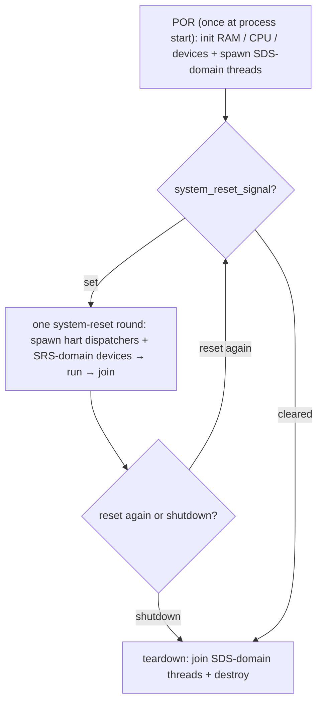
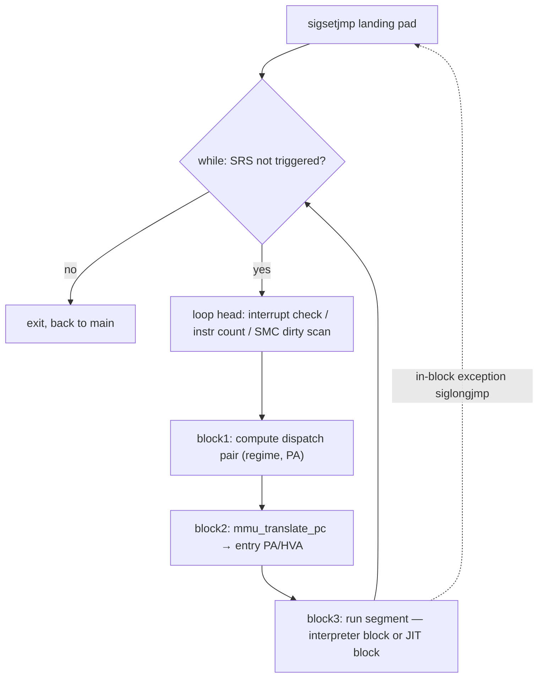
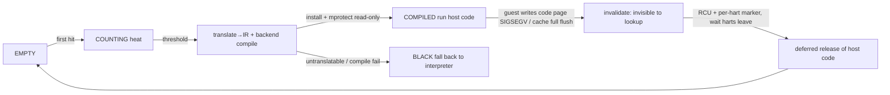

# riscv-jit-emulator

English | [简体中文](./README.md)

A graduate-level user-space RISC-V JIT emulator: it translates and executes RV32 guest code inside a single Linux user-space process. The target ISA is RV32 G (IMAFD_Zicsr_Zifencei) plus the compressed extension C, aimed at running system software such as OpenSBI, small OSes, and FreeRTOS-with-MMU, and serving as the implementation vehicle for a graduate thesis.

An interpreter provides the baseline; hot blocks are promoted to JIT-compiled blocks. End-to-end interpreter → JIT speedup is about 2.4x (geometric mean), up to ~16x for large blocks (full data in [`tests/review/REVIEW_REPORT.md`](tests/review/REVIEW_REPORT.md)).

## 1. Overview

riscv-jit-emulator is an **RV32 user-space JIT emulator**: it translates and runs the guest's RISC-V machine code inside a single Linux process. An interpreter guarantees correctness as a baseline, while hot basic blocks are just-in-time compiled into host (x86-64) machine code for speed. The goal is to boot system software (OpenSBI / small OSes / FreeRTOS-with-MMU) and to serve as the implementation for a graduate thesis.

- **Execution model**: interpreter and JIT are dispatched as peers under the dispatcher (§5); the JIT backend is asmjit, abstracted behind a C ABI with LLVM reserved (§9).
- **Full privilege stack**: M / S / U + Sv32 MMU + trap delegation; memory / TLB in §8, exceptions / interrupts / WFI in §6 / §7.
- **SMP-ready**: `--smp N` for multiple harts; shared state goes through C11 atomics + the monitor pattern (§3 / §4); single-hart compiles to plain ops with zero overhead.
- **Where to go next**: how the whole thing runs → §3; build & run → §10; layout & doc navigation → §11.

## 2. Implementation scope

Implemented:

- ISA: RV32 I / M / C + A (Zaamo + Zalrsc) + Zicsr + Zifencei.
- Privilege: M / S / U three levels, with the Sv32 MMU and trap delegation (medeleg / mideleg).
- Devices: CLINT / PLIC v1.0.0 / ns16550a UART / virtio-mmio blk (legacy) / test_dev.
- JIT: Translator → IR → JitBackend, end-to-end; whole-page SMC invalidation; SMP-safe block cache.

Deferred (interface reserved, may be done later):

- F/D floating point (`misa` F bit = 0); the H extension (the TLB already reserves the VS / VU slots and the regime interface, see §8).

Explicitly out of scope:

- Vector, PMP, AIA / IMSIC, modern PLIC v1.1, virtio v1.1 multi-queue.

---

## 3. Machine model and lifecycle

- **Macro modules**: `main` emulates three kinds of device — a CPU (HART in RISC-V terms), RAM, and peripherals. Because RISC-V uses MMIO, it can also be abstracted as "memory + CPU", with peripherals exposed to the guest through the physical address space.
- **The CPU's two halves**: data `cpu_t` (all guest-visible state: registers / CSRs / the TLB dispatch table) plus the execution flow `dispatcher()` (wrapped by `hart_exec_run` as the hart thread entry).
- **Macro control**: the whole program is governed by two signals — `shutdown_signal` (POR / SDS level, persisting across multiple system resets) and `system_reset_signal` (SRS level, governing execution/exit within one reset round). The three-phase lifecycle POR → system reset (`main`'s while loop spawns / runs / joins each round) → teardown is exactly these two signals unfolded over time; error handling also flows through these two signals, so normal exit and the various failures take the same form (no separate error path).
- **Two directions of the signals**: **enforce** (top-down) — once a high-level signal is set, lower levels stop on their own without per-target notification (to shut down, the SRS-domain devices and all harts stop accordingly); **escalate** (bottom-up) — each layer first tries to handle things itself, and only escalates by setting a signal when it cannot (a device hitting a situation it cannot handle → triggers SRS; severe enough to require a whole-machine abort → escalates SDS via `runtime_fatal`).
- **Devices are peers in the program flow**: HART, platform devices, and peripherals have no significant privilege distinction — all are bound by these two signals. For example the sifive_test-compatible shutdown device `test_dev` also rides on these two signals. Each device is self-governing within its own signal level.
- **The one special case**: to implement WFI, a HART relies on the `wfi` module's wake / fallback functions on parts of the `shutdown_signal` / `system_reset_signal` paths (a hart asleep in WFI must go through them to observe a signal change; see §7).
- Note: the dispatcher is the execution flow within a system-reset round; it is **no longer** a "device with hart-reset autonomy" — the project has removed its custom HART reset and `in_trap`.



*Lifecycle: POR once → SRS while-loop rounds (spawn / run / join) → teardown; the two signals are its control plane.*

**This section spawns three main lines (detailed later; here we only note how they hang off the lifecycle and signal system):**

- **Peripherals** — closest to the lifecycle, so §4 follows immediately to sketch their model (including monitor) and POR / SDS / SRS roles.
- **Dispatcher execution flow** — one per hart, detailed in §5 (its control flow and dispatch).
- **Memory / TLB dispatch** — guest physical memory and address translation, detailed in §8.

## 4. Peripheral model and lifecycle

> This section only **sketches which peripherals exist and how they hang off the POR / SRS lifecycle**, without unfolding registers or protocols; the monitor-pattern encapsulation is also briefly noted here as a shared trait of peripheral / platform devices.

- **The monitor pattern (brief)**: shared-state modules (CLINT / PLIC / RAM writes / JIT cache, etc.) each encapsulate their atomics / memory_order internally and expose only producer / consumer interfaces; callers (the dispatcher in particular) never touch synchronization primitives, so the dispatcher keeps single-threaded sequential semantics.
- Described by lifecycle role, without register / protocol detail:
  - **POR** one-time init + MMIO registration: RAM / bus / CLINT / PLIC / test_dev / UART / virtio-blk / CPU.
  - **SDS-domain helper threads** (long-lived across resets): CLINT timer, UART RX/TX, virtio-blk io_worker.
  - **SRS / system reset**: each round clears the device's guest-visible state, without necessarily destroying host resources or stopping SDS-domain threads.
- Role summary: CLINT (SDS domain, timer thread, `mtime` keeps running across resets) / PLIC (no helper thread) / UART (RX + TX threads) / virtio-blk (`--blk`, optional, io_worker) / test_dev (sifive_test-compatible, no thread).
- Thread lifecycle: whoever spawns joins; `destroy` is resource cleanup and does not hide a `pthread_join`.

## 5. Dispatcher and execution blocks

The dispatcher is the HART's execution-flow framework. The following is told from three viewpoints — **design intent / actual implementation / hardware execution flow** (distinguishing "why it is designed this way" from "what the code actually does" is a recurring idiom in this README).

**Design-intent viewpoint**

- The emulator starts on the interpreter as a baseline; once a block's heat reaches a threshold it switches to the JIT-compiled path.
- The JIT backend does not guarantee coverage of every instruction the interpreter supports; an untranslatable block falls back to interpreted execution.
- SMC is a constraint baked in from the start: the dispatcher and the memory subsystem (including MMU / TLB) are all designed around "a code page may be written by the guest" (SMC details in §9, memory / TLB in §8).

**Actual-implementation viewpoint**

- The interpreter flow and the JIT flow are collectively called **execution blocks**, and they are **peers** under the dispatcher — no master/slave relationship.
- Every execution block returns to the dispatcher at the end, which then decides which path to use next round; v1 does not do block chaining.

**Hardware-execution-flow viewpoint**

- Part of instruction fetch + the interrupt check sit at the dispatcher level; all other execution duties are inside the execution block.
- Fetch flow: with paging enabled, the MMU translation of the entry PC (which may hit / fill the TLB) happens at the dispatcher level, while the actual instruction decode happens inside the execution block.
- The dispatcher does the entry-fetch MMU translation only once per block; the block's own execution constraints (the block boundaries below) ensure no second MMU walk is needed within the block.

**Execution-block boundaries (shared by interpreter / JIT, not JIT-specific)**

- Determined by `decode.h::is_block_boundary_inst`; the interpreter flow and the translator share the same boundary set — it is an invariant relied upon jointly by the dispatcher / fetch translation / interrupt latency.
- **Hard boundaries**: jumps, plus system instructions that may change PC / the execution environment (CSR, xRET, ECALL / EBREAK, SFENCE.VMA, WFI, FENCE.I, etc.).
- **Cross-page truncation**: a block never spans a fetch-page boundary that would need re-translation — this is precisely the source of "one entry-fetch MMU walk per block".
- **Soft boundary**: the `BLOCK_INST_LIMIT` instruction-count cap; it comes not from ISA semantics but from scheduling policy — it keeps a single block from growing so long that interrupts wait too long at the dispatcher boundary, and it preserves the "eventually returns to the dispatcher" constraint for future larger execution units / block fusion.
- **Current limitation (block fusion)**: every branch instruction cuts a block; if a branch target does not cross the block and stays within the translatable range, the JIT could in principle fuse within the block. The performance motive is backed by measurement: the block-size sweep in `tests/review/REVIEW.md` shows that **the larger the block granularity, the higher the MIPS**, so block fusion is one future way to amortize dispatcher round-trips. But v1 explicitly **does not do block chaining** (block-to-block direct jumps); all block exits go back to the dispatcher. The README records this only as a current boundary and does not elaborate future plans.



The wrap-up work (interrupt check / counting / SMC dirty) is placed at the **loop head**, so that the normal exit and a `siglongjmp` jumping back into the next round look identical.

**The two dimensions of the dispatch pair `(regime, PA)` are not unfolded here; they are forward-referenced to their own sections:**

- **TLB / regime** — see §8. The regime's design intent is **multiple MMU / page-table contexts** (considered from the very start), not a JIT-specific optimization; it does also accelerate the JIT (different regimes compile different host code), but that is a consequence, not the original intent.
- **Whether to JIT** — see §9 (the dispatcher does the cache lookup / heat counting / threshold-triggered compilation; miss / BLACK / compile failure falls back to the interpreter).

**The dispatcher spawns three lines downward (detailed later): exceptions / interrupts (§6), WFI (§7), the JIT subsystem (§9).**

## 6. Exceptions and interrupts

> Following §5: exceptions and interrupts are two exit paths under the dispatcher system, but use **two entirely different mechanisms** — the README should not write them as a single trap path.

**Two mechanisms**

- **Interrupts**: polled by the dispatcher at block boundaries (return-based, no longjmp).
- **Exceptions**: aside from a few that occur during the dispatcher's fetch MMU-walker stage, they all occur inside the execution block; an in-block exception `siglongjmp`s back to the permanent landing pad before the dispatcher loop.

**may-trap boundary**

- The interpreter uses the `SYNC_COUNT()` macro to sync the local count back to the dispatcher at a may-trap boundary (before a possible `_Noreturn longjmp`).
- A JIT block, by the very act of "calling a C function", stores registers / local counters before the call, so state is recoverable should a longjmp happen.
- Because the JIT's external calls already cover every direct or indirect call to `trap_raise_exception`, no extra per-instruction may-trap marking is needed.

**CLINT / PLIC interrupt-flag design**

- Interrupts that occur during block execution are ignored; the dispatcher checks the interrupt flag after the block ends.
- Early on the dispatcher itself checked the timer / external interrupts; for performance this was changed so that the CLINT thread and PLIC-related paths set the per-hart flag internally (perf stats in `tests/review/REVIEW.md` / `tests/review/REVIEW_REPORT.md`).
- Interrupt reception may have block-level latency, but since interrupts are checked after the block anyway, this latency is negligible.
- This design naturally preserves: guest software can still poll `mtime` / `mtimecmp` / PLIC pending and other MMIO registers in software.

## 7. WFI

> Following the "one special case" in §3: to implement WFI, a HART relies on the `wfi` module's blocking / wake / fallback machinery.

- WFI is a **true blocking** implementation, not a NOP and not a sleep-poll.
- Per-hart `(mutex, cond)` slot + predicate: an execution block hitting WFI calls `wfi_wait`; the predicate checks `system_reset_signal != 0` or `(mie & csr_mip_read) != 0` (WFI wakeup does not require `mstatus.MIE = 1`, per the RV spec).
- Wake sources: a CLINT / PLIC pending 0→1 transition does a point-to-point `wfi_kick`; an ordinary shutdown does not `wfi_kick_all` — a sleeping hart relies on the 500ms `timedwait` fallback to wake itself; `wfi_kick_all` is used only for the `runtime_fatal` emergency stop.
- The interpreter and JIT WFI paths share the same semantics (TW check, clear LR/SC reservation on wake, advance PC).

**The one subtlety worth explaining: sticky kick**

- `pthread_cond_signal` is **edge-triggered**: a kick issued while the hart has not yet entered the wait queue is lost. The typical race — a device interrupt arrives just before the hart executes WFI; the trap is delivered by the dispatcher, the handler acks and clears `mip`; then when the hart enters WFI the pending bit is already gone, no new 0→1 transition fires a kick, and it sleeps forever.
- Fix: a per-hart `kick_sticky` records "a kick happened" as an atomic flag; `wfi_kick` does `store(sticky=1)` before `cond_signal`, and `wfi_wait` consumes it with `exchange(0)` on entry / after each wake — seeing it is equivalent to one spurious wake and returns directly.
- It compensates for the **semantic gap between the emulator's edge-triggered condvar and a real hardware level-triggered interrupt line** — not an arbitrary spurious wake; and this race **also exists on strict-school real hardware** (not unique to the emulator; an industrial instance is PULPino #91), consistent with the RV spec's allowance that WFI "may be resumed by a non-interrupt event, and software must re-check in a `while` loop".

Reference: RISC-V Privileged ISA Spec §3.2.3 / §3.3.2 (WFI semantics); PULPino [issue #91](https://github.com/pulp-platform/pulpino/issues/91) (an industrial case-A race); the full race analysis lives in the module docs / thesis.

## 8. Memory model, RAM/MMIO, and TLB dispatch

> This section unfolds the "memory / TLB" line forward-referenced in §3 (machine model) and §5 (dispatcher dispatch). The memory model is the **earliest-settled, least-changed** part of the project; the narrative centers on the **MMU's TLB design**.
> RISC-V TLB hardware rule: each hart flushes its own TLB on `sfence.vma` — so the TLB is naturally **per-HART**.

**RAM vs MMIO (a behavioral distinction, not just an address range)**

- **The fundamental reason for distinguishing them is behavioral**, not an address-range split: atomic instructions (AMO / LR/SC), page-table walks, and PTE A/D flag write-back hold only on RAM; AMO / LR/SC landing on MMIO are rejected as access faults, and page tables must be in RAM.
- RAM has an HVA, can enter the TLB, and can be the target of fetch / page tables / load-store / AMO / LRSC.
- MMIO is dispatched through the bus to device callbacks, has no cacheable host_ptr, and **does not enter the TLB**; an unregistered MMIO region raises an access fault from the bus.
- `IS_GPA_RAM(pa)` is the split point: RAM goes through `gpa_to_hva_offset + pa`; non-RAM goes through the mmio helper; a fetch landing on MMIO is an access fault.

### Address-translation model

**Bare mode uses an offset directly**

- We once considered letting the Bare regime (including M mode) also go through the TLB (one code path covering all accesses), but going through the TLB inevitably risks triggering MMU-related exceptions, and Bare mode should not encounter those on a memory access.
- Furthermore, this reserves "regime" as an interface for differing behavior under the future H-extension.
- Note: the regime itself does not care which privilege level the TLB came from (see "the translated memory model"); the helpers it calls (e.g. CSR) may care about privilege, but here we mean the code inside the actual execution block (pure-interpreter parts and JIT blocks) — from the block's fast path, helpers have already exited.

**The translated memory model**

- The TLB is a per-hart four-slot dispatch table `tlb_table[4]` (`tlb_t **`, indexed by RV privilege encoding U / S / VS / M); semantics are expressed via NULL / alias / ASID container, without an extra type layer:
  - `[M]` is **always NULL**: the Trust regime (M mode, or any privilege with a bare satp) uses identity + `IS_GPA_RAM` and does not consult the TLB.
  - `[S]` is the **ASID array container**: the container is eagerly allocated by `cpu_create`; leaf-TLB entries are **lazily allocated** by the walker on first access to a given ASID.
  - `[U]` is **always a copy (alias)**, mirroring the slot corresponding to U mode's current translation context: bare → a copy of NULL (aligned with `[M]`, no TLB); S-mode Sv32 → a copy of `[S]`'s ASID container (default MSU, U and S share the ASID namespace); H-extension (VU) → a copy of `[VS]`'s ASID container. Maintenance: `cpu_create` dispatches it per `misa` at init; the H-extension switch is mirrored by the csr helper at runtime.
  - `[VS]` is NULL in v1, reserved for the H-extension (same shape as `[S]` when active).
- The ASID dimension naturally expands into "one leaf TLB per ASID": the dispatcher hands out the leaf TLB of the **current ASID** directly at dispatch, so the execution block's hot path never re-selects an ASID.
- Lazy allocation: a given ASID's leaf TLB is allocated only on first use — workloads that do not fully use ASIDs do not waste allocation space.
- Regime ↔ TLB are mutual constraints: before each block the dispatcher computes the regime and leaf TLB from `priv` / `satp.mode`; once the TLB hits, the execution block no longer cares about privilege — this is the source of §5's `(regime, PA)`, and the condition that makes fast/slow-path separation hold. The regime is currently three-way: **BARE / SV32_S / SV32_U** (reused by the JIT as the cache key, see §9).

**Current limitations of regime dispatch**

- Regime dispatch corresponds exactly to whether `current_tlb == NULL`, with **no explicit dispatch field**.
- The future H-extension's VS / VU may bring more complex dispatch; but since the execution block does not care about the current privilege, mostly the dispatcher's selection logic changes — the execution block body need not be rewritten.
- Currently U and S are not dispatched as separate regimes → walking page tables / handling PTE permissions still needs the current privilege (a TLB hit does not); but the MMU walker is already wrapped as a helper, so the fast path is insensitive to this.

### Fast path / slow path (memory access)

- A load that hits the TLB reads `*hva` directly with no extra side effect; store / AMO / LR/SC must go through a helper because of side effects.
- **The root of the load/store asymmetry is the LR/SC mechanism** (plus the SMC side-effect entry): a store must go through `store_helper` to uniformly handle the effect of a RAM write on the LR/SC reservation, while a load has no such side effect and can read the HVA directly. So the asymmetry is about "having vs. not having a side effect", not a "performance trade-off".
- This asymmetry **is independent of whether the execution block is interpreted or JIT'd** — both share the same memory-access semantic boundary (a TLB-hitting load reads the HVA directly; store / AMO / LR/SC all go through a helper).

**LR/SC (brief)**

- LR/SC is the Zalrsc part of the A extension, implemented separately from AMO (Zaamo). The reservation is cross-hart protocol state, kept in a per-hart `_Atomic` array private to the `lrsc` module (**not embedded in `cpu_t`**); the reservation key is a RAM PA word (`pa & ~3`), not a VA.
- SC compares and clears the reservation under a per-PA hash bucket lock (success writes RAM, failure returns 1; either way it clears this hart's reservation); a plain store / AMO / device DMA also clears the matching reservation on hit; LR/SC landing on MMIO is rejected as an access fault.
- The full algorithm and the seven reservation-clearing occasions are in the module docs (sources: `src/isa/lrsc.{h,c}`, `dummy.txt §16`).

**TLB fast-path shape (hit lookup)**

- The leaf TLB is a direct-mapped array, with each entry = `gva_tag` + `pte_flags` (aligned with the RV PTE bits) + `host_ptr`.
- The hit lookup does not expose a `tlb_lookup` function; it is inlined by the interpreter / JIT: `index = (gva>>12) & (N-1)`; if `gva_tag` matches and the permission bits are satisfied, read `host_ptr` directly, otherwise go to the walker (miss / insufficient permission).
- The walker in `mmu.c` is just an ordinary page-table walk on the miss slow path, and does not dominate the narrative.

## 9. JIT subsystem

> This section unfolds the "whether to JIT" line forward-referenced in §5 (dispatcher dispatch).

**Design-intent viewpoint (the life of a block)**



The life of a block: cold (EMPTY) → heat counting (COUNTING) → compiled to host code at threshold (COMPILED) → executed directly on hit; cache read/write concurrency is managed by **RCU**, and it can be invalidated and deferred-released due to **SMC** or a **full code cache**. The three macro points below are the key supports of this line.

**Three-layer architecture**

- **Dispatcher** (execution-path selection, see §5) → **Translator** (knows RISC-V decode / block boundaries, produces backend-agnostic IR, does not know the host) → **JitBackend** (knows the host, not RV opcodes; currently asmjit; a C-ABI vtable isolates the C core from the C++ implementation, easing a future switch to LLVM).

**Macro point 1: cache key = (regime, PA)**

- The regime exists fundamentally to serve **TLB dispatch** (see §8), not invented by the JIT: the interpreter uses `current_tlb == NULL` to distinguish bare / M mode from paging (the code comments explain "why encode with NULL"); the **JIT further subdivides paging into S / U** (three-way BARE / SV32_S / SV32_U), baking the permission viewpoint at compile time and eliminating per-privilege branches inside the block.
- Using **PA, not VA**: what the execution flow actually runs is always the code bytes at a guest PA, and multiple VAs / page-table contexts can map to the same PA — a VA key would recompile the same physical code repeatedly, and `sfence.vma` would subject a VA-keyed cache to massive pointless invalidation; the SMC mechanism (macro point 2) is also organized by PA / page. On balance there is no reason to use VA.
- This is also one reason the dispatcher does an MMU walk at fetch: it must first obtain the entry PA. **Both the interpreter and JIT blocks depend on the same PA**, behaving identically.

**Macro point 2: SMC (self-modifying code) trigger mechanism**

- A RAM code page that has been JIT'd is `mprotect`'d read-only → a guest write to that page triggers a host SIGSEGV → user-space signal handling takes over: the handler does only async-signal-safe minimal work (mark `page_dirty` + un-protect), and the actual invalidation is deferred to the dispatcher scanning the bitmap at the loop head and invalidating the whole page.

**Macro point 3: production / invalidation decoupling + deferred release**

- The code comments are explicit: the JIT block cache's **production logic and invalidation logic do not interfere** (two independent dimensions).
- On SMC, a JIT host-code block **cannot be unmapped / freed immediately** (some hart may be executing it): first make the old block invisible to subsequent lookups, then via **RCU + a per-hart execution marker** wait until all harts have left before releasing it.

**A common misconception: `sfence.vma` / `fence.i` do not actively invalidate the JIT cache**

- JIT invalidation is driven only by the SMC page-dirty chain (macro point 2). `sfence.vma` affects only the TLB / address-translation state; `fence.i` is just a block boundary that gives the dispatcher a chance to handle already-recorded dirty pages at an instruction-sync point — neither calls JIT invalidation directly.

*(Loosely analogous to QEMU TCG's Translation Block flags/tag: CPU state that affects instruction interpretation must enter the block's selection condition — here that is the regime; the implementation does not copy QEMU.)*

---

## 10. Build, run, and test

- Target environment is **Linux** (Windows is used only for editing docs); dependencies are CMake ≥ 3.20, gcc / clang, and riscv64-unknown-elf-gcc (to cross-compile fixtures); AsmJit is auto-fetched and built by CMake `FetchContent` on first configure.
- Three build types: `make debug` (ASan + UBSan) / `make release` (perf runs) / `make tsan` (SMP race; the kernel needs `sysctl vm.mmap_rnd_bits=28`).
- Run arguments: `--bios FILE` (main guest image) / `--load [ADDR=]FILE` (extra load) / `--blk FILE` (virtio-blk backend) / `--smp N` (multiple harts, default 1).
- Tests: 147 fixtures (each a directory + `stub.S`); `make -C tests` builds them, `tests/review/run_tests.py` runs the batch, `tests/review/run_perf.py` runs the perf suite.
- CLion users can just use the GUI build profile; under Debug, set the env var `ASAN_OPTIONS=abort_on_error=1:detect_leaks=0` (LSan's ptrace conflicts with gdb; not needed in Run mode).

## 11. Project layout and doc navigation

```
src/
  main.c              entry: POR / system reset / teardown three-phase lifecycle (§3)
  config.h            compile-time macros (RAM / TLB / CLINT layout / MAX_HARTS / BLOCK_INST_LIMIT)
  riscv.h             RV ISA definitions (priv encoding / CSR / PTE bitfields / mstatus fields)
  loader.{c,h}        ELF / raw-binary loading + sanity checks
  runtime.{c,h}       SRS / SDS signal bitmaps + host signal handler
  debug.{c,h}         per-thread trace buf + CMake-driven gate flags
  dummy.txt           cross-file protocol ledger (not compiled; part of the source)
  core/               CPU core (all C): cpu / dispatcher / interpreter / decode / csr / mmu / tlb / trap / wfi
  isa/                ISA implementation (all C): lsu / amo / lrsc / fence / sfence
  platform/           platform infrastructure (all C): ram / bus / clint / plic
  device/             peripherals (all C): test_dev / uart / virtio_blk
  jit/                JIT subsystem: translator / ir / jit_cache / smc / backend (C) + backend_asmjit / jit_entry (C++)
  api/                cross-language boundary (extern "C" + POD, all C-compilable): helpers.h / jit_api.h
```

C is the default language; C++ is used only for the asmjit backend (`backend_asmjit.cc` / `jit_entry.cc`). Each file has a design doc at its top, and cross-file protocols are centralized in `src/dummy.txt`.

**Doc navigation:**

- In-repo: `tests/review/REVIEW_REPORT.md` (performance evaluation, thesis style) / `tests/review/REVIEW.md` (accumulated experiment log) / `src/dummy.txt` (cross-file protocol ledger) / the top-of-file design docs in each module's `.{c,h}`.
- Out-of-repo (maintainer-internal): the design plan, trade-off log, and architecture drafts under `notes/`.

## 12. Current limitations

- **ISA scope**: F/D floating point and Vector are unimplemented; the H extension, PMP, AIA / IMSIC, modern PLIC v1.1, and virtio v1.1 are out of current scope (see §2).
- **Execution granularity**: all block exits go through the dispatcher, v1 does no block chaining; every branch cuts a block, with no in-block fusion yet; interrupts are checked at block boundaries, so there is block-level latency (§5 / §6).
- **Regime dispatch**: U and S are not dispatched as separate regimes — walking page tables / handling PTE permissions still reads the current privilege at runtime (the TLB-hit fast path is unaffected, §8).
- **SMP**: data is already classified per-hart / shared and is SMP-aware, but v1 prioritizes correctness and has not tuned multi-hart scheduling / scalability.

## 13. License

TBD.
