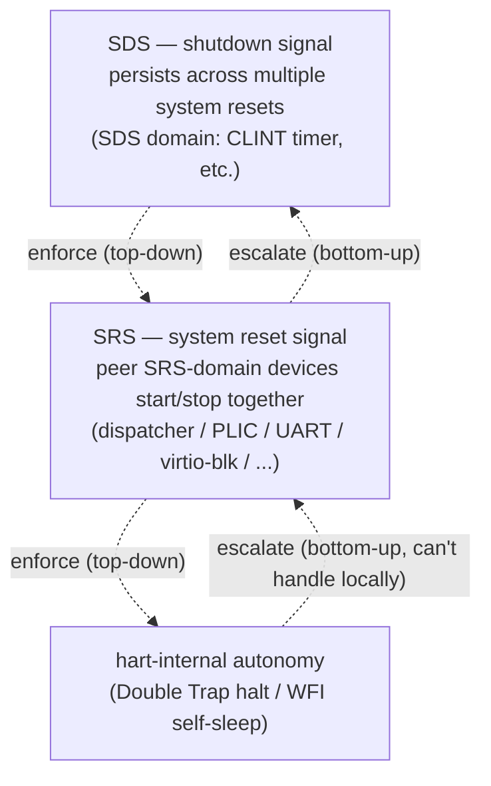
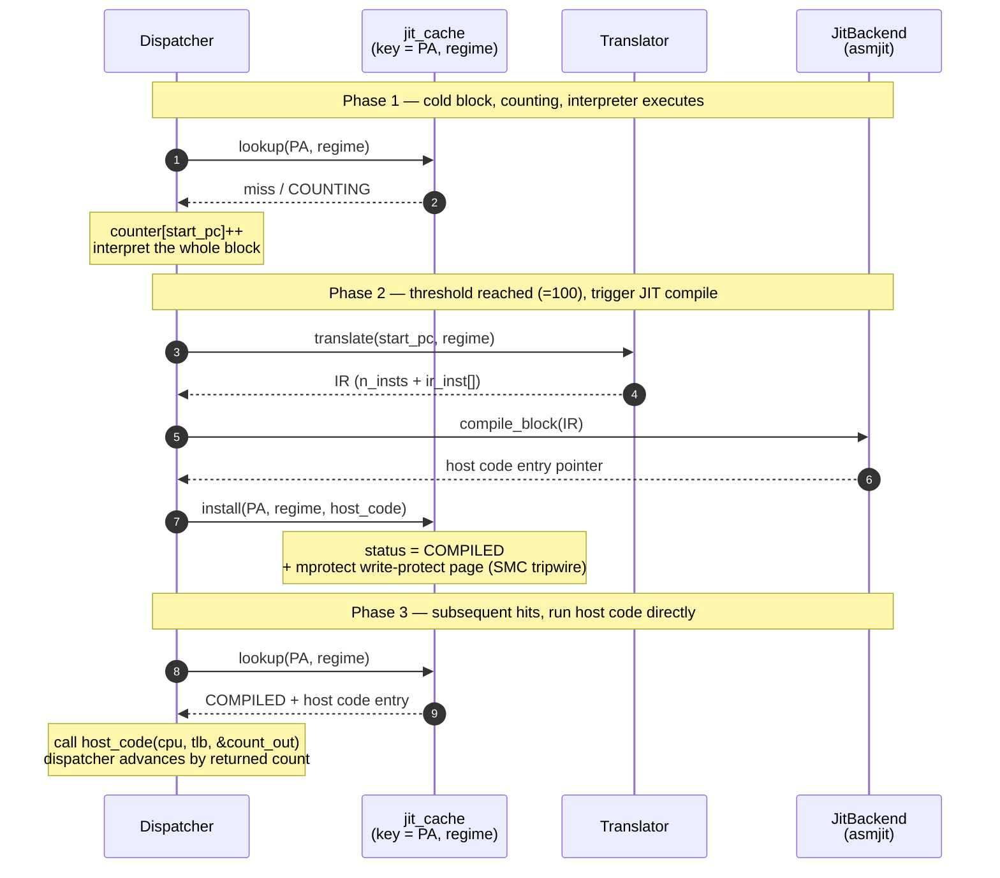

# riscv-jit-emulator

English | [简体中文](./README.md)

A graduate-level user-space RISC-V JIT emulator, targeting RV32 G (IMAFD_Zicsr_Zifencei) plus the standard compressed extension C, aiming to boot OpenSBI / small operating systems / FreeRTOS-with-MMU. Current state (`66c9cf3`, milestone b_03 closeout): JIT subsystem fully landed end to end, multi-hart SMP support complete, geometric-mean JIT/interpreter speedup 3x, with large blocks reaching 10x.

## Project Goals

| Dimension   | State                                                                                  |
| ----------- | -------------------------------------------------------------------------------------- |
| Target ISA  | RV32 IMAC + Zaamo + Zalrsc + Zicsr + Zifencei landed; F/D deferred, Vector not in scope |
| Priv levels | M / S / U three priv levels landed, with Sv32 MMU and full trap delegation (medeleg / mideleg) |
| Multi-hart  | `--smp N` support, `MAX_HARTS=8`, per-hart pthread, SMP-aware JIT cache (EBR RCU)       |
| Host        | Linux user-space process on x86_64; JIT backend is asmjit, LLVM OrcJIT interface reserved |
| Devices     | CLINT / PLIC v1.0.0 / ns16550a UART / virtio-mmio blk legacy / test_dev (fixture helper) |
| Test suite  | 146 fixtures (accumulated since a_01), all PASS across three build types (Debug+ASan / Release / Tsan) |

Out of scope: H extension (virtualization), PMP, AIA / IMSIC, modern PLIC v1.1, virtio multi-queue / modern v1.1 three-PFN forms.

## Architecture Overview

The whole runtime is organized as a set of **peer devices**, governed by a **signal hierarchy** and coordinated through the **monitor model**. This design unfolds across four viewpoints: machine and thread model (§main) / dispatcher main loop (§hart) / running-block memory model (§memory) / JIT three-layer architecture (§JIT). The discussion below is the core narrative; the full derivation lives in `notes/Demo/SoftwareArchitecture_v3.md` (local maintainer material).

### Signal Hierarchy + Bidirectional Autonomy

Stop signals are strictly three-level, distinguishing the **top-down enforcement direction** from the **bottom-up escalation direction**:



Enforcement direction: once a higher-level signal is asserted, lower levels stop naturally — no need to notify each one individually. For shutdown, the SRS domain and all harts halt naturally; for system reset, each hart's local handling is interrupted.

Escalation direction: each layer first tries to handle the situation locally, only escalating when it cannot. A hart first attempts hart-reset self-recovery; if that fails, it issues SRS=0. The system reset layer joins all SRS devices, then judges whether the failure is severe enough to escalate to shutdown; only then does it stop SDS-domain threads. This "try self-recovery first, escalate only when insufficient" chain makes every level a unit that can either resolve itself or call for help upward.

### Machine Model + Three-Layer Reset Lifecycle

The machine model starts from the classic CPU + RAM abstraction: `ram` manages guest physical memory via a single anonymous mmap; `loader` places ELF or raw binaries by physical address; `cpu_t` holds all guest-visible state (registers / CSRs / TLB dispatch table); `dispatcher` holds no guest state and only drives execution. The data/behavior split lets each hart own one `cpu_t` plus one dispatcher thread under SMP, keeping state ownership clean.

The three-layer reset lifecycle is the signal hierarchy unfolded along the time axis: **POR** (one-shot at process start: `ram_init` / `clint_init` / `cpu_create` plus spawning SDS-domain threads such as the CLINT timer) → **system reset** (each iteration of `main`'s while loop: SRS-domain devices spawn → run → join) → **hart reset** (the internal autonomy level of the dispatcher itself, viewed as one SRS device).

The thread model borrows the **monitor model** from Hoare / Brinch Hansen: each shared-state module encapsulates its internal atomic fields and memory_order choices, exposing only consumer / producer interfaces, so callers never touch synchronization primitives. The dispatcher reads/writes its own hart's `cpu_t` (per-hart, no synchronization required); any access to shared state goes through a monitor interface — synchronization complexity stays sealed inside the monitor, and the dispatcher keeps pure single-threaded sequential semantics. Error handling unifies through the SRS / SDS signal channels and **does not branch into a separate error path** — normal exits and various failures therefore have identical control-flow shapes.

### Dispatcher: an SRS-Domain Device with Internal hart-reset Autonomy

The dispatcher's shape: one-shot `sigsetjmp` permanent landing + a `while` multi-block loop + iteration-head bookkeeping. Each iteration runs three blocks: block 1 derives the dispatch packet `(regime, current_tlb)` from `priv` / `satp.mode`; block 2 calls `mmu_translate_pc` to translate the entry PC into a physical address; block 3 enters the real execution segment (JIT block or interpreter).

Whenever a slow-path helper decides to raise an exception, `trap_raise_exception` directly `siglongjmp`s back to the permanent landing point. Since `longjmp` bypasses the iteration tail, all tail bookkeeping (instruction counting, `mtime` advance, interrupt check) is moved to the iteration head, so the normal exit path and the longjmp-back path see the same shape on the next iteration. The dispatcher's only exit condition is `while (in_trap < 3 && SRS)`; the high bits of `in_trap` encode the host-side stop protocol — once any high bit is set, the value becomes ≥8 > 3 and the loop exits automatically.

### JIT Three-Layer Architecture

The JIT subsystem is the performance core, built as Dispatcher / Translator / JitBackend three layers, so swapping backends (e.g. asmjit for LLVM) only touches the bottom layer without polluting the rest. The sequence diagram below shows the full life cycle of a guest basic block, from cold start through steady-state hit:



Four key design decisions:

1. **Block cache key = (PA, regime) tuple rather than VA**: keying by VA would force every `sfence.vma` to invalidate a large number of blocks; keying by PA means `sfence.vma` does not affect the JIT cache at all. The `regime` axis distinguishes BARE / SV32_S / SV32_U block variants — the same PA is compiled separately for each regime, with the PTE_U viewpoint baked in at compile time, eliminating a runtime priv-level branch.
2. **All block exits go through dispatch, no block chaining**: both successors of a conditional branch jump back to the dispatcher. This independence pays off when switching backends, and `jalr`-style indirect jumps cannot be statically linked anyway.
3. **SMC (self-modifying code): whole-page invalidation + lazy invalidation**: the host pages holding JIT code are `mprotect`-ed read-only; a guest write to such a page triggers SIGSEGV. The handler, constrained by POSIX async-signal-safety, does only the minimum (an `atomic_fetch_or` on the `page_dirty` bit + `mprotect` back to writable + return); real cleanup is deferred to the dispatcher's main-loop head checking the bitmap, and invalidation granularity is the whole page. A companion `_Atomic uint64_t dirty_pending` cardinality counter lets the dispatcher's fast-path skip 99% of iterations with a single relaxed load, avoiding the 512-word table scan.
4. **Register mapping uses block-local use_count dynamic allocation (Layer 2)**: each `compile_block` entry scans all IR instructions, counts use_count per RV register by op-kind dispatch, picks the top 5 by descending use_count, and promotes them into a 5-register callee-saved host pool (rbx / r12-r15). For large blocks (32+ insts) the hot registers' use_count easily exceeds 5, yielding a +170 ~ +210% improvement over static fixed mapping (Layer 1) in a02_7 measurements.

The JIT block cache's shared data uses a hand-rolled **EBR (Epoch-Based Reclamation) RCU** (~30 lines): per-hart `_Atomic uint32_t` epoch slots plus a single global epoch counter. The read side (`jit_rcu_read_lock` / `unlock`) is one atomic each; the write side (`synchronize`) advances the global epoch and busy-waits until every hart's local epoch catches up before reclaiming the old host code.

### Memory Model: regime ↔ TLB as Mutual Constraints

In translated mode, the TLB is not just a GVA→HVA cache — it also acts as a "leaf-TLB-grained regime dispatch table". `cpu_t` holds a four-slot `tlb_table[4]`, indexed by the RV privilege encoding (U / S / VS / M).

The constraint closes thus:

1. **The regime determines TLB use**: before each block, the dispatcher selects the leaf TLB pointer from `priv` / `satp.mode` and passes it into the running block; empty slots are lazily allocated by `tlb_alloc`, so unused guest ASIDs cost no memory. The BARE regime (M-mode or any priv with bare satp) bypasses the TLB directly.
2. **A TLB hit lets the running block ignore priv level**: the body of the running block (interpreter or JIT) reads/writes only via the pointer the dispatcher hands it, with zero awareness of which priv level that leaf TLB came from.
3. **The fast/slow path abstraction stands on this pair of constraints**: priv-level concerns simply do not exist on the hot path — they have been pushed out of the hot path entirely, into the MMU walker (slow-path helper). The fast path is not "skipping a priv check"; the constraint structurally guarantees there is no priv check to perform.

### Fast Path / Slow Path Philosophy

JIT block emission strictly separates two paths:

- **Fast path** = arithmetic / logic / branches / register ops / TLB-hit loads, emitted directly as host instructions
- **Slow path** = memory writes / atomics / CSR reads/writes / interrupt checks / fences / TLB misses / permission faults — uniformly routed through C helpers via `call helper`, **never inlined** into the JIT block

The motivation for not inlining is multi-fold: changing helper logic does not invalidate the JIT cache; interpreter and JIT share one helper codebase; call stacks remain readable during debugging; on modern CPUs a call/ret costs roughly 5-15 cycles and is essentially free. The side effect is that store / CSR / atomic operations have a JIT speedup ceiling roughly at the interpreter level — a fact the performance data reflects.

The load/store asymmetry on a TLB hit is often misunderstood. The real causal chain is: the TLB caches hva (not pa) + MMIO never enters the TLB → on hit, the structure inherently cannot branch on RAM-vs-MMIO → load on hit can simply `return *hva` with no sub-helper; while store on hit must still go through `store_helper` (to clear LR/SC reservation + the SMC side-effect entry). So the load/store asymmetry is "side effect must go through helper" vs "no side effect can use TLB directly via `*hva`", not a "performance vs side effect" dichotomy.

## Current Capabilities

### ISA and System Software

- Full RV32 IM + C compressed instruction set (70 truly translated ops + 3 exit templates; RVC reuses the underlying RV32I ops)
- A extension: Zaamo 9 ops (AMOADD/SWAP/XOR/OR/AND through C11 atomic, MIN/MAX through CAS loops) + Zalrsc LR.W/SC.W + Zifencei (fence + fence.i)
- M / S mode CSRs (physical 64-bit mstatus accessed in halves, masked sstatus view, medeleg-driven trap delegation, mip/mie/sip/sie interrupt CSRs with `_mip_sw` software-writable subset and synthesized read of async sources)
- Sv32 MMU walker (hw-managed A/D, 4 KB + 4 MB superpages, PTE permission with SUM/MXR shared across three callsites)
- Trap system: exceptions take `siglongjmp` back to the dispatcher's permanent landing; interrupts go through dispatcher-frame return-based polling (mideleg routing + real vectored-mode dispatch); Double Trap follows the spec MDT/SDT (no NMI implementation)
- WFI fully implemented: `pthread_cond_wait` + per-hart `(mutex, cond)` slot; `wfi_kick` triggered at each CLINT / PLIC pending 0→1 edge; 500 ms `cond_timedwait` fallback

### Multi-hart SMP

The `--smp N` command-line flag spawns one pthread per hart running the dispatcher, with `MAX_HARTS=8` as a compile-time cap. Data is classified per-hart vs shared: `cpu_t` (including its embedded TLB / register mapping) is per-hart and needs no synchronization; RAM PTE A/D bits, CLINT, PLIC, JIT block cache, and LR/SC reservations are shared and use C11 atomics inside monitor wrappers. **`--smp 1` still walks the multithreaded path** (one pthread spawned), with zero overhead from this generalization.

JIT cache multi-hart safety relies on the hand-rolled EBR RCU described above; the block state machine uses four states (EMPTY / COUNTING / COMPILED / BLACK) maintained by atomic CAS; each page additionally has an `_Atomic uint16_t page_block_head` linked-list head — install CAS-prepends to it, whole-page invalidation walks the list and clears blocks, dropping single invalidation complexity from O(entire cache) to O(blocks/page).

### JIT Subsystem

End-to-end complete:

- Translator: RV → IR (POD struct, 70 truly translated ops, block-boundary judgement shared with the interpreter via `is_block_boundary_inst`)
- JitBackend: abstract C-style vtable (`backend.h`); asmjit implementation in `backend_asmjit.cc`; adding LLVM only requires a new `backend_llvm.cc` with the same vtable
- JitEntry: backend-agnostic composition layer (`jit_entry.cc`), implementing the five entrypoints `jit_init` / `jit_shutdown` / `jit_compile_block` / `jit_invalidate_block` / `jit_flush_all`
- jit_cache: 65536-slot open-addressing hash table, key=(PA, regime), with Fibonacci hash XOR regime
- SMC chain: SIGSEGV handler + `page_dirty` bitmap + `dirty_pending` counter + dispatcher head scan + jit_invalidate_page — four steps composed
- Register mapping Layer 2: block-local use_count dynamically promotes the top 5 to a callee-saved host pool
- Unsupported instructions truncate the block + mark BLACK state + interpreter falls back to executing the whole block

### Devices

- **CLINT** (Core-Local Interruptor) — mtime / mtimecmps[N] / msip[N] all `_Atomic`, layout matching SiFive CLINT + QEMU virt (CLINT_BASE=0x02000000). A timer helper thread `clock_nanosleep` ABSTIME wakes roughly every 1 ms and advances mtime via `atomic_fetch_add`. MTIP is precomputed on the producer side (timer thread + guest writes to mtimecmp) inside a short `mtip_lock` critical section, with the dispatcher reading `atomic_load(mtip)` directly.
- **PLIC** (Platform-Level Interrupt Controller, v1.0.0) — per-source `<device_line, claimed, priority>` + per-context `<threshold, enable bitmap>` + `plic_ctx_map` reverse index. Synchronous wrlock implementation, with hot-path optimization via two atomic fields (`plic_ctx_eip` / `plic_pending_bitmap_cache`); on the dispatcher, `is_plic_*_pending` reduces to an atomic_load — zero lock, zero scan (cost ~1 cycle).
- **ns16550a UART** — TX → host stdout, RX ← host stdin; `uart_reader_run` helper thread polls stdin (100 ms timeout) + dual mutex + dual cond + asynchronous TX FIFO drain; wired to PLIC source 10 (QEMU virt UART0-compatible).
- **virtio-mmio block device** (legacy v1.0, DeviceID=2) — host file backend (`pread`/`pwrite`), `io_worker` helper thread asynchronously drains the avail ring, dual mutex + dual cond + work queue cap=8; wired to PLIC source 1 (QEMU virt virtio-mmio.0-compatible).
- **test_dev** — a fanout helper, lets fixtures write MMIO to drive PLIC `device_set/clear_pending` directly, or write a `SIFIVE_TEST` magic to trigger main's exit_code.

CLINT is in the SDS domain (persists across system reset); the other four are in the SRS domain (start/stop with system reset).

### Tests

146 fixtures, each self-contained in a directory named `NN_descriptive_name[_reject]/` containing `stub.S` (RV32 assembly source, some fixtures additionally configure `main.c`) + `Makefile` (riscv64-unknown-elf-gcc cross-compile) + `link.ld` (entry at 0x80000000). A `_reject` suffix marks negative tests (verifying a specific loader validation branch is exercised).

`tests/review/run_tests.py` is the batch runner across three build types (`debug+ASan` by default / `--tsan` / Release auto-dispatched by `RUN-RELEASE` tag). Currently all PASS (Debug 146 fixtures all PASS; Tsan 146 fixtures with 19 skipped all PASS). The 3 RUN-TSAN-SKIP fixtures (`b03_01/05 SMC SMP2 race` / `a04_3/02 LR-SC spinlock` / `a02_5/01 timer basic`) cover a cross-hart latent race that the RV spec explicitly allows; details in each fixture's top-of-file doc.

## Performance

Comparing against the interpreter under identical conditions (the a_03 interrupt-check hot-path optimized steady state), the JIT MVP fully landed; release median × 5 across a02_7's 16 fixtures gives:

| Speedup category   | Range       | Representative scenario                       |
| ------------------ | ----------- | --------------------------------------------- |
| Fetch fast path    | 3-4x        | BARE / SV32 fetch, TLB-hit load               |
| load memory access | 1.3-2.7x    | dense / sparse, TLB miss                      |
| Block-size sweep   | 1.1-10.5x   | block 2 inst → 1.1x; block 32 inst → 10.5x    |
| Slow path parity   | ~1.0x       | store, AMO, CSR (sacred design expectation)   |

Overall: arithmetic mean 3.39x, geometric mean 2.66x. For real OS guest mixed workloads, typical basic block size is 10-20 inst, with an end-to-end speedup prediction in the 3-5x range. Full data (all fixtures + per-path analysis of JIT subsystems + cross-milestone perf trail) is in `tests/review/REVIEW_REPORT.md`; the detailed experimental record (milestone-end timelines, intermediate experiments, 4-binary comparison runs) is in `tests/review/REVIEW.md`.

## Build

Dependencies: CMake ≥ 3.10 / gcc or clang (host compile) / riscv64-unknown-elf-gcc (cross-compile fixtures, recommended gcc 16.1+ / binutils 2.46+ with `-march=rv32im_zicsr_zifencei -mabi=ilp32`). AsmJit is fetched via CMake `FetchContent` on first configure (~30s clone + build), no system install required.

Three build types:

```bash
# Debug (ASan + UBSan, default development)
make debug
# or: cmake -B cmake-build-debug -DCMAKE_BUILD_TYPE=Debug && cmake --build cmake-build-debug

# Release (-O2, used for perf runs)
make release

# Tsan (TSan + UBSan, SMP race detection)
# Note: Linux kernel 6.5+ requires `sudo sysctl vm.mmap_rnd_bits=28`
make tsan
```

CLion users continue with the GUI build profiles; the Makefile is for non-CLion / CI use.

Running fixtures:

```bash
# Rebuild all fixture binaries
make -C tests

# Run a single fixture
./cmake-build-debug/riscv_jit_emulator --bios tests/a_01/a01_3/01_arith_basic/out.bin

# Multi-hart
./cmake-build-debug/riscv_jit_emulator --bios FILE --smp 4

# Batch runs (auto-dispatched across build types)
python3 tests/review/run_tests.py            # Debug
python3 tests/review/run_tests.py --tsan     # Tsan

# Perf batch
python3 tests/review/run_perf.py             # Release, runs the a02_7 perf suite
```

For CLion Debug runs, set `ASAN_OPTIONS=abort_on_error=1:detect_leaks=0` — LSan's ptrace conflicts with gdb's ptrace and fatally exits 1 under Debug. Run mode (no gdb) does not need this.

Command-line flags: `--bios FILE` (main guest image) / `--load [ADDR=]FILE` (additional load: ELF by p_paddr, or raw with `ADDR=` prefix) / `--blk FILE` (virtio-blk backing file) / `--smp N` (multi-hart, defaults to 1).

## Project Structure

```
src/
  main.c              entry point, three-phase lifecycle (POR / system reset / teardown)
  config.h            compile-time macros (RAM / TLB / CLINT layout / MAX_HARTS)
  riscv.h             RV ISA definitions (priv encoding / CSR addresses / PTE fields / mstatus fields)
  loader.{c,h}        ELF / raw binary loading, strict 6-point sanity check
  runtime.{c,h}       SRS / SDS atomic bitmaps, host signal handlers (SIGINT/TERM/HUP)
  debug.{c,h}         per-thread trace buffer, 4 CMake-driven gate flags
  dummy.txt           cross-file protocol ledger (§1-§18, not compiled, but part of the source)

  core/               CPU subsystem (all C)
    cpu / dispatcher / interpreter / decode / csr / mmu / tlb / trap / wfi

  isa/                ISA implementations (all C)
    lsu / sfence / fence / amo / lrsc

  platform/           hardware platform infrastructure (all C)
    ram / bus / clint / plic

  device/             peripherals (all C)
    test_dev / uart / virtio_blk

  jit/                JIT subsystem (C plus two .cc)
    translator / ir / jit_cache / smc / backend (C)
    backend_asmjit / jit_entry (C++)

  api/                cross-language boundary (extern "C" + POD structs, all C-compilable)
    helpers.h         C-implemented, called from the C++ backend
    jit_api.h         C++-implemented, called from C
```

C is the default language; C++ is used only where strictly required (AsmJit is a C++ library → `backend_asmjit.cc` and `jit_entry.cc` are C++). Translator / IR / jit_cache / SMC / dispatcher / interpreter and other core modules remain C. Each file's top contains a design doc; cross-file protocols live in `src/dummy.txt`.

## Documentation Map

In-repo:

- `tests/review/REVIEW_REPORT.md` — performance evaluation report (paper-section style, targeting paper readers + open-source researchers)
- `tests/review/REVIEW.md` — accumulated experimental record (milestone-end timelines, cross-milestone perf trail)
- `tests/review/reorg_spec.md` — four-section banner spec for fixture stub.S
- `src/dummy.txt` — cross-file protocol ledger, 18 sections
- `src/<module>/<file>.{c,h}` — each module has a top-of-file doc with design motivation and invariants

Out of repo (maintainer-internal material, gitignored):

- `notes/Demo/SoftwareArchitecture_v3.md` — software-architecture narrative (full four-viewpoint derivation, paper-chapter style)
- `notes/plan_v7.md` — full design plan (§1 design principles / §2 deferred optimizations / §3 evaluated-and-rejected)
- `notes/trade_off_log_v7.md` — rationale records for key design decisions (§T.1-§T.25)
- `notes/context-summary.md` — project snapshot and milestone progress

## License

TBD.
