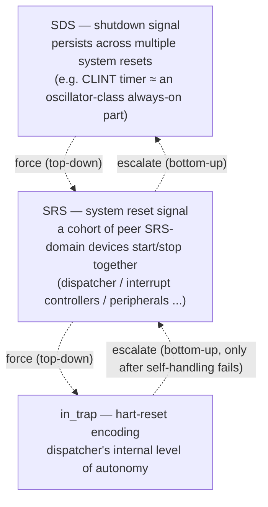
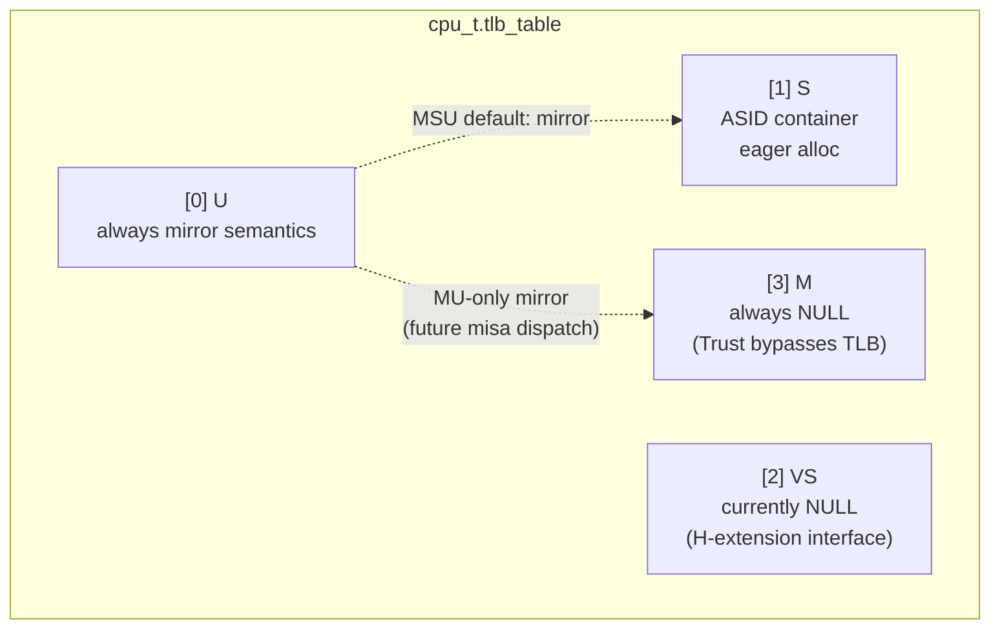
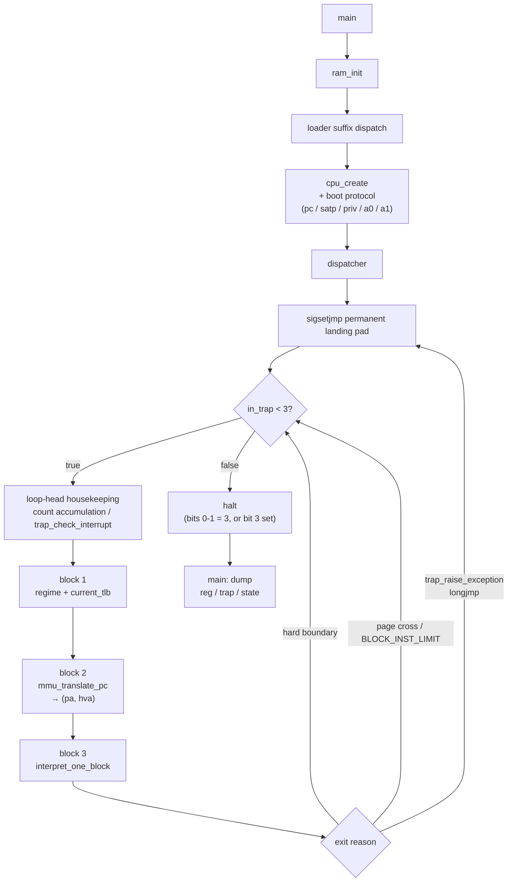
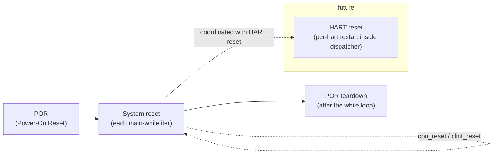
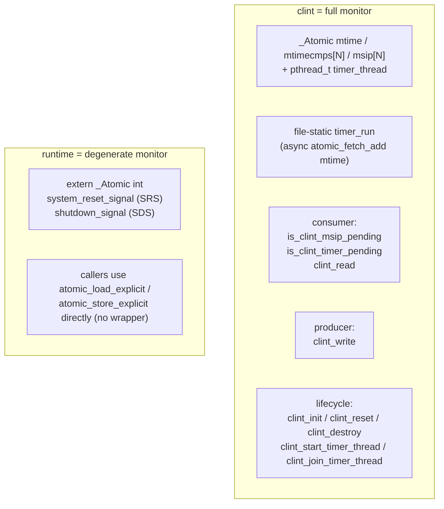

# riscv-jit-emulator

English | [简体中文](./README.md)

> **Note:** this English README lags behind the project state — it currently
> reflects roughly the a_02 close. The [简体中文](./README.md) version is the
> authoritative, up-to-date one; this translation is refreshed less often.

A graduate-level user-space RISC-V JIT emulator, targeting RV32 G plus the
standard compressed extension C, with the goal of booting OpenSBI / small OSes /
FreeRTOS-with-MMU. Milestone a_02 (the interpreter + bus/MMIO stage) is closed
out, with all sub-tasks T1~T6 landed; the project is now entering a_03 (PLIC +
UART external interrupts + virtio-blk + end-to-end verification).


## Design Goals

- ISA: RV32 G (IMAFD_Zicsr_Zifencei) + the standard compressed extension C
- Three-layer JIT architecture: Dispatcher / Translator / JitBackend (asmjit to
  start, with an LLVM OrcJIT interface reserved)
- Host: a Linux user-space process
- SMP is not implemented, but every design is SMP-ready
- 64-bit interfaces are reserved but not implemented


## Signal Hierarchy + Bidirectional Autonomy

The entire runtime is **a cohort of peer devices cooperating**. What
distinguishes them is not "is it the CPU", but **which level of stop signal
they obey**. Stop signals are strictly three-layered:



The hierarchy supports two directions at once, and the two directions are
self-consistent:

- **Force direction (top-down)**: once a higher-level signal is asserted, lower
  levels stop naturally — no individual notification is needed. When shutdown
  comes, the SRS domain and every hart stop with it; when system reset comes,
  the self-handling at each hart is naturally interrupted. High pressure
  arrives, and low pressure yields automatically.
- **Escalate direction (bottom-up)**: **each level first tries to handle the
  situation itself, and only escalates when it cannot**. A hart first tries
  hart-reset autonomy; only if that fails does it set SRS=0. The system-reset
  layer first joins all SRS-domain devices back, then decides "is this severe
  enough to escalate to shutdown" — only if so does it stop SDS-domain threads.

This "self-first, escalate only when insufficient" link makes **every level an
autonomous unit that can resolve itself or call upward for help**.

### The Dispatcher's Dual Identity

In this architecture, the dispatcher is a special device — it carries two roles
at once:

- **Horizontally (peer to other devices)**: the dispatcher is **one** peer
  device in the SRS domain, alongside future PLIC / UART / virtio-blk and so
  on. They are all started/stopped by SRS, and they all follow the "spawn /
  join in pairs" + atomic-flag cooperative shutdown protocol. The dispatcher
  has no special status on this axis.
- **Vertically (the hart execution core, with other peripherals serving it)**:
  the dispatcher is also the one that actually runs guest instructions — other
  peripherals (CLINT / future PLIC / UART / virtio-blk) are all monitors
  (Hoare/Brinch-Hansen paradigm) that **serve** the dispatcher through
  consumer / producer interfaces. The dispatcher reads/writes its own hart's
  `cpu_t` (per-hart, no synchronization needed); whenever it touches shared
  state it goes through monitor interfaces — **synchronization complexity is
  shut inside the monitors**, so the dispatcher keeps pure single-thread
  sequential semantics.

The reason the dispatcher owns the internal hart-reset autonomy (the
hart → SRS escalation level) is precisely this "hart execution core" identity —
when something goes wrong inside the hart, it first tries to restart itself;
only if that truly fails does it escalate to system reset.

### CLINT's Position in the Architecture

CLINT occupies its own large section in this README only because it is the
first monitor instance to be wired up (and currently the only peripheral in
the SDS domain); this is an accident of implementation order, **not a
reflection of its architectural status**. Once subsequent SRS-domain
peripherals (PLIC / UART / virtio-blk and so on) are wired up — they all
follow the same monitor template (consumer / producer interfaces + spawn/join
in pairs + cooperative shutdown) — CLINT's share of the README will naturally
settle back to a size commensurate with the other peripherals.

The three-layer reset lifecycle is this signal hierarchy unfolded along the
time axis, see "Multithreading + Reset Lifecycle"; the monitor model and
cooperative shutdown protocol are in the same section.


## Architecture Overview

The runtime structure can be understood from four viewpoints. This section gives
the overview; the detailed mechanisms follow in later sections, and the
per-file design is in "Project Layout".

### Machine Model (RAM + CPU)

A classical computer can be abstracted as CPU + RAM (I/O concepts such as MMIO
and ports are left aside here). Memory side: `ram` manages the guest physical
memory with a single anonymous mmap, and `loader` places an ELF / raw binary at
its physical address. CPU side: `cpu_t` is pure data (registers / CSRs / the TLB
dispatch table), and `dispatcher` is behavior (the fetch-decode-execute main
loop). Separating "data" from "behavior" keeps the dispatcher stateless — under
SMP, each hart owns one `cpu_t` and one dispatcher thread.

### Thread Model and the Three-Layer Reset Lifecycle

Thread control is "Signal Hierarchy + Bidirectional Autonomy" (top section)
unfolded along the time axis: **POR** (one-shot at process start, SDS-domain
threads power up) / **System reset** (every iteration of the `main` while
loop — SRS-domain devices spawn → run → join) / **HART reset** (the
dispatcher's internal level of autonomy). The current configuration is a
single hart (`dispatcher` invoked directly on the `main` thread) plus one
timer helper thread (SDS domain, the CLINT actor) that asynchronously
accumulates `mtime`.

The monitor model (the Hoare/Brinch-Hansen paradigm) encapsulates the atomic
fields and memory-order choices of shared state behind consumer / producer
interfaces. The `dispatcher` reads/writes its own hart's `cpu_t` (per-hart,
no synchronization needed); whenever it touches shared state it goes through
monitor interfaces — **synchronization complexity is shut inside the monitors**,
so the `dispatcher` keeps pure single-thread sequential semantics and "does
not see" multithreading. See "Multithreading + Reset Lifecycle".

### The Dispatcher Main Loop

Each hart runs one `dispatcher`: a one-time `sigsetjmp` permanent landing pad +
a `while (in_trap < 3)` multi-block loop + loop-head housekeeping. Each iteration
runs three blocks: select the leaf TLB / fetch / enter the execution segment
(currently the interpreter). Exit is governed by the `in_trap` bit-field
encoding. See "Control-Flow Overview" and "in_trap Bit-Field Encoding".

### The Memory Model Inside an Executed Block

Memory access in the execution segment is split into two regimes: REGIME_BARE
(M-mode or a bare satp; bypasses the TLB, identity offset) and REGIME_SV32 (goes
through the leaf TLB + PTE permissions). The separation of run models is
fundamentally a consequence of the memory model.

**Run regime ↔ TLB are mutual constraints (the causal reason the fast/slow path
abstraction even works)**: when translation is in effect, the TLB is not just a
GVA→HVA cache — it also doubles as a "run-regime dispatch table at the
granularity of a leaf TLB". The dispatcher selects a leaf TLB pointer based on
`priv` / `satp.mode` and hands it to the execution block; the execution block
only reads / writes through that pointer and **does not care which privilege
level this leaf TLB came from**. Through these mutual constraints,
**privilege-sensitivity is pushed out of the hot path entirely, into the MMU
walker slow-path helper** — so the fast path is not "skipping the privilege
check"; structurally there is no privilege to check. This is structural
simplicity earned by design, not corner-cutting.

Going further, the asymmetry on a load / store hit: a load hit dereferences
`*hva` directly, while a store hit must go through `store_helper` because of
side effects such as the LR/SC reservation. The real causal chain is not
"performance vs. side effects" but "TLB caches hva + MMIO doesn't enter the
TLB → the hit path structurally has no RAM/MMIO branch → a load can return
`*hva` directly; a store must go through the helper because LR/SC + future
SMC side effects force it". See "TLB Topology".

> The JIT subsystem (the three-layer Dispatcher / Translator / JitBackend, the
> jit_cache, and SMC detection) is planned design, not yet implemented (see the
> not-implemented list at the end of "Implemented So Far"); it is outside the
> scope of this README's "current progress". Key design points are already
> locked in: **the block cache key is PA** (not VA, so `sfence.vma` does not
> invalidate JIT blocks, and the same PA segment's translation is reusable
> across M / S modes); **all block exits go through dispatch**, no block
> chaining in v1; **SMC integral-page invalidation + lazy invalidation**
> (write-protect + the SIGSEGV handler only sets an atomic flag, the actual
> cleanup is done by the dispatcher when it next enters the block, since the
> handler is constrained by async-signal-safety and cannot call malloc / take
> locks).


## TLB Topology

`cpu_t.tlb_table[4]` is a four-slot dispatch array, indexed by the RV privilege
encoding:



- **[0] U** always has mirror semantics (mirrors [1] S or [3] M, depending on
  misa). Even on a MU-only CPU where U mirrors M and the slot is NULL (because M
  runs bare and does not consult the TLB), the "mirror" semantics itself does
  not change. Mirror allocation has two paths:
    - Initialization — `cpu_create` dispatches by misa (MSU mirrors [1]; MU-only
      mirrors [3])
    - Runtime — the H extension (VS / VU switching) maintains the mirror via the
      corresponding csr_helper
- **[1] S** — the ASID array container (`tlb_t **`); the container is eagerly
  allocated by `cpu_create`, while entries are lazily allocated by the walker on
  first access to a given ASID
- **[2] VS** — NULL in v1 (no H extension); takes the same shape as [1] when the
  H extension is active
- **[3] M** — always NULL. The Trust regime (M-mode, or any privilege level with
  a bare satp) goes straight through identity + the IS_GPA_RAM check and needs
  no TLB (a real CPU also bypasses the MMU/TLB in bare mode)


## in_trap Bit-Field Encoding

`hart->trap.in_trap` is a bit-field encoding (a host-side protocol; multiple
signals may be superimposed):

| Bit field | Value range | Meaning                                                            |
|-----------|-------------|--------------------------------------------------------------------|
| bit 0-1   | 0..3        | actual trap nesting depth: 0/1/2 ordinary nesting; 3 = triple fault |
| bit 2     | 4..7        | reserved gap, preventing future expansion of the nesting bits from colliding with the fields below |
| bit 3     | 8..15       | internal exception / internal normal halt (host-side protocol, not an RV trap) |
| bit 4     | 16..31      | reserved gap                                                       |
| bit 5+    | 32+         | future halt extensions                                             |

Design philosophy (bit-wise superposition):

- The interpreter / JIT internally looks only at bits 0-1 (the trap-nesting
  view); `in_trap < 3` means "keep going"
- The higher bits (bit 3+) are written only by the dispatcher; the interpreter /
  JIT never touches them
- The `while (in_trap < 3)` test doubles as a safety gate: once a higher bit is
  set the value becomes ≥ 8 > 3 and the dispatcher exits automatically
- The reset path clears only bits 0-1; the higher bits are decided explicitly by
  the reset flow according to the halt type

Unrelated to the RV Smdbltrp extension (`CAUSE_DOUBLE_TRAP=16`) — Smdbltrp is an
architectural trap-delivery mechanism, while in_trap is the host emulator's exit
protocol; the two coexist but their semantics do not overlap.


## Control-Flow Overview




## Multithreading + Reset Lifecycle

This section is "Signal Hierarchy + Bidirectional Autonomy" (top section)
unfolded at the implementation level — the `main` flow pseudo-code / the
three-layer reset timing / monitor behavior / the cooperative shutdown
protocol, in the concrete form we have at a_02 close. After a_02 T5 landed,
the project evolved from single-threaded (the hart thread solely advancing
mtime) to multithreaded (the hart thread + a timer helper thread running
concurrently, synchronized with an atomic mtime + the monitor model). Error
handling is unified through the SRS / SDS signal channel, with **no separate
error path** — normal exit and the various failure modes therefore have the
same shape. For the detailed protocols see `src/dummy.txt §7` (the monitor
model) + `§12` (whoever spawns, joins); for signal semantics see the
top-of-file doc in `src/runtime.h`.

### Three-Layer Reset Lifecycle



- **POR (Power-On Reset)** — once per process: ram_init / clint_init /
  cpu_create (which writes the hardware reset default state) / explicitly set
  SRS=1 SDS=1 / start the timer helper thread (clint_start_timer_thread). The
  timer helper thread keeps running across system resets (matching real
  hardware, where the RTC oscillator does not lose power or stop); it exits only
  with SDS
- **System reset** — each main-while iteration: cpu_reset (clears
  regs/pc/mstatus/in_trap, keeps the hardwired hartid) + clint_reset (clears
  mtimecmp/msip back to their sentinels, **mtime untouched, timer untouched**) +
  dispatcher(hart) + distinguishing an SR-only re-iteration from a shutdown exit
  (currently simplified to always shut down, with an `if(0)` placeholder)
- **HART reset** — a per-hart restart inside the dispatcher (future; a comment
  placeholder at the end of dispatcher.c); under SMP, one hart failing does not
  affect the others

### `main` Flow Pseudo-Code (current form, a_02 T5 landed)

```c
int main(int argc, char **argv) {
    /* === POR === */
    ram_init();                   // failure → main returns 1
    clint_init();                 // failure → main returns 1 (via destroy chain + return)
    cpu_t *hart = cpu_create();   // failure → main returns 1

    /* explicitly set the lifecycle signals to 1 (redundant with runtime.c's
       BSS-1 init fallback, but explicit is more readable) */
    atomic_store_explicit(&system_reset_signal, 1, memory_order_release);
    atomic_store_explicit(&shutdown_signal,     1, memory_order_release);

    /* start the timer helper thread; on failure it internally does fprintf +
       set SRS=0 + SDS=0; main does not check, has no separate error path —
       errors flow through the SRS/SDS signal channel */
    clint_start_timer_thread();

    /* === System reset === */
    while (atomic_load_explicit(&system_reset_signal, memory_order_acquire)) {
        cpu_reset(hart);
        clint_reset();

        /* placeholder: spawn all SRS-controlled threads — spawn/join each iter,
           started/stopped in sync with the system reset (e.g. a future
           multi-hart setup does pthread_create per hart; other SRS-controlled
           helper threads go here too) */
        dispatcher(hart);                   /* single hart, direct call; tri-fault sets SRS=0 internally */
        /* placeholder: join all SRS-controlled threads — dual of the spawn
           above (the hart thread + other SRS-controlled helper threads all
           join here) */

        /* SR-only vs shutdown branch (currently simplified to always shut down) */
        if (0 /* SR_only placeholder; a real reset-and-re-iterate goes here later */) {
            atomic_store_explicit(&system_reset_signal, 1, memory_order_release);
            continue;
        } else {
            atomic_store_explicit(&shutdown_signal, 0, memory_order_release);
            break;
        }
    }

    /* === POR teardown === */
    clint_join_timer_thread();    /* the timer thread exits on observing SDS=0, then is joined */
    /* dump (reg + trap + state) */
    clint_destroy();
    cpu_destroy(hart);
    ram_destroy();
    return 0;
}
```

All three exit paths converge on `while → join → cleanup → return 0`:

1. **Normal exit** (dispatcher tri-fault): the dispatcher function ends with
   `atomic_store(&SRS, 0, release)` → the main while loop exits → the else
   branch sets SDS=0 → break → join (normal exit) → cleanup
2. **Timer spawn failure**: `clint_start_timer_thread` internally does
   `atomic_store(&SRS, 0) + atomic_store(&SDS, 0)` → the main while loop is not
   entered because SRS=0 → SDS is already 0 (the else branch never runs) → join
   (pthread_t = BSS 0, glibc returns ESRCH; one fprintf line, not fatal) →
   cleanup
3. **Failure inside the timer routine** (a clock_nanosleep / clock_gettime
   errno): the timer routine likewise sets SRS=0 + SDS=0 + returns NULL → the
   main while loop exits → the else branch sets SDS=0 (already 0, a no-op) →
   break → join (the timer thread has already returned, a normal join) → cleanup

Error handling uniformly flows through the SRS/SDS signal channel, **with no
separate error path** — the destroy chain is written once, in the cleanup
section, and not repeated on the spawn-fail / dispatcher-fail paths.

### Monitor Behavior (dummy.txt §7)

From the Hoare/Brinch-Hansen concurrent-monitor paradigm — each shared-state
module encapsulates its internal atomic fields + memory_order, exposing only
consumer / producer interfaces; callers are not aware of the internal
synchronization.

> **Position note** (echoing "CLINT's Position in the Architecture" at the
> top): CLINT is currently the only peripheral in the SDS domain; it takes up
> a large share of this section only because it is the first complete monitor
> instance. Once subsequent SRS-domain peripherals (PLIC / UART / virtio-blk
> and so on) come online, they will all follow the same template below
> (consumer / producer interfaces + spawn/join in pairs + cooperative
> shutdown), and CLINT's share of the README will naturally settle back.

The project has two instances:



- **clint** = a full monitor: a three-function lifecycle (init / reset /
  destroy) + a spawn/join pair (clint_start_timer_thread /
  clint_join_timer_thread, called explicitly on the main side, not buried inside
  destroy); the file-static timer_run routine runs as an internal actor, holding
  no cpu_t and touching only shared fields. memory_order: producer release
  (atomic_fetch_add &mtime) / consumer acquire (is_clint_timer_pending /
  clint_read), the pair establishing happens-before
- **runtime** = a degenerate monitor (a single-flag simplification): the
  `extern _Atomic int` flags are read and written directly, with no wrapper; a
  single field has no cross-field consistency concern, so interface functions
  are not enforced. The "SDS implies SRS" trigger contract — before setting
  SDS=0 one must first set SRS=0 ("tell all helper threads to exit" implies "the
  system itself must exit too")

External modules (csr.c / dispatcher.c / bus.c, etc.) **do not perform
`atomic_*` operations on clint's internal fields directly**; they always go
through the consumer/producer interfaces. For example, the synthesized read in
csr_mip_read goes through `is_clint_msip_pending(hartid) |
is_clint_timer_pending(hartid)`, not a direct
`atomic_load_explicit(&clint.mtime, ...)` (the latter would break the monitor's
encapsulation, violating dummy.txt §7).

### Cooperative Shutdown Protocol (dummy.txt §12 + runtime.h)

```
spawn caller (main)        worker thread (timer_run)       lifecycle signal
-------------------        -------------------------       ----------------
SRS = 1, SDS = 1                                           runtime.c
clint_start_timer_thread() --> pthread_create
                                                           SRS = 1, SDS = 1
                           --> while (atomic_load(SDS))
                                 accumulate mtime
                                 ...
normal: dispatcher tri-fault                               SRS = 0 (dispatcher)
main while loop exits                                      SDS = 0 (main else branch)
                           <-- timer observes SDS=0, exits
clint_join_timer_thread()  <-- pthread_join
cleanup chain
return 0
```

- **No pthread_cancel / pthread_kill**: a deferred cancel deep in the
  interpreter / JIT call stack risks half-updated state; pthread_kill actually
  sends a signal that kills the whole process rather than the thread.
  Shutdown is always cooperative (atomic flag + periodic worker check + main
  join)
- **No SIGINT/SIGTERM signal handler**: the default Ctrl-C kill of the process
  is enough for now (atomic_fetch_add is a single lock-prefixed instruction, so
  killing the process does not corrupt data); revisit once the reset machinery
  matures (a_03+)
- **Destroy functions are pure cleanup**: they contain no pthread_join (to avoid
  implicitly blocking control flow); the spawn/join pair is exposed separately
  and joined explicitly by the spawn caller


## Project Layout


### Program Entry + Global Config


#### main.c

The program entry point, with a three-phase lifecycle: POR (`ram_init` /
`clint_init` / `cpu_create` + explicitly set SRS/SDS + start the timer helper
thread) / system reset (each `while` iteration: `cpu_reset` / `clint_reset` +
call `dispatcher(hart)`) / POR teardown (join the timer thread + dump + the
destroy chain). See "Multithreading + Reset Lifecycle".

The current single hart calls `dispatcher(hart)` directly on the `main` thread,
spawning no pthread for it; the timer helper thread is the only genuinely
concurrent thread today. The trailing dump section is temporary — it prints
registers / trap / state for fixture comparison after a run, to be replaced
gradually once a UART + a real unit harness are in place.


#### config.h

The project's own compile-time macros (RAM config / TLB topology / IALIGN /
block soft boundary / CLINT layout / TIMEBASE / MAX_HARTS). Runtime variables
(`host_ram_base` and the like) live in `ram.h`.


#### riscv.h

A central collection of RISC-V specification definitions (privilege encodings /
CSR addresses / PTE bit fields / mstatus fields / Exception Codes). Incremental
principle: add one when it is actually used. Division of labor with `config.h`:
`config.h` = "how we configure", `riscv.h` = "what the spec defines".


#### loader.{c,h}

Guest program loading, three functions: `guest_load_bin / guest_load_elf /
guest_is_elf`.

ELF loading does a strict 6-item sanity check (magic / class=ELFCLASS32 /
data=ELFDATA2LSB / machine=EM_RISCV / type=ET_EXEC / phentsize+phnum).

Three semantic boundaries: **does not move the ELF** (segments placed strictly
at `p_paddr`, out-of-range is a failure), **does not handle the entry point**
(the caller guarantees it = `GUEST_RAM_START`), and **does not clear BSS** (the
guest startup is responsible) — the emulator is just an observer of physical
addresses, not an OS loader, and does no relocation.


#### dummy.txt

The cross-file protocol ledger (`.txt`, not compiled, but part of the source —
it collects "runtime mechanisms / ABI conventions / call-order contracts that
span multiple files"), 13 sections:

- **§1 sigsetjmp / siglongjmp protocol** — the dispatcher's one-time permanent
  landing pad + helper longjmp return + unified register protection; path D
  interrupts go through the dispatcher main frame return-based; the final part
  covers the **true mechanism of load/store asymmetry** (the TLB caches hva +
  MMIO does not enter the TLB → the hit path is structurally branch-free; a load
  hit does *hva, a store hit goes through store_helper because of the forced
  reservation+SMC side effects)
- **§2 global x0 register encoding** — read = the literal 0, write = a dead
  store to a local garbage variable (so IR / backend stay unaware of x0's
  specialness)
- **§3 satp ASID validity contract** — csr.c is the producer (WARL truncation),
  the dispatcher is the consumer (indexes `tlb_table[priv][asid]` directly with
  no bounds check)
- **§4 the TLB as the block-entry dispatch mechanism** — bare mode also goes
  through the TLB, unifying dispatch logic across privilege levels and letting
  JIT translation products be reused across privilege levels
- **§5 error-reporting style** — exactly two lines on stderr per failure (inner
  why + outer where); no enum error codes, no `*_strerror` translation table,
  modules do not call `exit`
- **§6 the five-category naming of CSR physical storage fields** — the `_`
  prefix / `x` prefix / no prefix / `_sw`-`_hw` suffix, four naming categories
  (the 5th category = a software-writable subset + a synthesized read from
  async sources, e.g. `_mip_sw`)
- **§7 multithreading vs. multi-HART terminology + the monitor model** —
  per-hart / shared / thread-local tristate; shared fields are always atomic;
  shared modules encapsulate consumer/producer interfaces (the Hoare/Brinch-
  Hansen paradigm)
- **§8 the PMP / MMU / memory three-layer relationship** — the mmu only
  translates GVA→PA; ram+bus do the real access; PMP is not implemented long
  term
- **§9 the cause-0 path + the "0 = success" interface convention** —
  mmu_translate_pc / mmio_*_helper / device read/write share an encoding; the
  underlying rule of the longjmp-vs-return mechanism
- **§10 helper granularity + the may-longjmp boundary + JIT register
  preservation** — mmu_walker_helper_* / lsu_*_helper / amo_*_helper each have
  their own entry (granularity = one instruction, not merged); the JIT
  translator stores the mapped host registers to cpu_t before every may-longjmp
  call
- **§11 the predicate `is_*` naming** — query functions with boolean semantics
  uniformly take the `is_` prefix
- **§12 thread lifecycle — whoever spawns, joins** — spawn / join are exposed as
  a pair, called explicitly by the creator; `*_destroy` is pure cleanup and
  contains no `pthread_join`
- **§13 the typedef family type discipline** — `uxlen_t` / `ixlen_t`
  (XLEN-tied) + `u32_t` / `u64_t` (spec-pinned); a grep trail for the RV64
  switch, not a runtime XLEN abstraction


### Core (`src/core/`)


#### cpu.{c,h}

The single-hart guest CPU state (`cpu_t`). `regs[32]` is a single contiguous
array; the physical position `regs[0]` holds the pc (x0 takes a special path and
never touches it). `tlb_table[4]` is the four-slot dispatch array (see
[TLB Topology](#tlb-topology)).

The split into `per_hart_info` (embedded) / `shared_info` (a pointer to a
`static const` in cpu.c) reflects SMP-readiness — in a heterogeneous SMP
(1×MU + 4×MSU), `misa / mhartid` differ per hart while `mvendorid / marchid /
mimpid` are shared across the whole machine.


#### decode.{c,h}

RV32I + RVC instruction decoding, a pure function (does not read / write
`cpu_t`), shared by the interpreter / the future translator. 49 op_kinds (RVC
reuses the same-origin RV32I ops, with `pc_step` distinguishing the length).

`is_block_boundary_inst` is a shared inline, keeping the interpreter and the
future translator 100% consistent on hard-boundary judgment (`-Wswitch-enum
-Werror` forces full coverage).


#### interpreter.{c,h}

The interpreter body. `interpret_one_block` does a sequential fetch + decode +
switch-execute, until one of five exit conditions: `OP_UNSUPPORTED` / a hard
boundary / an exception longjmp / the `BLOCK_INST_LIMIT` runaway guard / a
cross-page soft boundary.

PC maintenance is data-driven (decode decides `pc_step` once, the fetch loop
advances it uniformly at the tail); a control-flow case that describes its own
pc goes through the `WRITE_PC_OR_TRAP` macro, which includes an IALIGN alignment
check + a trap placeholder.

The count synchronization contract: on a may-trap path the sync happens inside
the case before trap_raise; the boundary path syncs as a fallback in the `out`
section; a pure case (pure arithmetic / logic) needs no sync, consistent with RV
precise traps (the trap-triggering instruction itself does not count).


#### dispatcher.{c,h}

The hart main loop. Shape: **a one-time sigsetjmp permanent landing pad + a
while(in_trap<3) multi-block loop + loop-head housekeeping**. Each iteration runs
3 blocks:

- **block 1** — compute the dispatch packet `(regime, current_tlb)` from
  `priv + xatp.mode`
- **block 2** — `mmu_translate_pc` fetch
- **block 3** — `interpret_one_block` (the future `jit_cache_hit` takes priority)

A helper-side longjmp back to the sigsetjmp landing pad skips the loop tail, so
the housekeeping (count accumulation / future mtime advancement / interrupt
checking / `perf_advance`) must be moved to the loop head — making it the same
shape as the normal continue path. Exit is governed by the `in_trap` bit-field
encoding (see [in_trap Bit-Field Encoding](#in_trap-bit-field-encoding)).


#### csr.{c,h}

A big CSR switch + per-field r/w file-static helpers. `csr_op` is the unified
entry for the 6 CSR instruction variants (CSRRW/RS/RC + their 3 immediate
variants).

The entry check uses the permission bit fields built into `csr_addr`:
`bits[11:10]` = RO / `bits[9:8]` = the minimum required privilege; on failure it
uniformly traps with cause 2.

The 5-category organizing philosophy: category 1, extension CSRs (F/V/Debug),
will move to `isa/`; category 2, cross-module CSRs (`satp`), keep their fields
in `cpu_t` and their functions in csr.c; category 3, core CSRs, keep their
fields in `trap_csrs_t`; category 4, boot-info RO CSRs, split into per-hart +
shared; category 5, temporary debug CSRs (`tohost / privrd`), do streaming
output and the whole section will be deleted once a UART is in place.


#### trap.{c,h}

The trap system, with two layers of responsibility. The architectural-semantics
layer does not longjmp: `trap_set_exception_state` (the synchronous path — writes
xcause/xtval/xepc + switches the priv mstatus fields + `regs[0] = xtvec`,
medeleg routing) and `trap_set_interrupt_state` (the asynchronous path — mideleg
routing + vectored mode base+4*cause). The control-flow layer:
`trap_raise_exception` is `_Noreturn` and does a longjmp (for use deep in helper
stacks; internally `trap_set_exception_state + siglongjmp` back to the
dispatcher's one-time landing pad); `trap_check_interrupt` is return-based
(polled every iteration in the dispatcher main frame, no longjmp). The
non-symmetric shape — exception longjmp vs. interrupt return — is by design
(dummy.txt §1 path D).

`deliver_priv` takes effect by medeleg (an M-mode trap always M; a U/S-mode trap
with bit=1 → S). When `in_trap >= 3` it does not deliver, keeping the fields at
the second occurrence's state as the root cause for the main-side dump.


#### mmu.{c,h}

The Sv32 MMU walker + the walker helpers. **A return to the dummy.txt §8
three-layer model** — the mmu only translates + routes, it does not do the "real
access" itself: on the RAM path the walker fills the TLB and the caller does a
direct `*hva` (load) / `store_helper` (store); on the MMIO path it calls
`mmio_*_helper` directly (not entering the TLB).

The execution regime split (the project's internal "two hardware-logic
families" classification): **REGIME_BARE** (`priv == M`, or any priv with a bare
satp; bypasses the TLB, identity) / **REGIME_SV32** (the
`tlb_table[priv][asid]` leaf TLB + PTE permission semantics). The interface
layer is simplified — the downstream `mmu_translate_pc / interpret_one_block /
lsu_*_helper` only take `current_tlb` (NULL encodes BARE).

`check_perm` (`mmu.h` `static inline`) is shared in three places (fetch / load /
store) and, being same-origin with the walker, will not drift between two
copies. **hw-managed A/D** (non-Svade): the walker only **computes** the
suggested post-set new_pte and returns it to the caller via an out-parameter;
the caller does the real memcpy write-back to the PT only on the RAM path; the
MMIO path does not write back (a simplified version consistent with Spike's "do
not set on fail"). The TLB does not store the PTE physical address, so on a
store hit with D=0 it falls back to the walker to re-set.

The `mmu_walker_helper_*` family (load/store + future amo_lr/sc/amo_*) is **JIT
granularity by design** — each access instruction has one helper entry, the JIT
does not merge them; see dummy.txt §10.


#### tlb.{c,h}

The TLB data structure (`tlb_e_t`, 16 B, with field positions aligned to the RV
PTE) + the two functions `tlb_alloc` / `tlb_clear`. `tlb_table[4]` is the
four-slot dispatch array (see [TLB Topology](#tlb-topology)).

The fast path exposes no `tlb_lookup` function — a hit is inlined by the caller
(V + tag + `check_perm`), and only a miss calls the walker helper.
`tlb_clear(NULL)` is a C-standard no-op, so the sfence helper needs no
null-check.


### ISA Implementations (`src/isa/`)


#### sfence.{c,h}

`sfence_vma_helper` (extern, slow path). The RV-spec 4-combination simplification
scheme 4.a: `rs1=x0 + rs2!=x0` clears a single ASID, the other three
combinations all clear everything (over-flushing is allowed by the RV spec;
sfence is not a hot path, so no loss).

The interface passes two groups, `(vaddr_val, asid_val)` + `(rs1, rs2)` — the RV
spec uses `rs1=x0` as a **magic encoding** for "ignore vaddr", but `vaddr_val=0`
is also a legal real value; the helper, seeing only register values, cannot tell
them apart and must look at the register numbers.


#### lsu.{c,h}

The true mechanism of load / store asymmetry (dummy.txt §1, final part). Current
form:

- `lsu_load_helper` / `lsu_store_helper` (inline top level in `lsu.h`, called
  directly by the interpreter): BARE inlines the RAM/MMIO routing / an SV32 TLB
  hit goes straight through (load `*hva`, store calls store_helper) / an SV32
  miss falls back to `mmu_walker_helper_*`
- `store_helper` (extern in `lsu.c`, **HVA-based**): the RAM write + an LR/SC
  reservation-clear placeholder + the entry point for the future SMC side
  effect; shared by three callers (BARE / SV32 hit / the walker_helper RAM path)
- the MMIO path does not go through store_helper, calling `mmio_*_helper`
  directly (skipping reservation+SMC, since MMIO does not participate)
- the `LOAD_MISALIGN_CHECK` / `STORE_MISALIGN_CHECK` implicit contract: the
  caller (the interpreter case entry) does it in one place, and all helpers
  trust that the caller has already checked

A future improvement is to inline `store_helper` (a naming clarification: this
is **not** "store becoming a fast path" — all of its operations remain
slow-path in nature; only the linkage form changes from extern to inline,
eliminating the function call/ret cost on every store).


### Platform (`src/platform/`)


#### ram.{c,h}

Host mmap management. Two globals, `host_ram_base` + `gpa_to_hva_offset =
host_ram_base - GUEST_RAM_START`, let the fast path turn gpa → hva with a single
addition and no cast.

The `IS_GPA_RAM(pa)` macro (an unsigned-underflow idiom) uniformly wraps the "PA
is in the RAM region" judgment, shared by 7 call sites (mmu / lsu).

`MAP_NORESERVE` does not pre-charge swap commit; `MADV_NOHUGEPAGE` explicitly
rules out transparent huge pages to keep 4 KB granularity for the future SMC
detection (smc.c's `page_dirty` bitmap is indexed by 4 KB). `mmap(NULL, ...)`
returns a kernel-allocated, 4 KB-aligned address — the interpreter's cross-page
guard depends on this invariant.


#### bus.{c,h}

The MMIO registry + dispatch. The `mmio_dev_t` struct (gpa_start / gpa_end /
ctx / read / write / name); `bus_register_mmio` registers + checks half-open
interval overlap; `mmio_read_helper` / `mmio_write_helper` do a linear-scan
dispatch (BUS_MAX_DEV=16, a static array).

Interface form: **_Noreturn-on-failure** — on a bus failure (no match / device
rejection) it does a trap_raise longjmp internally and does not return to the
caller; a device read/write fn returns a cause (0 = success / non-0 = cause),
which the bus passes through to trap_raise (the same form as mmu_translate_pc).
See dummy.txt §8 + §9.

The `mmio_dev_t` struct **contains no R/W/X/execute / tick / has_pending_irq
fields** — those three things belong to independent dimensions (PMP / physical
fetchability / device side effects), see dummy.txt §8.

Future-extension placeholders (in the top-of-file comment of bus.h): (a) a
fetchable-range table (when ROM/flash is enabled); (b) device unregister +
hot-plug (RCU / atomic pointer swap).


#### clint.{c,h}

The CLINT (Core-Local Interruptor) MMIO device — mtime / mtimecmp[N] / msip[N],
all `_Atomic` (satisfying dummy.txt §7, "shared fields are always atomic"; on a
single hart they compile to plain load/store, zero overhead). The layout matches
the SiFive CLINT + QEMU virt (CLINT_BASE=0x02000000, mtimecmp @+0x4000 per hart,
mtime @+0xBFF8 global).

`mtime` is advanced asynchronously by the file-static timer helper thread
(clock_nanosleep ABSTIME, waking roughly every ~1 ms to atomic_fetch_add
TIMEBASE_PER_WAKE; scheme C). clint is the project's first full monitor
instance: a three-function lifecycle (init / reset / destroy) + a spawn/join
pair (clint_start_timer_thread / clint_join_timer_thread). A `size != 4` /
`off & 3 != 0` / an out-of-range offset all yield an access fault.


## Implemented So Far

- The complete RV32 IM + RVC instruction set (49 op_kinds, RVC reuse)
- M / S mode CSRs (mstatus stored physically as 64 bits with split access /
  sstatus masked view / medeleg-driven trap delegation; the mip/mie/sip/sie
  interrupt CSRs — `_mip_sw` software-writable subset + synthesized read from
  async sources, `_mie` masked view; csr_op entry checks priv + RO write)
- The Sv32 MMU walker (incl. hw-managed A/D, 4 KB + 4 MB superpages; **the
  walker does not write back the PT, the caller writes back on the RAM path, the
  MMIO path does not write back**, consistent with Spike's "do not set on fail")
- The mmu / lsu / bus three-layer model (dummy.txt §8) — the mmu only translates
  + routes, lsu does the real access after the PA, bus dispatches MMIO; the
  **mmu_walker_helper_\*** family is JIT granularity by design (§10)
- The TLB four-slot, two-level ASID index (per-priv isolation / U mirror /
  sfence.vma full clear / single-ASID clear); **MMIO does not enter the TLB**,
  keeping the hit path structurally branch-free
- The LSU (lsu_load/store_helper inline top level + store_helper HVA-based
  extern; the LOAD/STORE MISALIGN_CHECK implicit contract; SUM/MXR perm check
  shared in three places)
- The trap system — exception: medeleg-driven `deliver_priv` / mret/sret really
  switching the priv mstatus fields / **PRIV_CHECK_OR_TRAP** checking priv at the
  MRET/SRET/SFENCE.VMA entry; interrupt: `trap_check_interrupt` wired into the
  top of the dispatcher loop + mideleg routing + vectored mode (mtvec/stvec
  mode=1 really wired, base+4*cause)
- The dispatcher (a sigsetjmp permanent landing pad + while(in_trap<3) + loop-
  head housekeeping + the count synchronization contract; a **loop-top pc IALIGN
  fallback** as a single source catching errors on every pc-write path,
  dummy.txt §9)
- The in_trap bit-field encoding (bits 0-1 trap nesting / bit 3 internal halt /
  higher bits reserved)
- Cross-page protection (after the interpreter advances, hva_pc crossing 4 KB →
  leave the block, the dispatcher re-dispatches)
- The bus + CLINT MMIO (the mmio_dev_t registry + linear dispatch; CLINT
  mtime/mtimecmp/msip `_Atomic`, layout matching QEMU virt + SiFive CLINT)
- The timer helper thread asynchronously advancing the atomic `mtime`
  (clock_nanosleep ABSTIME, scheme C) + the three-layer reset lifecycle + the
  runtime degenerate monitor (the two SRS/SDS atomic flags) + the whoever-spawns-
  joins protocol
- The register-width typedef family (`uxlen_t` / `ixlen_t` / `u32_t` / `u64_t`;
  a grep trail for the RV64 switch, dummy.txt §13)
- The debug character trace (`_` refetch / `E` exception / `t/s/e`
  time/soft/ext intr; on stderr, auto line-wrap at the DEBUG_TICK threshold 80)

Not yet implemented (later milestones): the JIT subsystem (Translator / IR /
jit_cache / code_cache / SMC, a_05+) / PLIC / UART / virtio-blk / boot ROM
(a_03+) / the A-extension LR/SC/AMO / F/D-extension floating point / the
a_02_end end-to-end hello world (depends on a_03's UART + PLIC) / long-term
TODO: graceful Ctrl-C interruption, mstatus.TSR/TVM control-bit traps, WFI
implementation.


## Build + Run

Dependencies:

- CMake ≥ 3.10
- gcc / clang (host compilation; AddressSanitizer on by default in Debug)
- riscv64-unknown-elf-gcc (cross-compiling fixtures; `-march=rv32imac
  -mabi=ilp32`)

Build:

```bash
cmake -B cmake-build-debug -DCMAKE_BUILD_TYPE=Debug
cmake --build cmake-build-debug
```

Run a fixture:

```bash
make -C tests                                                # rebuild all fixture .bin/.elf
./cmake-build-debug/jit-emu tests/a_01/a01_3/01_arith_basic/out.bin
```

Under CLion Debug, the environment variable
`ASAN_OPTIONS=abort_on_error=1:detect_leaks=0` is required — LSan collides with
gdb's ptrace and would fatally exit 1, looking like a program bug but actually a
toolchain limitation; Run mode (no gdb) does not need it.


## Test Organization

Each fixture is a self-contained directory, named `NN_descriptive_name[_reject]/`:

```
tests/a_01/a01_<N>/<NN>_<name>/
  stub.S       (RV32 assembly source; some fixtures also have a main.c)
  Makefile     (riscv64-unknown-elf-gcc cross-compile)
  link.ld      (linker script, origin 0x80000000)
```

The `_reject` suffix marks a negative test (verifying that a loader validation
branch is actually reached). Each sub-milestone gets at least one fixture, and
they accumulate into a regression suite.


## License

To be determined.
