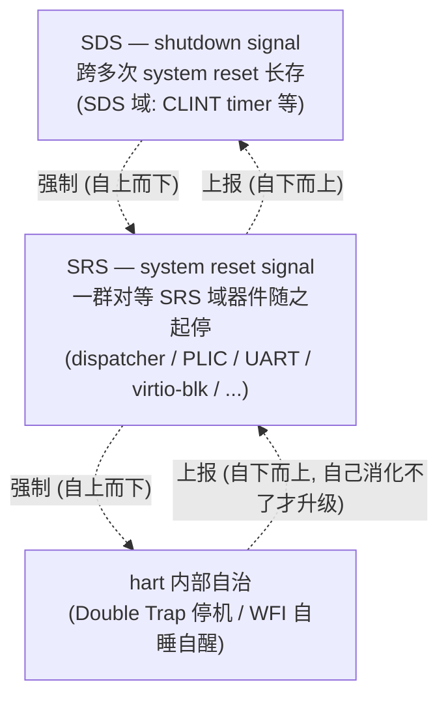
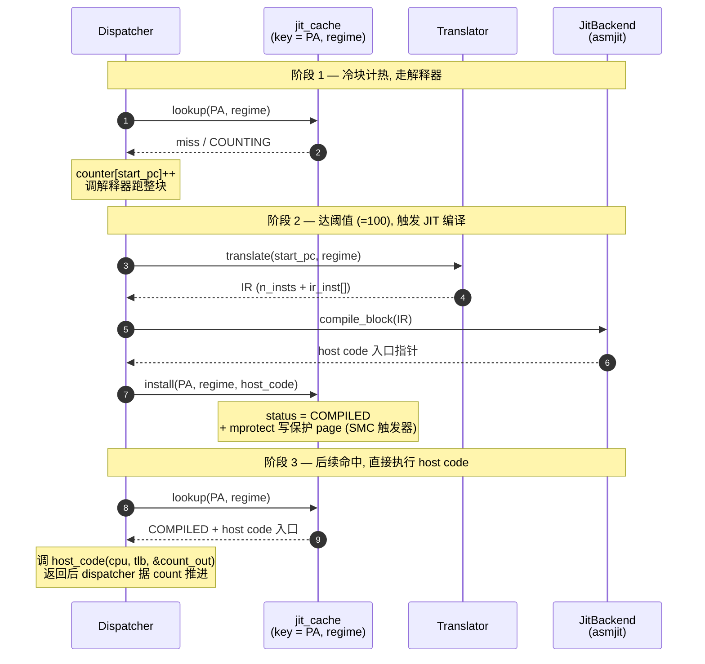

# riscv-jit-emulator

[English](./README.en.md) | 简体中文

研究生级别的 RISC-V 用户态 JIT 模拟器, 目标 ISA 为 RV32 G (IMAFD_Zicsr_Zifencei) 加标准压缩扩展 C, 跑通 OpenSBI / 小型 OS / FreeRTOS-with-MMU 等 guest 软件。当前形态 (`66c9cf3`, b_03 milestone 收尾): JIT 子系统端到端落地, 多 hart SMP 支持完整, 平均 JIT/解释器加速 3 倍 (几何均值), 大块最高 10 倍。

## 项目目标

| 维度       | 现状                                                                                |
| ---------- | ----------------------------------------------------------------------------------- |
| 目标 ISA   | RV32 IMAC + Zaamo + Zalrsc + Zicsr + Zifencei 已实装;F/D 推后, Vector 不在目标   |
| 特权级     | M / S / U 三特权级实装, 含 Sv32 MMU 跟完整 trap delegation (medeleg / mideleg)       |
| 多 hart    | `--smp N` 支持, `MAX_HARTS=8`, per-hart pthread, SMP-aware JIT 缓存 (EBR RCU)        |
| Host       | Linux 用户态进程, x86_64;JIT 后端为 asmjit, LLVM OrcJIT 接口预留                    |
| 设备       | CLINT / PLIC v1.0.0 / ns16550a UART / virtio-mmio blk legacy / test_dev (fixture)   |
| 测试套件   | 146 fixture (累积自 a_01 起), 三 build_type (Debug+ASan / Release / Tsan) 全 PASS  |

不在目标内: H 扩展 (虚拟化), PMP, AIA / IMSIC, 现代 PLIC v1.1, virtio multi-queue / modern v1.1 三 PFN 形态。

## 架构概览

整个运行体被组织为一组**对等器件**, 由**信号层级**支配, 经 **monitor 模型**协同。这套设计在四个视角上展开: 机器模型与线程模型 (§main) / dispatcher 主循环 (§hart) / 运行块内存模型 (§访存) / JIT 三层架构 (§JIT)。下面是核心论述, 完整推导见 `notes/Demo/SoftwareArchitecture_v3.md` (本地材料)。

### 信号层级 + 双向自治

停机信号严格三级, 区分**自上而下的强制方向**跟**自下而上的上报方向**:



强制方向: 高级信号一旦确立, 低级层次自然停止, 无需逐个通知。要 shutdown, SRS 域跟各 hart 自然随之停;要 system reset, 各 hart 的自处理自然中断。

上报方向: 每一层先尝试自己消化, 消化不了才上报升级。hart 先尝试 hart-reset 自治, 不行才 SRS=0;system reset 这一层把所有 SRS 器件 join 回来后, 再判断"是否严重到要升级为 shutdown", 严重才停 SDS 域线程。这条"先自治、不足才升级"的链路, 使每一级都是可以自我了断、也可以向上求援的自治单元。

### 机器模型 + 三层 reset lifecycle

机器模型从 CPU + RAM 这一经典抽象开始: `ram` 用单块匿名 mmap 管理 guest 物理内存, `loader` 把 ELF 或裸二进制按物理地址放入, `cpu_t` 持有全部 guest 可见状态 (寄存器 / CSR / TLB 派发表), `dispatcher` 不持有任何 guest 状态、只驱动其运转。数据与行为分离让 SMP 时每个 hart 一份 `cpu_t` + 一个 dispatcher 线程, 状态归属清晰。

三层 reset lifecycle 是信号层级在时间轴上的展开: **POR** (进程启动一次, ram_init / clint_init / cpu_create + 起 SDS 域线程如 CLINT timer) → **system reset** (`main` while 每一轮, SRS 域器件 spawn → 运行 → join) → **hart reset** (dispatcher 这一 SRS 器件的内部一级自治)。

线程模型借鉴 Hoare / Brinch Hansen 的 **monitor 模型**: 每个共享状态模块把内部 atomic 字段跟 memory_order 封装起来, 对外只暴露 consumer / producer 接口, 调用方不接触同步原语。dispatcher 读写本 hart 的 `cpu_t` (per-hart 无需同步), 凡触及共享状态一律经 monitor 接口 — 同步复杂度被关在 monitor 内部, dispatcher 保持纯单线程顺序语义。错误处理统一走 SRS / SDS 信号通道, **不分 error path** — 正常退出跟各类失败因此形态一致。

### Dispatcher: 一个带 hart-reset 自治的 SRS 器件

dispatcher 形态: 一次性 `sigsetjmp` 永久落点 + `while` 多块循环 + 迭代头扫尾。每轮三个 block: block1 按 `priv`/`satp.mode` 算派发包 `(regime, current_tlb)` ; block2 调 `mmu_translate_pc` 把入口 PC 翻成物理地址;block3 进入实际运行段 (JIT 块或解释器)。

任何 slow-path helper 一旦决定 raise 异常, 经 `trap_raise_exception` 直接 `siglongjmp` 跳回永久落点。`longjmp` 跳过迭代尾, 所以扫尾工作 (指令计数、`mtime` 推进、中断检查) 都搬到迭代头, 让正常出口跟 longjmp 跳回下一轮看到的形态完全一致。dispatcher 退出唯一由 `while (in_trap < 3 && SRS)` 决定, `in_trap` 高位编码 host 端内部停机协议, ≥8>3 自动退出。

### JIT 三层架构

JIT 子系统是性能核心, 采用 Dispatcher / Translator / JitBackend 三层架构, 后端切换 (asmjit 换 LLVM) 只动最底层不污染其他。下面的时序图展示一个 guest 基本块从冷启动到稳态命中的完整生命周期:



四个关键设计决定:

1. **块缓存 key = (PA, regime) 二元而非 VA**: 以 VA 为 key 会让 `sfence.vma` invalidate 大量块;以 PA 为 key 时 `sfence.vma` 不影响 JIT 缓存。`regime` 维度区分 BARE / SV32_S / SV32_U 三类块体, 同一段 PA 在三个 regime 下分别编译, 编译期 baked PTE_U 视角差异, 消除运行时 priv 分支检查。
2. **所有块出口走 dispatch, 不做 block chaining**: 条件分支两个出口都跳回 dispatcher, 换后端时这种无关性更有价值, 且 `jalr` 间接跳转本就无法静态链接。
3. **SMC (自修改代码) 整页失效 + lazy invalidation**: 对持有 JIT 代码的 host 页 `mprotect` 成只读, guest 写该页触发 SIGSEGV, handler 受 POSIX async-signal-safety 约束只做最小工作 (`atomic_fetch_or` 置 `page_dirty` bit + `mprotect` 改回可写 + 返回), 真正清理推迟到 dispatcher 主循环顶部检查 bitmap, 失效粒度是整页。配套加 `_Atomic uint64_t dirty_pending` cardinality counter, dispatcher 顶 fast-path skip 99% iter 单次 relaxed load 跳过 512-word 全表扫。
4. **寄存器映射用块内 use_count 动态分配 (Layer 2)**: 每次 compile_block 入口扫所有 IR 指令, 按 RV 寄存器 use_count 降序选 top 5 promote 到 5 个 callee-saved host 寄存器 (rbx / r12-r15) pool。大块 (32 inst+) 内 hot register use_count 容易 > 5, 相对静态固定映射 (Layer 1) 提升 +170 ~ +210% (a02_7 实测)。

JIT 块缓存共享数据走 **EBR (Epoch-Based Reclamation) RCU 自实现** (约 30 行): per-hart `_Atomic uint32_t` epoch slot + 单 global epoch 计数, 读端 `jit_rcu_read_lock/unlock` 各 1 个 atomic, 写端 `synchronize` 推进 global epoch 后忙等所有 hart 本地 epoch 追上才回收旧 host code。

### 内存模型: 运行模式 ↔ TLB 互为约束

走翻译时, TLB 不只是 GVA→HVA 缓存, 还充当"以叶 TLB 为粒度的运行模式派发表"。`cpu_t` 持有 4 槽 `tlb_table[4]`, 按 RV 特权级编码索引 (U / S / VS / M)。

这对约束是这样闭合的:

1. **运行模式决定 TLB 的取用**: dispatcher 在每块前按 `priv`/`satp.mode` 选定叶 TLB 指针交给运行块;槽位为 NULL 时 `tlb_alloc` 懒分配, guest 从不用的 ASID 不占内存。BARE regime (M-mode 或任何 priv 带 bare satp) 直接 bypass TLB。
2. **TLB 命中反过来让运行块不关心权级**: 实际运行块内部的代码 (解释器与 JIT 块) 只通过 dispatcher 给的指针读写, 完全不在意此叶 TLB 来自哪个特权级。
3. **由这对约束, 快慢路径抽象才成立**: 因为热路径上"权级"这件麻烦事根本不存在 — 它被整个挤出热路径, 挤进 MMU walker 这个慢路径 helper。快路径不是"省略了权级检查", 而是这对约束保证了热路径上压根没有需要检查的权级。

### Fast path / Slow path 哲学

JIT 块体的发射严格分两条路径:

- **Fast path** = 算术 / 逻辑 / 分支 / 寄存器操作 / 命中 TLB 的 load, JIT 直接 emit host 指令
- **Slow path** = 内存写 / 原子操作 / CSR 读写 / 中断检查 / fence / TLB miss / 权限 fault, 统一走 C 实现的 helper, JIT 块内 emit `call helper`, **绝不 inline**

不 inline 的多个工程动机: helper 改逻辑一处改完不需作废 JIT 缓存;解释器跟 JIT 共用一份 helper 代码;调试 call stack 可读;现代 CPU 上 call/ret 约 5-15 cycle 几乎免费。副作用是 store / CSR / 原子操作的 JIT 加速比有上限 (约等于解释器水平), 这一点在性能数据中显现。

load / store 命中后的不对称常被误解。真正的因果链是: TLB 缓存的是 hva 而非 pa + MMIO 不进 TLB → 命中路径结构上不可能带 RAM/MMIO 分支 → load 命中可直接 `return *hva` 无需任何子 helper, 而 store 命中仍必须走 `store_helper` (清 LR/SC reservation + SMC 副作用入口)。所以 load/store 不对称是"有副作用必须经 helper" vs "无副作用可走 TLB 直接 `*hva`", 不是"性能 vs 副作用"二分。

## 当前能力

### ISA 跟系统软件

- 完整 RV32 IM + C 压缩指令集 (70 个真翻译 op + 3 出口模板, RVC 复用同源 RV32I op)
- A 扩展: Zaamo 9 op (AMOADD/SWAP/XOR/OR/AND 走 C11 atomic, MIN/MAX 走 CAS loop) + Zalrsc LR.W/SC.W + Zifencei (fence + fence.i)
- M / S 模式 CSR (mstatus 物理 64 位拆访问, sstatus masked view, medeleg-driven trap delegation, mip/mie/sip/sie 中断 CSR 含 `_mip_sw` 软件可写子集跟异步源合成读)
- Sv32 MMU walker (含 hw-managed A/D, 4 KB + 4 MB superpage, PTE 权限 SUM/MXR 三处共用)
- Trap 系统: exception 走 `siglongjmp` 跳回 dispatcher 永久落点, interrupt 走 dispatcher 主帧 return-based polling (mideleg 分流 + vectored mode 真接), Double Trap 走 spec MDT/SDT (不实装 NMI)
- WFI 真实装: `pthread_cond_wait` + per-hart `(mutex, cond)` slot, CLINT / PLIC pending 0→1 翻转处 `wfi_kick`, 500ms `cond_timedwait` 兜底

### 多 hart SMP

`--smp N` 命令行参数 spawn per-hart pthread 跑 dispatcher, `MAX_HARTS=8` 编译期 cap。数据按 per-hart / shared 分类: `cpu_t` 跟其内嵌的 TLB / 寄存器映射等 per-hart 无需同步, RAM PTE A/D 位 / CLINT / PLIC / JIT 块缓存 / LR/SC reservation 等 shared 数据走 C11 atomic 跟 monitor 封装。**`--smp 1` 仍走多线程路径** (spawn 1 个 pthread), 恒等无开销。

JIT 块缓存的多 hart 安全靠 EBR RCU 自实现 (见 JIT 段); 块状态机用 4 状态 (EMPTY / COUNTING / COMPILED / BLACK) 跟 atomic CAS 维护; 每页另起 `_Atomic uint16_t page_block_head` 链表, install 时 CAS 挂头, 整页 invalidate 时顺链清块, 把单次复杂度从 O(整个 cache) 降到 O(块/页)。

### JIT 子系统

端到端完整:

- Translator: RV → IR (POD struct, 70 个真翻译 op, 块边界判断跟解释器共享 `is_block_boundary_inst`)
- JitBackend: 抽象 C-style vtable 接口 (`backend.h`); asmjit 实装在 `backend_asmjit.cc`; LLVM 接入只需新增一个 `backend_llvm.cc` 加 vtable 实装
- JitEntry: backend-agnostic 组合层 (`jit_entry.cc`), 实装 `jit_init` / `jit_shutdown` / `jit_compile_block` / `jit_invalidate_block` / `jit_flush_all` 五入口
- jit_cache: 65536 slot 开放寻址哈希表, key=(PA, regime), Fibonacci hash + regime XOR
- SMC chain: SIGSEGV handler + `page_dirty` bitmap + `dirty_pending` counter + dispatcher 顶扫 + jit_invalidate_page 四步组合
- 寄存器映射 Layer 2: 块内 use_count 动态分配 top 5 promote 到 callee-saved host pool
- 不支持指令处块截断 + BLACK 状态标记 + 解释器兜底执行整块

### 外设

- **CLINT** (Core-Local Interruptor) — mtime / mtimecmps[N] / msip[N] 全 `_Atomic`, 布局跟 SiFive CLINT + QEMU virt 一致 (CLINT_BASE=0x02000000)。timer 辅助线程 `clock_nanosleep` ABSTIME 每 ~1 ms 唤醒 `atomic_fetch_add` 推进 mtime。MTIP 在 producer 端 (timer thread + guest 写 mtimecmp) 进同 `mtip_lock` 短临界区预计算, dispatcher 直读 `atomic_load(mtip)`。
- **PLIC** (Platform-Level Interrupt Controller, v1.0.0) — per-source `<device_line, claimed, priority>` + per-ctx `<threshold, enable bitmap>` + `plic_ctx_map` 反向映射。同步 wrlock 实装, 但通过 `plic_ctx_eip` / `plic_pending_bitmap_cache` 两 atomic 字段做 hot path 优化, dispatcher `is_plic_*_pending` 走 atomic_load 零 lock 零 scan (cost ~1 cycle)。
- **ns16550a UART** — TX → host stdout, RX ← host stdin, `uart_reader_run` 辅助线程 poll stdin (100 ms timeout) + 双 mutex 双 cond + TX FIFO 异步 drain, 接 PLIC source 10 (QEMU virt UART0 兼容)。
- **virtio-mmio block device** (legacy v1.0, DeviceID=2) — host file 后端 (`pread`/`pwrite`), `io_worker` 辅助线程异步 drain avail ring, 双 mutex 双 cond + work queue cap=8, 接 PLIC source 1 (QEMU virt virtio-mmio.0 兼容)。
- **test_dev** — fanout 设备, 给 fixture 写 MMIO 直接驱动 PLIC `device_set/clear_pending`, 或写 `SIFIVE_TEST` magic 触发 main exit_code。

CLINT 是 SDS 域 (跨 system reset 长存), 其他四个是 SRS 域 (随 system reset 起停)。

### 测试

146 fixture, 每个自包含一个目录, 命名 `NN_descriptive_name[_reject]/`, 内含 `stub.S` (RV32 汇编源, 部分 fixture 配 main.c) + `Makefile` (riscv64-unknown-elf-gcc 跨编) + `link.ld` (起点 0x80000000)。`_reject` 后缀标负面测试 (验 loader 验证分支真打到)。

`tests/review/run_tests.py` 跑批工具支持三 build_type (`debug+ASan` 默认 / `--tsan` / Release 由 `RUN-RELEASE` tag 自动 dispatch)。当前全 PASS (Debug 146 全 PASS;Tsan 146 fixture 19 skip 全 PASS)。Skip 的 3 fixture 是 RV spec 允许的 cross-hart latent race (`b03_01/05 SMC SMP2 race` / `a04_3/02 LR-SC spinlock` / `a02_5/01 timer basic`), TSan 体例说明在 fixture 顶段 doc。

## 性能

跟解释器同条件 (a_03 中断检查 hot path 优化后稳态) 对比, JIT MVP 端到端落地后 a02_7 16 fixture release median × 5 跑批:

| 加速比类别       | 范围         | 代表场景                                |
| ---------------- | ------------ | --------------------------------------- |
| 取指 fast path   | 3-4x         | BARE / SV32 取指, load 命中             |
| 内存访问 load    | 1.3-2.7x     | dense / sparse, TLB miss                |
| 块大小敏感       | 1.1-10.5x    | block 2 inst → 1.1x; block 32 inst → 10.5x |
| 慢路径持平       | ~1.0x        | store, AMO, CSR (sacred 设计预期)        |

整体: 算术均值 3.39x, 几何均值 2.66x。OS guest 混合工作负载典型块大小 10-20 inst, 预测端到端加速比 3-5x。完整数据 (全套 fixture + JIT 子系统各路径分析 + 跨 milestone perf trail) 见 `tests/review/REVIEW_REPORT.md`;详细实验记录 (milestone 收尾时序 / 中间态实验 / 4 binary 对照实验) 见 `tests/review/REVIEW.md`。

## 构建

依赖: CMake ≥ 3.10 / gcc 或 clang (host 编译) / riscv64-unknown-elf-gcc (跨编 fixture, 推荐 gcc 16.1+ / binutils 2.46+ 配 `-march=rv32im_zicsr_zifencei -mabi=ilp32`)。AsmJit 通过 CMake `FetchContent` 首次 configure 时自动 clone + 编 (~30s), 不需要 system 安装。

三 build_type:

```bash
# Debug (ASan + UBSan, 默认开发用)
make debug
# 或: cmake -B cmake-build-debug -DCMAKE_BUILD_TYPE=Debug && cmake --build cmake-build-debug

# Release (-O2, perf 跑批用)
make release

# Tsan (TSan + UBSan, SMP race detection)
# 注意: Linux kernel 6.5+ 需要 sudo sysctl vm.mmap_rnd_bits=28
make tsan
```

CLion 用户继续走 GUI build profile, 不必走 Makefile。

跑 fixture:

```bash
# 重建所有 fixture 二进制
make -C tests

# 跑单个 fixture
./cmake-build-debug/riscv_jit_emulator --bios tests/a_01/a01_3/01_arith_basic/out.bin

# 多 hart
./cmake-build-debug/riscv_jit_emulator --bios FILE --smp 4

# 跑批 (跨三 build_type 自动 dispatch)
python3 tests/review/run_tests.py            # Debug
python3 tests/review/run_tests.py --tsan     # Tsan

# Perf 跑批
python3 tests/review/run_perf.py             # Release 跑 a02_7 perf 套件
```

CLion Debug 环境变量需含 `ASAN_OPTIONS=abort_on_error=1:detect_leaks=0` — LSan ptrace 撞 gdb ptrace 在 Debug 下 fatal exit 1。Run 模式 (无 gdb) 不需要。

命令行参数: `--bios FILE` (主 guest 镜像) / `--load [ADDR=]FILE` (额外加载, ELF 按 p_paddr 或 raw 用 `ADDR=` 前缀) / `--blk FILE` (virtio-blk 后端) / `--smp N` (多 hart, 默认 1)。

## 项目结构

```
src/
  main.c              入口, 三阶段 lifecycle (POR / system reset / teardown)
  config.h            编译期宏 (RAM / TLB / CLINT 布局 / MAX_HARTS)
  riscv.h             RV ISA 定义 (priv 编码 / CSR 地址 / PTE 位段 / mstatus 字段)
  loader.{c,h}        ELF / 裸二进制加载, 严格 6 项 sanity 检查
  runtime.{c,h}       SRS / SDS atomic bitmap, host signal handler (SIGINT/TERM/HUP)
  debug.{c,h}         per-thread trace buf, 4 CMake-driven gate flags
  dummy.txt           跨文件协议总账 (§1-§18, 不参与编译, 是源码组成)

  core/               CPU 子系统 (全 C)
    cpu / dispatcher / interpreter / decode / csr / mmu / tlb / trap / wfi

  isa/                ISA 实现 (全 C)
    lsu / sfence / fence / amo / lrsc

  platform/           硬件平台基础设施 (全 C)
    ram / bus / clint / plic

  device/             外设 (全 C)
    test_dev / uart / virtio_blk

  jit/                JIT 子系统 (C 主导 + 两 .cc)
    translator / ir / jit_cache / smc / backend (C)
    backend_asmjit / jit_entry (C++)

  api/                跨语言边界 (extern "C" + POD struct, 全 C-compilable)
    helpers.h         C-implemented 给 C++ backend 调
    jit_api.h         C++-implemented 给 C 调
```

C 是默认语言, C++ 仅用于必需场景 (AsmJit 是 C++ 库 → `backend_asmjit.cc` 跟 `jit_entry.cc` 是 C++)。Translator / IR / jit_cache / SMC / dispatcher / interpreter 等核心模块仍是 C。每文件顶部含设计 doc, 跨文件协议在 `src/dummy.txt`。

## 文档导航

仓库内可见:

- `tests/review/REVIEW_REPORT.md` — 性能评估报告 (论文章节稿体例, 面向论文读者 + 开源研究者)
- `tests/review/REVIEW.md` — 实验记录累积 (milestone 收尾时序, 跨 milestone perf trail)
- `tests/review/reorg_spec.md` — fixture stub.S 四段式 banner 规范
- `src/dummy.txt` — 跨文件协议总账 18 段
- `src/<module>/<file>.{c,h}` — 各模块顶段 doc 含设计动机 + 不变式

仓库外 (maintainer 内部材料, gitignored):

- `notes/Demo/SoftwareArchitecture_v3.md` — 软件架构论述稿 (四视角完整推导, 论文章节稿)
- `notes/plan_v7.md` — 完整设计 plan (§1 设计原则 / §2 已推迟优化清单 / §3 评估后否决项)
- `notes/trade_off_log_v7.md` — 重要设计决策的取舍论证 (§T.1-§T.25)
- `notes/context-summary.md` — 项目当前快照 + milestone 进度

## 许可

待定。
