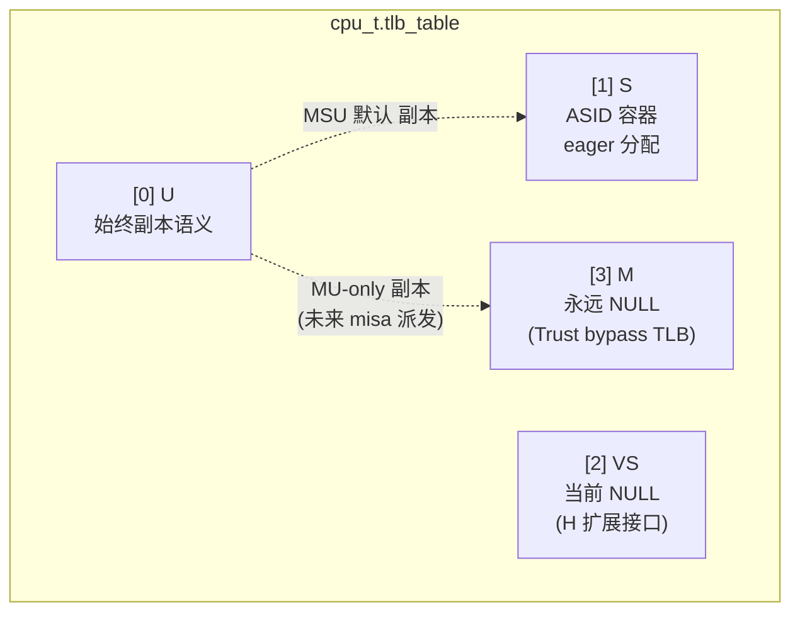
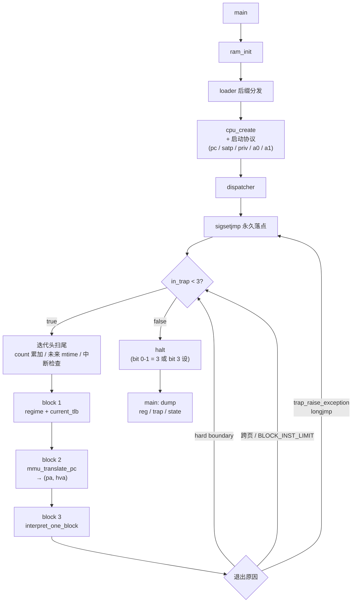

# riscv-jit-emulator

[English](./README.en.md) | 简体中文

研究生级别的 RISC-V 用户态 JIT 模拟器,目标支持 RV32 G + 标准压缩扩展 C,跑通
OpenSBI / 小型 OS / FreeRTOS-with-MMU。当前在 milestone a_02 (interpreter +
bus/MMIO 阶段, T1 bus + CLINT 已落地; T2 中断 CSR / T4 trap_raise / T5 计时器待做)。


## 设计目标

- ISA: RV32 G (IMAFD_Zicsr_Zifencei) + 标准压缩扩展 C
- 三层 JIT 架构: Dispatcher / Translator / JitBackend (asmjit 起步,留 LLVM OrcJIT 接口)
- 宿主: Linux 用户态进程
- SMP 不实现但所有设计 SMP-ready
- 64 位接口预留,不实现


## 项目结构


### 程序入口 + 全局配置


#### main.c

初始化整个 guest 系统的 RAM,加载程序,准备运行一个 hart 线程(现在还没有用上 pthread)。
一个 hart 线程,包括了 `cpu_t`(CPU 的存储)和 `dispatcher`(CPU 怎么动)。


`decode_test()` 跟末尾的 dump 段是临时的 —— 前者跑前先做 decode 单测 sanity,
后者跑完后印寄存器 / trap / state 给 fixture 对照。uart + 真 unit harness 上线
后逐步替代。


#### config.h

项目自身的全局编译期宏(RAM 配置 / TLB 拓扑 / IALIGN / 块软边界)。运行期变量
(`host_ram_base` 之类)放 `ram.h`。


#### riscv.h

集中收纳 RISC-V 规范定义(priv 编码 / CSR 地址 / PTE 位段 / mstatus 字段 /
Exception Code)。增量原则,真用到一个加一个。跟 `config.h` 的职能划分:
`config.h` = "我们怎么配",`riscv.h` = "规范怎么定"。


#### loader.{c,h}

guest 程序加载,三函数 `guest_load_bin / guest_load_elf / guest_is_elf`。

ELF 加载严格 6 项 sanity 检查(magic / class=ELFCLASS32 / data=ELFDATA2LSB /
machine=EM_RISCV / type=ET_EXEC / phentsize+phnum)。

三条语义边界:**不挪 ELF**(段严格按 `p_paddr` 放,越界即失败)、**不管 entry**
(由使用者保证 = `GUEST_RAM_START`)、**不清 BSS**(由 guest startup 负责) ——
模拟器只是物理地址观察者,不是 OS loader,不做 relocation。


#### dummy.txt

跨文件协议总账(`.txt` 不参与编译,但属于源码组成 —— 收纳"涉及多个文件协作的运行时
机制 / ABI 约定 / 调用顺序契约"),10 段:

- **§1 sigsetjmp / siglongjmp 协议** —— dispatcher 一次性永久落点 + helper longjmp
  跳回 + 寄存器统一保护;末段 **load/store 不对称真机理** (TLB 缓存 hva + MMIO 不进
  TLB → 命中路径结构不带分支; load 命中 *hva / store 命中走 store_helper 强制
  reservation+SMC 副作用)
- **§2 x0 寄存器全局编码** —— 读 = 立即数 0,写 = dead store 到局部垃圾桶变量
  (让 IR / backend 不感知 x0 特殊性)
- **§3 satp ASID 合法性契约** —— csr.c 是生产者(WARL 截断),dispatcher 是消费者
  (直接索引 `tlb_table[priv][asid]` 无 bounds check)
- **§4 TLB 作为 block 入口分发机制** —— bare 模式也走 TLB,让派发逻辑跨 priv 统一,
  JIT 翻译产物跨 priv 复用
- **§5 报错风格** —— 每条失败 stderr 上恰好两行(内 why + 外 where);不引 enum
  错误码,不维护 `*_strerror` 翻译表,模块不调 `exit`
- **§6 CSR 物理存储字段命名四类** —— `_` 前缀 / `x` 前缀 / 不带前缀 三套命名分类
- **§7 多线程 vs 多 HART 术语** —— per-hart / shared / thread-local 三态; shared
  字段一律 atomic
- **§8 PMP / MMU / 内存三层关系** —— mmu 只翻译 GVA→PA; ram+bus 才真访问; PMP 长期
  不实装
- **§9 cause 0 路径 + "0=成功" 接口约定** —— mmu_translate_pc / mmio_*_helper /
  device read/write 共用编码; 长跳 vs 返回机制本质规则
- **§10 helper 颗粒度 + may-longjmp 边界 + JIT 寄存器保存** —— mmu_walker_helper_*
  / lsu_*_helper / amo_*_helper 各自入口 (颗粒度 = 单条指令, 不合并); JIT translator
  emit 每个 may-longjmp call 前 store 映射 host 寄存器到 cpu_t


### 核心 (`src/core/`)


#### cpu.{c,h}

单 hart guest CPU 状态(`cpu_t`)。`regs[32]` 单连续数组,`regs[0]` 物理位置存
pc(x0 走特殊路径不碰)。`tlb_table[4]` 4 槽派发数组(详见 [TLB 拓扑](#tlb-拓扑))。

`per_hart_info`(嵌入)/ `shared_info`(指针指向 cpu.c 内 `static const`)拆分体现
SMP-ready —— 异构 SMP(1×MU + 4×MSU)时 `misa / mhartid` per-hart 不同,
`mvendorid / marchid / mimpid` 全机器共享。


#### decode.{c,h}

RV32I + RVC 指令解码,纯函数(不读 / 不写 `cpu_t`),给 interpreter / 未来 translator
共用。49 个 op_kind(RVC 复用同源 RV32I op,`pc_step` 区分长度)。

`is_block_boundary_inst` 共享 inline,让 interpreter 跟未来 translator 对硬边界
判断 100% 一致(`-Wswitch-enum -Werror` 强制全覆盖)。


#### interpreter.{c,h}

解释器主体。`interpret_one_block` 顺序 fetch + decode + switch 执行,直到五种退出
条件:`OP_UNSUPPORTED` / 硬边界 / 异常 longjmp / `BLOCK_INST_LIMIT` 失控保护 /
跨页软边界。

PC 维护数据驱动(decode 一次决定 `pc_step`,fetch loop 末段统一推进);控制流 case
自描述 pc 走 `WRITE_PC_OR_TRAP` 宏含 IALIGN 对齐检查 + trap 占位。

count 同步契约:may-trap 路径 case 内同步在 trap_raise 之前;boundary 路径走 out
段托底同步;pure case(纯算术 / 逻辑)不需同步,跟 RV precise trap 一致(trap
触发指令本身不算入 count)。


#### dispatcher.{c,h}

hart 主循环。形态:**sigsetjmp 一次性永久落点 + while(in_trap<3) 多块循环 +
迭代头扫尾**。每轮 3 block:

- **block 1** —— 按 `priv + xatp.mode` 算派发包 `(regime, current_tlb)`
- **block 2** —— `mmu_translate_pc` 取指
- **block 3** —— `interpret_one_block`(未来 `jit_cache_hit` 优先)

helper 端 longjmp 跳回 sigsetjmp 落点会跳过迭代尾,所以扫尾(count 累加 / 未来
mtime 推进 / 中断检查 / `perf_advance`)必须搬到迭代头 —— 跟正常 continue 路径
同形态。退出条件由 `in_trap` 位段编码控制(详见 [in_trap 位段编码](#in_trap-位段编码))。


#### csr.{c,h}

CSR 大 switch + 各 r/w file-static helper。`csr_op` 是 6 csr 指令变体(CSRRW/RS/RC
+ 3 I 变体)统一入口。

入口判利用 `csr_addr` 自带的权限位段:`bits[11:10]` = RO / `bits[9:8]` = 最低 priv
要求,失败统一 trap cause 2。

5 类组织哲学:类 1 扩展 CSR(F/V/Debug)未来归 `isa/`;类 2 跨模块 CSR(`satp`)
字段在 `cpu_t`,函数留 csr.c;类 3 核心 CSR 字段在 `trap_csrs_t`;类 4 出场信息
RO CSR 拆 per-hart + shared;类 5 临时调试 CSR(`tohost / privrd`)流式输出,
uart 实装后整段删。


#### trap.{c,h}

trap 系统两层 helper。`trap_set_state` 架构语义层不长跳(写 xcause/xtval/xepc +
切 priv mstatus 字段 + `regs[0] = xtvec`);`trap_raise_exception` `_Noreturn`
长跳(内部 `trap_set_state + siglongjmp` 跳回 dispatcher 一次性落点)。

`deliver_priv` 按 medeleg 真生效(M-mode trap 总 M;U/S-mode + bit=1 → S)。
候选 A 早 return:`in_trap >= 3` 时不 deliver,字段保留第二次状态作 root cause
给 main dump。


#### mmu.{c,h}

Sv32 MMU walker + 各 walker helper。**回归 dummy.txt §8 三层模型** —— mmu 只翻译
+ 分流,不亲自做"真访问":RAM 路径让 walker fill TLB + caller 调 RAM 直接 *hva
(load) / store_helper (store);MMIO 路径直接调 `mmio_*_helper` (不入 TLB)。

执行 regime 二分(项目内部"两套硬件逻辑"分类):**REGIME_BARE**(`priv == M` 或
任何 priv 带 bare satp,bypass TLB identity)/ **REGIME_SV32**(`tlb_table[priv][asid]`
叶 TLB + PTE 权限语义)。接口层简化,下游 `mmu_translate_pc / interpret_one_block /
lsu_*_helper` 只吃 `current_tlb`(NULL 编码 BARE)。

`check_perm`(`mmu.h` `static inline`)三处共用(取指 / load / store),跟 walker
同源不会两份维护偏离。**hw-managed A/D**(非 Svade):walker 内**只算**建议 set 后
的 new_pte 通过出参回给 caller,caller 在 RAM 路径才真 memcpy 写回 PT;MMIO 路径
不写回 (跟 Spike "fail 不 set" 一致简化版)。TLB 不存 PTE 物理地址,store 命中 D=0
时 fall back walker 重 set。

`mmu_walker_helper_*` 一族 (load/store + 未来 amo_lr/sc/amo_*) 是 **JIT 颗粒度 by
design** —— 每条访问指令对应一个 helper 入口, JIT 不合并; 详 dummy.txt §10。


#### tlb.{c,h}

TLB 数据结构(`tlb_e_t` 16 B,字段位置对齐 RV PTE)+ `tlb_alloc` / `tlb_clear`
两个函数。`tlb_table[4]` 4 槽派发(详见 [TLB 拓扑](#tlb-拓扑))。

fast path 不暴露 `tlb_lookup` 函数 —— 命中由调用方 inline(V + tag + `check_perm`),
miss 才调 walker helper。`tlb_clear(NULL)` C 标准 no-op,sfence helper 不需要
null-check。


### ISA 实现 (`src/isa/`)


#### sfence.{c,h}

`sfence_vma_helper`(extern,slow path)。RV spec 4 组合简化方案 4.a:`rs1=x0 +
rs2!=x0` 单 ASID 清,其他三组合都全清(过度刷新 RV spec 允许;sfence 不是 hot
path 不亏)。

接口分两组传 `(vaddr_val, asid_val)` + `(rs1, rs2)` —— RV spec 用 `rs1=x0` 这个
**magic 编码**标"忽略 vaddr",但 `vaddr_val=0` 也是合法实值,helper 只看寄存器值
看不出区别,必须看寄存器编号。


#### lsu.{c,h}

load / store 不对称真机理 (dummy.txt §1 末段)。当前形态:

- `lsu_load_helper` / `lsu_store_helper` (inline 顶层在 `lsu.h`, interpreter 直调):
  BARE 内联 RAM/MMIO 分流 / SV32 TLB hit 直走 (load *hva, store 调 store_helper) /
  SV32 miss fall back `mmu_walker_helper_*`
- `store_helper` (extern 在 `lsu.c`, **HVA-based**): RAM 写 + LR/SC reservation 清除
  占位 + 未来 SMC 副作用入口; 三处 caller 共用一份 (BARE/SV32 hit / walker_helper
  RAM 路径)
- MMIO 路径不经 store_helper, 直接 `mmio_*_helper` (跳过 reservation+SMC; 因 MMIO
  不参与)
- `LOAD_MISALIGN_CHECK` / `STORE_MISALIGN_CHECK` 隐式契约: caller (interpreter case
  入口) 一处做, 所有 helper 信任 caller 已查

未来改进 `store_helper` inline 化(命名澄清:**不是**"store 变 fast path",内部
所有操作仍是 slow path 性质,只是链接形态从 extern 变 inline,消除每次 store 的
函数 call/ret 开销)。


### 平台 (`src/platform/`)


#### ram.{c,h}

host mmap 管理。`host_ram_base` + `gpa_to_hva_offset = host_ram_base -
GUEST_RAM_START` 两个全局,fast path 一次加法 gpa → hva 不用 cast。

`IS_GPA_RAM(pa)` 宏 (无符号下溢 idiom) 统一封装"PA 在 RAM 区"判断, 7 处 callsite
(mmu / lsu) 共用。

`MAP_NORESERVE` 不预扣 swap commit charge;`MADV_NOHUGEPAGE` 显式排 transparent
huge page 保 4 KB 颗粒度服务未来 SMC 检测(`smc.c` 的 `page_dirty` bitmap 按
4 KB 索引)。`mmap(NULL, ...)` 内核分配地址 4 KB 对齐,interpreter 跨页保护依赖
此 invariant。


#### bus.{c,h}

MMIO 注册表 + 派发。`mmio_dev_t` 结构 (gpa_start / gpa_end / ctx / read / write / name);
`bus_register_mmio` 注册 + 半开区间重叠校验; `mmio_read_helper` / `mmio_write_helper`
线性扫表派发 (BUS_MAX_DEV=16 静态数组)。

接口形态: **_Noreturn-on-failure** —— bus 失败 (未命中 / device 拒绝) 内部 trap_raise
longjmp 不返回 caller; device read/write fn 返 cause (0=成功 / 非0=cause), bus 透传给
trap_raise (跟 mmu_translate_pc 同形态)。详 dummy.txt §8 + §9。

`mmio_dev_t` struct **不含 R/W/X/execute / tick / has_pending_irq 字段** —— 三件事
分属独立维度 (PMP / 物理可 fetch / device 副作用), 见 dummy.txt §8。

未来扩展占位 (bus.h 顶部注释): (a) 可 fetch 范围表 (ROM/flash 启用时); (b) device
unregister + 热插拔 (RCU/atomic pointer swap)。


#### clint.{c,h}

CLINT (Core-Local Interruptor) MMIO 设备 —— mtime / mtimecmp[N] / msip[N], 全部
`_Atomic` (满足 dummy.txt §7 shared 字段一律 atomic; 单 hart 编译为 plain load/store,
零开销)。布局跟 SiFive CLINT + QEMU virt 一致 (CLINT_BASE=0x02000000, mtimecmp
@+0x4000 per-hart, mtime @+0xBFF8 global)。

T1 阶段不真自动推进 mtime, 写啥读啥 (T5 真接计时器源时按方案 A/C 切; 见
start_plan §T5)。`size != 4` / `off & 3 != 0` / offset 越界 都 access fault。


## TLB 拓扑

`cpu_t.tlb_table[4]` 是 4 槽派发数组,index 按 RV privilege encoding:



- **[0] U** 始终是副本语义(副本于 [1] S 或 [3] M,取决于 misa)。即使 MU-only CPU 中
  U 副本 M、槽内 NULL(因 M 走 bare 不查 TLB),"副本"语义本身不变。副本分配两路:
    - 初始化 —— `cpu_create` 按 misa 派发(MSU 副本 [1];MU-only 副本 [3])
    - 运行时 —— H 扩展(VS / VU 切换)由对应 csr_helper 维护 mirror
- **[1] S** —— ASID 数组容器 (`tlb_t **`),容器由 `cpu_create` eager 分配,entries
  由 walker 在首次访问该 ASID 时懒分配
- **[2] VS** —— 初版 NULL(无 H 扩展),H 扩展激活时同 [1] 形态
- **[3] M** —— 永远 NULL。Trust regime(M-mode 或任何 priv 带 bare satp)直接走
  identity + IS_GPA_RAM 检查,不需要 TLB(real CPU bare 下也 bypass MMU/TLB)


## in_trap 位段编码

`hart->trap.in_trap` 是位段编码(host 端协议,多种信号可叠加):

| 位段     | 值范围   | 含义                                                          |
|----------|----------|---------------------------------------------------------------|
| bit 0-1  | 0..3     | 实际 trap 嵌套深度:0/1/2 普通 nesting; 3 = triple fault       |
| bit 2    | 4..7     | 留白,防止 trap 嵌套位将来扩展跟下面位段冲突                  |
| bit 3    | 8..15    | 内部异常 / 内部正常停机(host 端协议,不是 RV trap)           |
| bit 4    | 16..31   | 留白                                                          |
| bit 5+   | 32+      | 未来停机扩展                                                  |

设计哲学(位表示叠加):

- 解释器 / JIT 内部只看 bit 0-1(trap nesting 视角),`in_trap < 3` 即继续
- 高位(bit 3+)仅由 dispatcher 写,解释器 / JIT 不碰
- `while (in_trap < 3)` 的判断作为安全闸:高位一被设值就 ≥ 8 > 3,dispatcher 自动退出
- reset 路径只清 bit 0-1;高位由 reset 流程显式按停机类型决定

跟 RV Smdbltrp 扩展(`CAUSE_DOUBLE_TRAP=16`)无关 —— Smdbltrp 是规范层 trap 投递机制,
in_trap 是 host emulator 退出协议,两者并存但语义不重叠。


## 控制流概览




## 当前已落地

- 完整 RV32 IM + RVC 指令集(49 个 op_kind,RVC 复用)
- M / S 模式 CSR 22 个(含 mstatus 物理 64 位拆访问 / sstatus masked view / medeleg
  真 driven trap delegation; csr_op 入口判 priv + RO 写)
- Sv32 MMU walker(含 hw-managed A/D,4 KB + 4 MB superpage; **walker 不真写回 PT,
  caller 在 RAM 路径写回; MMIO 路径不写回**, 跟 Spike "fail 不 set" 一致)
- mmu / lsu / bus 三层模型 (dummy.txt §8) —— mmu 只翻译 + 分流, lsu 是 PA 后真访问,
  bus 是 MMIO 派发; **mmu_walker_helper_\*** 一族 JIT 颗粒度 by design (§10)
- TLB 4 槽 ASID 二级索引(per-priv 隔离 / U 副本 / sfence.vma 全清 / 单 ASID 清);
  **MMIO 不进 TLB** 让命中路径结构不带分支
- LSU (lsu_load/store_helper inline 顶层 + store_helper HVA-based extern; LOAD/STORE
  MISALIGN_CHECK 隐式契约; SUM/MXR perm check 三处共用)
- trap 系统(medeleg-driven deliver_priv / mret/sret 真切 priv mstatus 字段;
  **PRIV_CHECK_OR_TRAP** 在 MRET/SRET/SFENCE.VMA 入口判 priv)
- dispatcher(sigsetjmp 永久落点 + while(in_trap<3) + 迭代头扫尾 + count 同步契约;
  **循环顶 pc IALIGN 兜底** single source 捕所有写 pc 路径错误, dummy.txt §9)
- in_trap 位段编码(bit 0-1 trap 嵌套 / bit 3 内部停机 / 高位预留)
- 跨页保护(interpreter 推进后 hva_pc 跨 4 KB → 退出 block,dispatcher 重派发)
- **bus + CLINT MMIO** (mmio_dev_t 注册表 + 线性派发; CLINT mtime/mtimecmp/msip
  `_Atomic`, 布局跟 QEMU virt + SiFive CLINT 一致)
- debug 字符 trace (`f` refetch / `E` exception / `t/s/e` time/soft/ext intr;
  stderr 上, DEBUG_TICK 阈值 80 自动换行)

未实现(后续 milestone): JIT 子系统 / PLIC / UART / virtio-blk / A 扩展 LR/SC/AMO /
F/D 扩展浮点 / 中断机制 (mip/mie/mideleg/sip/sie 真生效 + 中断 deliver 路径) /
mtime 真自动推进 (T5 方案 A/C) / 长期 TODO: mstatus.TSR/TVM 控制位 trap, WFI 实装。


## 构建 + 运行

依赖:

- CMake ≥ 3.10
- gcc / clang(host 编译; AddressSanitizer Debug 默认开)
- riscv64-unknown-elf-gcc(跨编 fixture; `-march=rv32imac -mabi=ilp32`)

构建:

```bash
cmake -B cmake-build-debug -DCMAKE_BUILD_TYPE=Debug
cmake --build cmake-build-debug
```

跑 fixture:

```bash
make -C tests                                                # 重建所有 fixture .bin/.elf
./cmake-build-debug/jit-emu tests/a_01/a01_3/01_arith_basic/out.bin
```

CLion Debug 下需要环境变量 `ASAN_OPTIONS=abort_on_error=1:detect_leaks=0` —— LSan 撞
gdb ptrace 会 fatal exit 1,看似程序 bug 实际是工具链限制;Run 模式(无 gdb)不需要。


## 测试组织

每个 fixture 自包含一个目录,命名 `NN_descriptive_name[_reject]/`:

```
tests/a_01/a01_<N>/<NN>_<name>/
  stub.S       (RV32 汇编源,部分 fixture 配 main.c)
  Makefile     (riscv64-unknown-elf-gcc 跨编)
  link.ld      (linker script,起点 0x80000000)
```

`_reject` 后缀标负面测试(验 loader 验证分支真打到)。每个 sub-milestone 至少一个
fixture,累积成回归集。


## 许可

待定。
