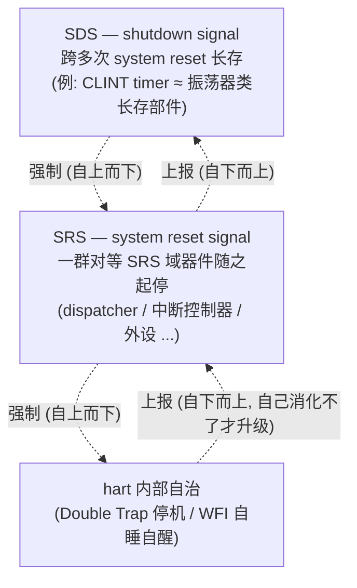
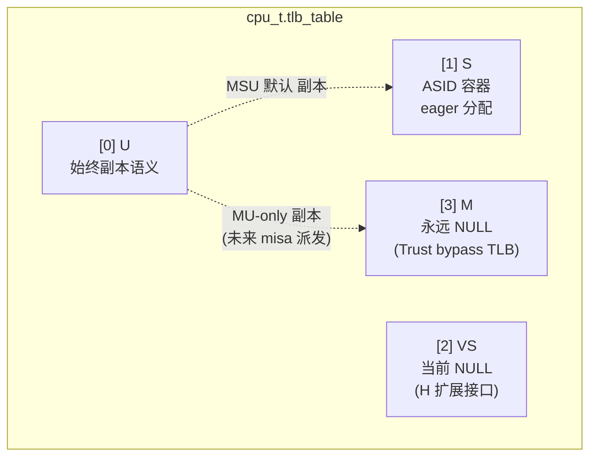
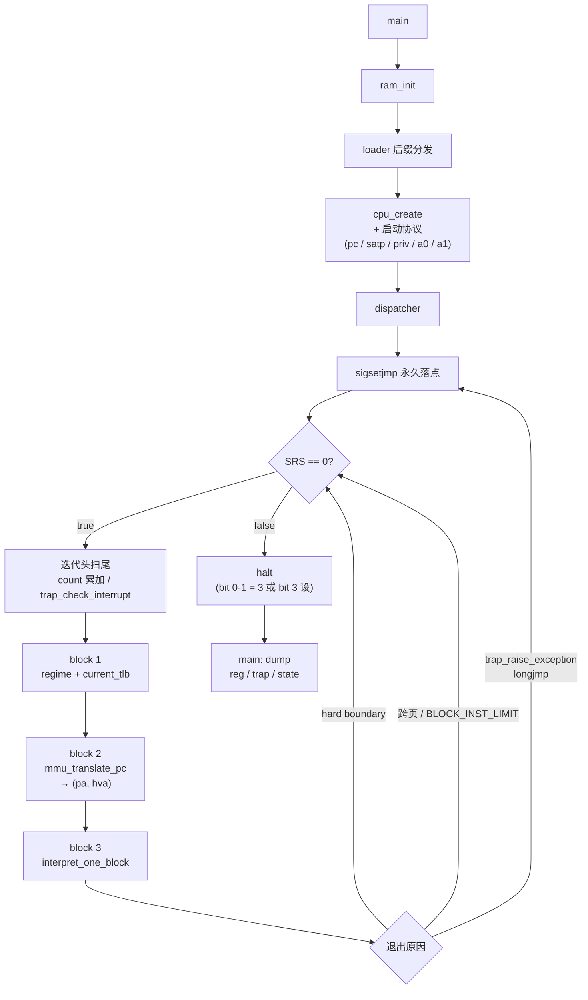
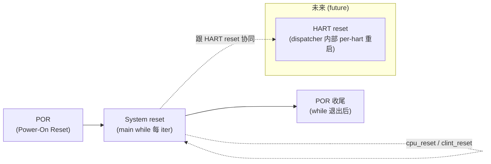
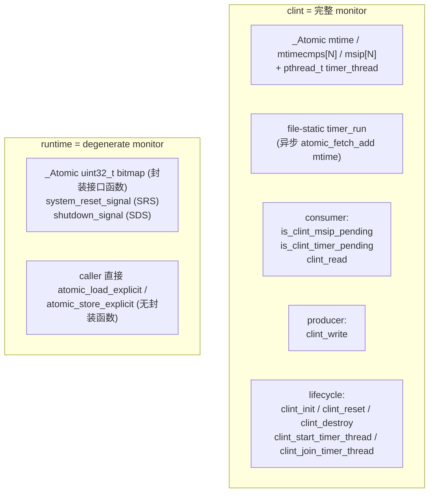

# riscv-jit-emulator

[English](./README.en.md) | 简体中文

研究生级别的 RISC-V 用户态 JIT 模拟器,目标支持 RV32 G + 标准压缩扩展 C,跑通
OpenSBI / 小型 OS / FreeRTOS-with-MMU。milestone a_03(PLIC + UART 外部中断 +
virtio-blk + 端到端验证)已收口,T1~T6 全部落地, monitor 范式集齐四态 (CLINT
timer / UART reader / virtio-blk io_worker / PLIC 无线程纯 atomic);收尾期另落地
RV32M 整数乘除 / WFI 真实装 / Smdbltrp+Ssdbltrp Double Trap (in_trap 字段废除走
spec MDT/SDT) / host signal handler (SIGINT/TERM/HUP) + stdin raw 模式 /
`--bios`|`--load`|`--blk` 命令行;SRS/SDS 升级为 32-bit bitmap。下一 milestone 待启动。


## 设计目标

- ISA: RV32 G (IMAFD_Zicsr_Zifencei) + 标准压缩扩展 C
- 三层 JIT 架构: Dispatcher / Translator / JitBackend (asmjit 起步,留 LLVM OrcJIT 接口)
- 宿主: Linux 用户态进程
- SMP 不实现但所有设计 SMP-ready
- 64 位接口预留,不实现


## 信号层级 + 双向自治

整套运行体是**一组对等器件在协同**。区分它们的不是"是不是 CPU",而是它们受
哪一级停机信号支配。停机信号严格分三层:



层级同时支持两个方向, 且两个方向自洽:

- **强制方向 (自上而下)**: 高级信号一旦确立, 低级层次自然停止 —— 无需逐个
  通知。要 shutdown, SRS 域与各 hart 自然随之停;要 system reset, 各 hart
  的自处理自然中断。高压一来, 低压自动让位。
- **上报方向 (自下而上)**: 每一层**先尝试自己消化, 消化不了才上报升级**。
  hart 先尝试 hart-reset 自治, 不行才 SRS=0; system reset 这一层把所有 SRS
  器件 join 回来后, 再判断"是否严重到要升级为 shutdown", 严重才停 SDS 域线程。

这条"先自治、不足才升级"的链路, 使每一级都是**可以自我了断、也可以向上求援
的自治单元**。

### dispatcher 的双重身份

dispatcher 在这套架构里是个特殊器件 —— 它同时承担两个角色:

- **横向 (与其他器件对等)**: dispatcher 是 SRS 域里**一个**对等器件, 跟未来
  的 PLIC / UART / virtio-blk 等并列, 都受 SRS 起停, 都按"谁 spawn 谁 join"
  + atomic flag 协作式停机协议。它在这一维度上没有特殊地位。
- **纵向 (hart 运行核心 + 其他外设服务于它)**: dispatcher 又是真正跑 guest
  指令的那个 —— 其他外设 (CLINT / 未来 PLIC / UART / virtio-blk) 都是
  monitor (Hoare/Hansen 范式), 通过 consumer / producer 接口**服务于**
  dispatcher。dispatcher 读写本 hart 的 cpu_t (per-hart, 无需同步), 凡触及
  共享状态都经 monitor 接口 —— 同步复杂度被关在 monitor 内, dispatcher 因此
  保持纯单线程顺序语义。

dispatcher 之所以拥有内部 hart-reset 自治 (上报方向 hart→SRS 那一级), 正是
这个"hart 运行核心"身份的体现 —— hart 内部出问题先尝试自己重启, 真不行才
升级为 system reset。

### CLINT 在架构中的位置

CLINT 在 README 里之所以单独大段, 仅因为它是当前接上的第一个 monitor 实例
(也是 SDS 域里目前唯一一个外设); 这是实现顺序的偶然, **不是架构地位的体现**。
后续 PLIC / UART / virtio-blk 等 SRS 域外设接进来后, 都按 monitor 同模板走
(consumer / producer 接口 + 谁 spawn 谁 join + 协作式停机), CLINT 在 README
里的篇幅占比会自然回落到与其他外设相称的位置。

三层 reset lifecycle 是这套信号层级在时间轴上的展开, 详见「多线程 + reset
lifecycle」节; monitor 模型 / 协作式停机协议同节。


## 架构概览

模拟器的运行时结构可以从四个视角理解。本节给出概览,详细机制见后续各节,
逐文件设计见「项目结构」。

### 机器模型(RAM + CPU)

经典计算机模型可抽象为 CPU + RAM(此处不涉及 MMIO / port 等 I/O 概念)。内存侧:
`ram` 用单块匿名 mmap 管理 guest 物理内存,`loader` 把 ELF / 裸二进制按物理地址
放入。CPU 侧:`cpu_t` 是纯数据(寄存器 / CSR / TLB 派发表),`dispatcher` 是行为
(取指—译码—执行主循环)。「数据 / 行为」分离让 dispatcher 不持有状态 —— SMP 时
每个 hart 一份 `cpu_t`、一个 dispatcher 线程。

### 线程模型与三层 reset lifecycle

线程控制是「信号层级 + 双向自治」(见上节) 在时间轴上的展开:**POR**(进程
启动一次, SDS 域线程上电)/ **System reset**(`main` while 每一轮, SRS 域
器件 spawn → 运行 → join)/ **HART reset**(dispatcher 内部一级自治)。当前
是单 hart(`dispatcher` 在 `main` 线程内直调)加一个 timer 辅助线程
(SDS 域, CLINT 的 actor)异步累加 `mtime`。

monitor 模型(Hoare/Hansen 范式)把共享状态的 atomic 字段与 memory_order 封装
在 consumer / producer 接口内,`dispatcher` 读写本 hart 的 `cpu_t`(per-hart,
无需同步), 凡触及共享状态都经 monitor 接口 —— **同步复杂度被关在 monitor
内**, `dispatcher` 因此保持纯单线程顺序语义,「看不到」多线程。详见
「多线程 + reset lifecycle」。

### dispatcher 主循环

每个 hart 跑一个 `dispatcher`:`sigsetjmp` 一次性永久落点 + `while (system_reset_signal == 0)`
多块循环 + 迭代头扫尾。每轮三个 block:选叶 TLB / 取指 / 进实际运行段(当前为
解释器)。退出由 SRS bitmap 控制。详见「控制流概览」「hart 内部停机与唤醒机制」。

### 实际运行块的内存模型

实际运行段的访存分两条 regime:REGIME_BARE(M 态或 bare satp,bypass TLB,
identity 偏移)与 REGIME_SV32(走叶 TLB + PTE 权限)。运行模型的分离本质上是
内存模型导致的结果。

**运行模式 ↔ TLB 互为约束(快慢路径抽象成立的因果原因)**: 走翻译时, TLB
不只是 GVA→HVA 缓存, 还充当"以叶 TLB 为粒度的运行模式派发表"。dispatcher
按 `priv`/`satp.mode` 选定叶 TLB 指针交给运行块, 运行块只通过这个指针读写,
**完全不在意此叶 TLB 来自哪个特权级**。由这对约束, **权级敏感这件事被整个
挤出热路径, 挤进了 MMU walker 这个慢路径 helper** —— 所以快路径不是"省略了
权级检查", 而是结构上根本没有需要检查的权级。这是设计换来的结构性简洁, 不是
偷工。

进一步, load / store 命中后的不对称: load 命中直接 `*hva`,store 命中因
LR/SC reservation 等副作用必经 `store_helper`。真因果不是"性能 vs 副作用",
而是"TLB 缓存 hva + MMIO 不进 TLB → 命中路径结构上不带 RAM/MMIO 分支 → load
可直接 `*hva`; store 因 LR/SC + 未来 SMC 副作用强制走 helper"。详见
「TLB 拓扑」。

> JIT 子系统(Dispatcher / Translator / JitBackend 三层、jit_cache、SMC 检测)
> 为计划设计,尚未实装(见「当前已落地」末的未实现清单),不在本 README 的
> 当前进展范围内。关键设计点已锁定: **块缓存 key = PA**(不是 VA, 让 sfence.vma
> 不 invalidate JIT 块、同段 PA 在 M/S 态翻译产物可复用);**所有块出口走
> dispatch**,初版不做 block chaining;**SMC 整页失效 + lazy invalidation**
> (write-protect + SIGSEGV handler 只置 atomic 标志, 真清理由 dispatcher 在
> 执行块前检查标志, handler 受 async-signal-safety 约束不调 malloc/锁)。


## TLB 拓扑

`cpu_t.tlb_table[4]` 是 4 槽派发数组,index 按 RV privilege encoding:



- **[0] U** 始终是副本语义(副本于 [1] S 或 [3] M,取决于 misa)。即使 MU-only CPU 中
  U 副本 M、槽内 NULL(因 M 走 bare 不查 TLB),"副本"语义本身不变。副本分配两路:
    - 初始化 —— `cpu_create` 按 misa 派发(MSU 副本 [1];MU-only 副本 [3])
    - 运行时 —— H 扩展(VS / VU 切换)由对应 csr_helper 维护 mirror
- **[1] S** —— ASID 数组容器 (`tlb_t **`),容器由 `cpu_create` eager 分配,entries
  由 walker 在首次访问该 ASID 时懒分配
- **[2] VS** —— 初版 NULL(无 H 扩展),H 扩展激活时同 [1] 形态
- **[3] M** —— 永远 NULL。Trust regime(M-mode 或任何 priv 带 bare satp)直接走
  identity + IS_GPA_RAM 检查,不需要 TLB(real CPU bare 下也 bypass MMU/TLB)


## hart 内部停机与唤醒机制

WFI 实装后 hart 内部有两套机制(取代早期 host 自定义的 in_trap 位段编码 +
triple-fault 退出协议)。

**Double Trap 停机(Smdbltrp / Ssdbltrp,无 NMI)** —— cpu_reset 时 mstatus.MDT=1 /
sstatus.SDT=1(spec §3.1.6.2 / §4.1.1.5):

- S-trap entry 检 sstatus.SDT=1 → unexpected,升级 deliver M,cause=`DOUBLE_TRAP`
  (mtval2 存原 tval)
- M-trap entry 检 mstatus.MDT=1 → critical-error:不实装 NMI → 整机 abort
  (`system_reset_signal_set_bit(HART_MDT)` 走 ABORT_MASK 通道,main 统一 cleanup)
- mret 清 MDT / sret 清 SDT

这套取代了早期"in_trap 嵌套计数 + triple-fault 退出"的 host 自定义协议(详
trade_off_log §T.9)。dispatcher 退出统一靠 `while (system_reset_signal == 0)`,
退出原因由 SRS bitmap 的 bit 编码表达(HART_MDT / shutdown / test_dev / signal)。

**WFI 唤醒(cond_wait + per-hart slot)** —— WFI 不再是 NOP / busy-wait:

- 挂起:`pthread_cond_wait` + per-hart `(mutex, cond)` slot;predicate 查 SRS +
  `(mip & mie)`,醒来必重检
- 唤醒:CLINT / PLIC 的 pending 0→1 翻转处调 `wfi_kick`(lock + cond_signal);
  `cond_timedwait` 500ms 兜底(kick 漏调也自醒)
- shutdown 走 self-poll(predicate 第一条查 SRS,醒来即退;无"通知者"角色)
- TW=1 + priv<M 的 WFI 走 timeout=0 → trap illegal(spec §3.1.6.5 允许最严格)

四不变式(lock-hold predicate / source lock+signal / while 重检 / timeout 兜底)详
trade_off_log §T.8。两套机制跟顶段「信号层级」图的"hart 内部自治"一层对应:hart
自己消化不了(M-mode critical-error)时升级写 SRS,SRS 域器件随之起停。


## 控制流概览




## 多线程 + reset lifecycle

本节是「信号层级 + 双向自治」(顶段) 在实装层面的展开 —— main 流程伪码 /
三层 reset 时序 / monitor 行为 / 协作式停机协议, 落到当前 a_02 收尾的具体
形态。a_02 T5 落地后, 项目从单线程 (hart 线程独占 mtime 推进) 演化为多线程
(hart 线程 + timer 辅助线程并发, atomic mtime + monitor 模型同步)。错误处理
统一走 SRS / SDS signal 通道, **不分 error path** —— 正常退出与各类失败因此
形态一致。详细协议见 `src/dummy.txt §7` (monitor 模型) + `§12` (谁 spawn 谁
join), 信号语义见 `src/runtime.h` 顶段 doc。

### 三层 reset lifecycle



- **POR (Power-On Reset)** — 进程启动一次: ram_init / clint_init / cpu_create
  (内部已写硬件 reset 默认状态) / 显式 set SRS=1 SDS=1 / 起 timer 辅助线程
  (clint_start_timer_thread)。timer 辅助线程跨 system reset 一直跑 (跟真硬件
  RTC oscillator 不掉电不停一致), 随 SDS 才退
- **System reset** — main while 每 iter: cpu_reset (regs/pc/mstatus 清, 保留
  hartid hardwired) + clint_reset (mtimecmp/msip 清回 sentinel, **mtime 不动
  timer 不动**) + dispatcher(hart) + 区分 SR-only 重 iter vs shutdown 退出
  (SYSRESET_BIT_TEST_RESET 命中且非 ABORT_MASK → try_clear continue 重 iter;
  否则 cleanup 退出)
- **HART reset** — dispatcher 内部 per-hart 重启 (future; dispatcher.c 末段
  注释占位); SMP 多 hart 时单 hart fail 不影响其他 hart

### main 流程伪码 (a_02 T5 形态; a_03 收尾后 SRS/SDS 已 bitmap 化 + 加 signal handler + TEST_RESET reset 重 iter 真做, 当前真相详 runtime.h / main.c)

```c
int main(int argc, char **argv) {
    /* === POR === */
    ram_init();                   // 失败 → main 返 1
    clint_init();                 // 失败 → main 返 1 (走 destroy chain + return)
    cpu_t *hart = cpu_create();   // 失败 → main 返 1

    /* lifecycle 信号显式 set 1 (跟 runtime.c BSS 1 init 兜底重叠, 但显式更可读) */
    atomic_store_explicit(&system_reset_signal, 1, memory_order_release);
    atomic_store_explicit(&shutdown_signal,     1, memory_order_release);

    /* 起 timer 辅助线程; 失败内部 fprintf + set SRS=0 + SDS=0;
       main 不 check, 不分 error path — 错误走 SRS/SDS signal 通道 */
    clint_start_timer_thread();

    /* === System reset === */
    while (atomic_load_explicit(&system_reset_signal, memory_order_acquire)) {
        cpu_reset(hart);
        clint_reset();

        /* 占位: 所有 SRS-controlled 线程 spawn — 每 iter spawn / join, 跟
           system reset 同步起停 (例: 未来多 hart 走 pthread_create per hart;
           其他受 SRS 控制的辅助线程也在这里) */
        dispatcher(hart);                   /* 单 hart 直调; tri-fault 内部 set SRS=0 */
        /* 占位: 所有 SRS-controlled 线程 join — 跟上面 spawn 对偶 (hart 线程 +
           其他受 SRS 控制的辅助线程都在这里 join) */

        /* SR-only vs shutdown 分支 (当前简化恒 shutdown) */
        if (0 /* SR_only 占位; 未来真做 reset 重 iter */) {
            atomic_store_explicit(&system_reset_signal, 1, memory_order_release);
            continue;
        } else {
            atomic_store_explicit(&shutdown_signal, 0, memory_order_release);
            break;
        }
    }

    /* === POR 收尾 === */
    clint_join_timer_thread();    /* timer thread 看到 SDS=0 自然退后 join */
    /* dump (reg + trap + state) */
    clint_destroy();
    cpu_destroy(hart);
    ram_destroy();
    return 0;
}
```

三种退出路径都收敛到 `while → join → cleanup → return 0`:

1. **正常退出** (dispatcher tri-fault): dispatcher 函数末 `atomic_store(&SRS,
   0, release)` → main while 退 → else 分支 set SDS=0 → break → join (正常退) →
   cleanup
2. **timer spawn 失败**: clint_start_timer_thread 内 `atomic_store(&SRS, 0) +
   atomic_store(&SDS, 0)` → main while 因 SRS=0 不进 → SDS 已 0 (else 分支不执行) →
   join (pthread_t = BSS 0, glibc 返 ESRCH fprintf 一行不 fatal) → cleanup
3. **timer routine 内部 fail** (clock_nanosleep / clock_gettime errno): timer
   routine 同样 set SRS=0 + SDS=0 + return NULL → main while 退 → else 分支
   set SDS=0 (已是 0 no-op) → break → join (timer thread 已 return, 正常 join) →
   cleanup

错误处理统一走 SRS/SDS signal 通道, **不分 error path** — destroy chain 只在
cleanup 段写一次, 不在 spawn-fail / dispatcher-fail 路径重复。

### monitor 行为 (dummy.txt §7)

来自 Hoare/Hansen 并发 monitor 范式 — 每个共享状态模块封装内部 atomic 字段 +
memory_order, 对外只暴露 consumer / producer 接口; 调用方不感知内部同步细节。

> **位置说明** (跟顶段「CLINT 在架构中的位置」呼应): CLINT 是 SDS 域里目前
> 唯一接上的外设, 在本节占大篇幅仅因它是第一个完整 monitor 实例; 后续 PLIC /
> UART / virtio-blk 等 SRS 域外设接进来后, 都按下面这一套 (consumer/producer
> 接口 + 谁 spawn 谁 join + 协作式停机) 同模板走, CLINT 的篇幅占比会自然回落。

项目内两个实例:



- **clint** = 完整 monitor: 三函数 lifecycle (init / reset / destroy) + spawn /
  join 对偶 (clint_start_timer_thread / clint_join_timer_thread, main 端显式调,
  不埋 destroy 内); file-static timer_run routine 跑在内部 actor, 不持 cpu_t
  只动 shared 字段。memory_order: producer release (atomic_fetch_add &mtime) /
  consumer acquire (is_clint_timer_pending / clint_read), 配对建立 happens-
  before
- **runtime** = degenerate monitor: SRS/SDS 是两个 `_Atomic uint32_t` bitmap
  (0=允许 / 非0=触发对应停机路径), 经 `*_set_bit` / `*_try_clear` 接口函数封装协议
  (atomic_fetch_or 不覆盖别人 bit)。"SDS 蕴含 SRS" 契约固化在 `shutdown_signal_set_bit`
  内 (顺序 B: 先 set SDS bit, 后 set SRS BIT_SHUTDOWN_TRIGGER)。详 runtime.h

外部模块 (csr.c / dispatcher.c / bus.c 等) **不直接 atomic_\* 操作 clint 内部
字段**, 一律走 consumer/producer 接口。例: csr_mip_read 合成读时走
`is_clint_msip_pending(hartid) | is_clint_timer_pending(hartid)`, 不直接
`atomic_load_explicit(&clint.mtime, ...)` (后者破坏 monitor encapsulation,
违反 dummy.txt §7)。

### 协作式停机协议 (dummy.txt §12 + runtime.h)

```
spawn 调用方 (main)      worker thread (timer_run)       lifecycle signal
─────────────────       ────────────────────────        ────────────────
SRS = 1, SDS = 1                                        runtime.c
clint_start_timer_thread() ─→  pthread_create
                                                        SRS = 1, SDS = 1
                          ─→  while(atomic_load(SDS))
                                accumulate mtime
                                ...
正常: dispatcher tri-fault                              SRS = 0 (dispatcher)
main while 退                                           SDS = 0 (main else 分支)
                          ←  timer 看到 SDS=0 退
clint_join_timer_thread() ←  pthread_join
cleanup chain
return 0
```

- **不用 pthread_cancel / pthread_kill**: deferred cancel 在 interpreter / JIT
  深栈取消 = 状态半更新风险; pthread_kill 是发 signal SIGKILL 杀整进程不是
  杀线程; 一律 cooperative (atomic flag + worker periodic check + main join)
- **已实装 SIGINT/SIGTERM/SIGHUP signal handler**: handler 内只做 atomic CAS
  external_signal_no (first-wins) + shutdown_signal_set_bit (async-signal-safe;
  同 SIGSEGV 约束不调 malloc/锁); raw mode 下 ^C 字节进 guest, handler 是 cooked
  路径 fallback; main 末段按 POSIX 128+signum 返出。详 runtime.h
- **destroy 函数纯 cleanup**: 不含 pthread_join (避免控制流隐式 block); spawn /
  join 对偶函数单独暴露由 spawn 调用方显式 join


## 项目结构


### 程序入口 + 全局配置


#### main.c

程序入口,三段式 lifecycle:POR(`ram_init` / `clint_init` / `cpu_create` + 显式
set SRS/SDS + 起 timer 辅助线程)/ system reset(`while` 每轮 `cpu_reset` /
`clint_reset` + 调 `dispatcher(hart)`)/ POR 收尾(join timer 线程 + dump +
destroy chain)。详见「多线程 + reset lifecycle」。

当前单 hart 直接在 `main` 线程内调 `dispatcher(hart)`,不真起 pthread;timer
辅助线程是目前唯一真实的并发线程。末尾 dump 段是临时的 —— 跑完后印寄存器 /
trap / state 给 fixture 对照,uart + 真 unit harness 上线后逐步替代。


#### config.h

项目自身的全局编译期宏(RAM 配置 / TLB 拓扑 / IALIGN / 块软边界 / CLINT 布局 /
TIMEBASE / MAX_HARTS)。运行期变量
(`host_ram_base` 之类)放 `ram.h`。


#### riscv.h

集中收纳 RISC-V 规范定义(priv 编码 / CSR 地址 / PTE 位段 / mstatus 字段 /
Exception Code)。增量原则,真用到一个加一个。跟 `config.h` 的职能划分:
`config.h` = "我们怎么配",`riscv.h` = "规范怎么定"。


#### loader.{c,h}

guest 程序加载,三函数 `guest_load_bin / guest_load_elf / guest_is_elf`。

ELF 加载严格 6 项 sanity 检查(magic / class=ELFCLASS32 / data=ELFDATA2LSB /
machine=EM_RISCV / type=ET_EXEC / phentsize+phnum)。

三条语义边界:**不挪 ELF**(段严格按 `p_paddr` 放,越界即失败)、**不管 entry**
(由使用者保证 = `GUEST_RAM_START`)、**不清 BSS**(由 guest startup 负责) ——
模拟器只是物理地址观察者,不是 OS loader,不做 relocation。


#### dummy.txt

跨文件协议总账(`.txt` 不参与编译,但属于源码组成 —— 收纳"涉及多个文件协作的运行时
机制 / ABI 约定 / 调用顺序契约"),13 段:

- **§1 sigsetjmp / siglongjmp 协议** —— dispatcher 一次性永久落点 + helper longjmp
  跳回 + 寄存器统一保护;路径 D 中断走 dispatcher 主帧 return-based;末段
  **load/store 不对称真机理** (TLB 缓存 hva + MMIO 不进 TLB → 命中路径结构不带
  分支; load 命中 *hva / store 命中走 store_helper 强制 reservation+SMC 副作用)
- **§2 x0 寄存器全局编码** —— 读 = 立即数 0,写 = dead store 到局部垃圾桶变量
  (让 IR / backend 不感知 x0 特殊性)
- **§3 satp ASID 合法性契约** —— csr.c 是生产者(WARL 截断),dispatcher 是消费者
  (直接索引 `tlb_table[priv][asid]` 无 bounds check)
- **§4 TLB 作为 block 入口分发机制** —— bare 模式也走 TLB,让派发逻辑跨 priv 统一,
  JIT 翻译产物跨 priv 复用
- **§5 报错风格** —— 每条失败 stderr 上恰好两行(内 why + 外 where);不引 enum
  错误码,不维护 `*_strerror` 翻译表,模块不调 `exit`
- **§6 CSR 物理存储字段命名五类** —— `_` 前缀 / `x` 前缀 / 不带前缀 / `_sw`-`_hw`
  后缀四套命名分类(第 5 类 = 软件可写子集 + 异步源合成读,如 `_mip_sw`)
- **§7 多线程 vs 多 HART 术语 + monitor 模型** —— per-hart / shared / thread-local
  三态;shared 字段一律 atomic;shared 模块封装 consumer/producer 接口(Hoare/Hansen
  范式)
- **§8 PMP / MMU / 内存三层关系** —— mmu 只翻译 GVA→PA; ram+bus 才真访问; PMP 长期
  不实装
- **§9 cause 0 路径 + "0=成功" 接口约定** —— mmu_translate_pc / mmio_*_helper /
  device read/write 共用编码; 长跳 vs 返回机制本质规则
- **§10 helper 颗粒度 + may-longjmp 边界 + JIT 寄存器保存** —— mmu_walker_helper_*
  / lsu_*_helper / amo_*_helper 各自入口 (颗粒度 = 单条指令, 不合并); JIT translator
  emit 每个 may-longjmp call 前 store 映射 host 寄存器到 cpu_t
- **§11 predicate is_* 命名** —— 返回布尔语义的查询函数统一 `is_` 前缀
- **§12 线程 lifecycle —— 谁 spawn 谁 join** —— spawn / join 成对暴露,由创建方
  显式调;`*_destroy` 纯 cleanup 不含 `pthread_join`
- **§13 类型规约 typedef family** —— `uxlen_t` / `ixlen_t`(XLEN-tied)+ `u32_t` /
  `u64_t`(spec-pinned);RV64 切换 grep trail,非运行期 XLEN 抽象


### 核心 (`src/core/`)


#### cpu.{c,h}

单 hart guest CPU 状态(`cpu_t`)。`regs[32]` 单连续数组,`regs[0]` 物理位置存
pc(x0 走特殊路径不碰)。`tlb_table[4]` 4 槽派发数组(详见 [TLB 拓扑](#tlb-拓扑))。

`per_hart_info`(嵌入)/ `shared_info`(指针指向 cpu.c 内 `static const`)拆分体现
SMP-ready —— 异构 SMP(1×MU + 4×MSU)时 `misa / mhartid` per-hart 不同,
`mvendorid / marchid / mimpid` 全机器共享。


#### decode.{c,h}

RV32I + RVC 指令解码,纯函数(不读 / 不写 `cpu_t`),给 interpreter / 未来 translator
共用。49 个 op_kind(RVC 复用同源 RV32I op,`pc_step` 区分长度)。

`is_block_boundary_inst` 共享 inline,让 interpreter 跟未来 translator 对硬边界
判断 100% 一致(`-Wswitch-enum -Werror` 强制全覆盖)。


#### interpreter.{c,h}

解释器主体。`interpret_one_block` 顺序 fetch + decode + switch 执行,直到五种退出
条件:`OP_UNSUPPORTED` / 硬边界 / 异常 longjmp / `BLOCK_INST_LIMIT` 失控保护 /
跨页软边界。

PC 维护数据驱动(decode 一次决定 `pc_step`,fetch loop 末段统一推进);控制流 case
自描述 pc 走 `WRITE_PC_OR_TRAP` 宏含 IALIGN 对齐检查 + trap 占位。

count 同步契约:may-trap 路径 case 内同步在 trap_raise 之前;boundary 路径走 out
段托底同步;pure case(纯算术 / 逻辑)不需同步,跟 RV precise trap 一致(trap
触发指令本身不算入 count)。


#### dispatcher.{c,h}

hart 主循环。形态:**sigsetjmp 一次性永久落点 + while(system_reset_signal==0) 多块
循环 + 迭代头扫尾**。每轮 3 block:

- **block 1** —— 按 `priv + xatp.mode` 算派发包 `(regime, current_tlb)`
- **block 2** —— `mmu_translate_pc` 取指
- **block 3** —— `interpret_one_block`(未来 `jit_cache_hit` 优先)

helper 端 longjmp 跳回 sigsetjmp 落点会跳过迭代尾,所以扫尾(count 累加 / 未来
mtime 推进 / 中断检查 / `perf_advance`)必须搬到迭代头 —— 跟正常 continue 路径
同形态。退出条件由 SRS bitmap 控制(详见 [hart 内部停机与唤醒机制](#hart-内部停机与唤醒机制))。


#### csr.{c,h}

CSR 大 switch + 各 r/w file-static helper。`csr_op` 是 6 csr 指令变体(CSRRW/RS/RC
+ 3 I 变体)统一入口。

入口判利用 `csr_addr` 自带的权限位段:`bits[11:10]` = RO / `bits[9:8]` = 最低 priv
要求,失败统一 trap cause 2。

5 类组织哲学:类 1 扩展 CSR(F/V/Debug)未来归 `isa/`;类 2 跨模块 CSR(`satp`)
字段在 `cpu_t`,函数留 csr.c;类 3 核心 CSR 字段在 `trap_csrs_t`;类 4 出场信息
RO CSR 拆 per-hart + shared;类 5 临时调试 CSR(`tohost / privrd`)流式输出,
uart 实装后整段删。


#### trap.{c,h}

trap 系统两层分工。架构语义层不长跳:`trap_set_exception_state`(同步路径 —— 写
xcause/xtval/xepc + 切 priv mstatus 字段 + `regs[0] = xtvec`,medeleg 分流)、
`trap_set_interrupt_state`(异步路径 —— mideleg 分流 + vectored mode base+4*cause)。
控制流层:`trap_raise_exception` `_Noreturn` 长跳(供 helper 深栈用,内部
`trap_set_exception_state + siglongjmp` 跳回 dispatcher 一次性落点);
`trap_check_interrupt` return-based(dispatcher 主帧每轮 polling,不长跳)。
exception 长跳 / interrupt 返回的形态不对偶是 by design(dummy.txt §1 路径 D)。

`deliver_priv` 按 medeleg 真生效(M-mode trap 总 M;U/S-mode + bit=1 → S)。
Double Trap(spec MDT/SDT):S-trap SDT=1 升级 M `DOUBLE_TRAP`;M-trap MDT=1 →
critical-error(字段保留作 root cause 给 main dump)。


#### mmu.{c,h}

Sv32 MMU walker + 各 walker helper。**回归 dummy.txt §8 三层模型** —— mmu 只翻译
+ 分流,不亲自做"真访问":RAM 路径让 walker fill TLB + caller 调 RAM 直接 *hva
(load) / store_helper (store);MMIO 路径直接调 `mmio_*_helper` (不入 TLB)。

执行 regime 二分(项目内部"两套硬件逻辑"分类):**REGIME_BARE**(`priv == M` 或
任何 priv 带 bare satp,bypass TLB identity)/ **REGIME_SV32**(`tlb_table[priv][asid]`
叶 TLB + PTE 权限语义)。接口层简化,下游 `mmu_translate_pc / interpret_one_block /
lsu_*_helper` 只吃 `current_tlb`(NULL 编码 BARE)。

`check_perm`(`mmu.h` `static inline`)三处共用(取指 / load / store),跟 walker
同源不会两份维护偏离。**hw-managed A/D**(非 Svade):walker 内**只算**建议 set 后
的 new_pte 通过出参回给 caller,caller 在 RAM 路径才真 memcpy 写回 PT;MMIO 路径
不写回 (跟 Spike "fail 不 set" 一致简化版)。TLB 不存 PTE 物理地址,store 命中 D=0
时 fall back walker 重 set。

`mmu_walker_helper_*` 一族 (load/store + 未来 amo_lr/sc/amo_*) 是 **JIT 颗粒度 by
design** —— 每条访问指令对应一个 helper 入口, JIT 不合并; 详 dummy.txt §10。


#### tlb.{c,h}

TLB 数据结构(`tlb_e_t` 16 B,字段位置对齐 RV PTE)+ `tlb_alloc` / `tlb_clear`
两个函数。`tlb_table[4]` 4 槽派发(详见 [TLB 拓扑](#tlb-拓扑))。

fast path 不暴露 `tlb_lookup` 函数 —— 命中由调用方 inline(V + tag + `check_perm`),
miss 才调 walker helper。`tlb_clear(NULL)` C 标准 no-op,sfence helper 不需要
null-check。


### ISA 实现 (`src/isa/`)


#### sfence.{c,h}

`sfence_vma_helper`(extern,slow path)。RV spec 4 组合简化方案 4.a:`rs1=x0 +
rs2!=x0` 单 ASID 清,其他三组合都全清(过度刷新 RV spec 允许;sfence 不是 hot
path 不亏)。

接口分两组传 `(vaddr_val, asid_val)` + `(rs1, rs2)` —— RV spec 用 `rs1=x0` 这个
**magic 编码**标"忽略 vaddr",但 `vaddr_val=0` 也是合法实值,helper 只看寄存器值
看不出区别,必须看寄存器编号。


#### lsu.{c,h}

load / store 不对称真机理 (dummy.txt §1 末段)。当前形态:

- `lsu_load_helper` / `lsu_store_helper` (inline 顶层在 `lsu.h`, interpreter 直调):
  BARE 内联 RAM/MMIO 分流 / SV32 TLB hit 直走 (load *hva, store 调 store_helper) /
  SV32 miss fall back `mmu_walker_helper_*`
- `store_helper` (extern 在 `lsu.c`, **HVA-based**): RAM 写 + LR/SC reservation 清除
  占位 + 未来 SMC 副作用入口; 三处 caller 共用一份 (BARE/SV32 hit / walker_helper
  RAM 路径)
- MMIO 路径不经 store_helper, 直接 `mmio_*_helper` (跳过 reservation+SMC; 因 MMIO
  不参与)
- `LOAD_MISALIGN_CHECK` / `STORE_MISALIGN_CHECK` 隐式契约: caller (interpreter case
  入口) 一处做, 所有 helper 信任 caller 已查

未来改进 `store_helper` inline 化(命名澄清:**不是**"store 变 fast path",内部
所有操作仍是 slow path 性质,只是链接形态从 extern 变 inline,消除每次 store 的
函数 call/ret 开销)。


### 平台 (`src/platform/`)


#### ram.{c,h}

host mmap 管理。`host_ram_base` + `gpa_to_hva_offset = host_ram_base -
GUEST_RAM_START` 两个全局,fast path 一次加法 gpa → hva 不用 cast。

`IS_GPA_RAM(pa)` 宏 (无符号下溢 idiom) 统一封装"PA 在 RAM 区"判断, 7 处 callsite
(mmu / lsu) 共用。

`MAP_NORESERVE` 不预扣 swap commit charge;`MADV_NOHUGEPAGE` 显式排 transparent
huge page 保 4 KB 颗粒度服务未来 SMC 检测(`smc.c` 的 `page_dirty` bitmap 按
4 KB 索引)。`mmap(NULL, ...)` 内核分配地址 4 KB 对齐,interpreter 跨页保护依赖
此 invariant。


#### bus.{c,h}

MMIO 注册表 + 派发。`mmio_dev_t` 结构 (gpa_start / gpa_end / ctx / read / write / name);
`bus_register_mmio` 注册 + 半开区间重叠校验; `mmio_read_helper` / `mmio_write_helper`
线性扫表派发 (BUS_MAX_DEV=16 静态数组)。

接口形态: **_Noreturn-on-failure** —— bus 失败 (未命中 / device 拒绝) 内部 trap_raise
longjmp 不返回 caller; device read/write fn 返 cause (0=成功 / 非0=cause), bus 透传给
trap_raise (跟 mmu_translate_pc 同形态)。详 dummy.txt §8 + §9。

`mmio_dev_t` struct **不含 R/W/X/execute / tick / has_pending_irq 字段** —— 三件事
分属独立维度 (PMP / 物理可 fetch / device 副作用), 见 dummy.txt §8。

未来扩展占位 (bus.h 顶部注释): (a) 可 fetch 范围表 (ROM/flash 启用时); (b) device
unregister + 热插拔 (RCU/atomic pointer swap)。


#### clint.{c,h}

CLINT (Core-Local Interruptor) MMIO 设备 —— mtime / mtimecmp[N] / msip[N], 全部
`_Atomic` (满足 dummy.txt §7 shared 字段一律 atomic; 单 hart 编译为 plain load/store,
零开销)。布局跟 SiFive CLINT + QEMU virt 一致 (CLINT_BASE=0x02000000, mtimecmp
@+0x4000 per-hart, mtime @+0xBFF8 global)。

`mtime` 由 file-static 的 timer 辅助线程异步推进(clock_nanosleep ABSTIME 每
~1 ms 唤醒一次 atomic_fetch_add TIMEBASE_PER_WAKE;方案 C)。clint 是项目内第一个
完整 monitor 实例:三函数 lifecycle(init / reset / destroy)+ spawn/join 对偶
(clint_start_timer_thread / clint_join_timer_thread)。`size != 4` / `off & 3 != 0`
/ offset 越界 都 access fault。


#### plic.{c,h}

PLIC (Platform-Level Interrupt Controller) MMIO 设备 —— per-source <device_line,
claimed, priority> + per-ctx <threshold, enable bitmap> + plic_ctx_map (hart_priv
→ ctx_id 反向映射, index = (hartid<<2)+priv 复用 cpu_t.tlb_table priv encoding)。
完整 claim/complete 仲裁 (priority > threshold, 同 priority 选 source_id 小者)。
布局跟 QEMU virt + RV PLIC spec v1.0.0 一致。

monitor 模型 "monitor 但无辅助线程" — 所有路径 (device_set/clear_pending 外设侧
+ hart MMIO) 都是同步 wrlock 调用; hot path 优化通过 `plic_ctx_eip` /
`plic_pending_bitmap_cache` 两 atomic 字段实现 (hart 主帧 `is_plic_*_pending` 走
atomic_load 零 lock 零 scan)。pthread_rwlock_t 单锁简化。


#### test_dev.{c,h}

测试用 fanout 设备 (不是 monitor, 无内部状态) —— fixture 写 `TEST_DEV_SET_OFF` /
`TEST_DEV_CLEAR_OFF` 直接驱动 `plic.device_set/clear_pending`, 模拟外设拉线行为。
开发 PLIC 用; 真实 OS 跑起来后由 UART / virtio-blk 取代。


### 设备 (`src/device/`)


#### uart.{c,h}

ns16550a 兼容 UART —— TX → host stdout / RX ← host stdin。`uart_reader_run` 辅助
线程周期 poll stdin (100 ms timeout 给 cooperative shutdown), 命中 POLLIN → read 1
byte → 加锁 push RX FIFO + 重算 device_line → device_set/clear_pending。接 PLIC
source 10 (跟 QEMU virt UART0 一致)。

单 pthread_mutex_t (不 rwlock — UART 状态写改占比高, 没有"高频纯读"路径)。当前
stdin 是 line-buffered (回车后才进; raw 模式留长期 TODO)。


#### virtio_blk.{c,h}

virtio-mmio block device (legacy v1.0, DeviceID=2) —— host file 后端 (pread/pwrite),
io_worker 辅助线程异步 drain avail ring。寄存器子集跟 QEMU virt virtio-mmio.0 + IRQ 1
对齐 (base 0x10001000)。

双 mutex 双 cond 锁结构 (跟 UART 单锁 / PLIC rwlock 区分): `state_mutex` (寄存器
+ ring 解析 + pread/pwrite 长持锁) + `queue_mutex` (work queue ring + 双 cond)。
锁顺序硬约束: `queue_mutex` 永不嵌套 `state_mutex`。

异步默认体例: hart fast path 不阻塞优先, pread/pwrite blocking syscall 必走异步
worker (详 dummy.txt §7 monitor 模型 + file_plan §T 异步默认体例)。


## 当前已落地

- 完整 RV32 IM + RVC 指令集(49 个 op_kind,RVC 复用)
- M / S 模式 CSR(mstatus 物理 64 位拆访问 / sstatus masked view / medeleg-driven
  trap delegation;mip/mie/sip/sie 中断 CSR —— `_mip_sw` 软件可写子集 + 异步源
  合成读、`_mie` masked view;csr_op 入口判 priv + RO 写)
- Sv32 MMU walker(含 hw-managed A/D,4 KB + 4 MB superpage; **walker 不真写回 PT,
  caller 在 RAM 路径写回; MMIO 路径不写回**, 跟 Spike "fail 不 set" 一致)
- mmu / lsu / bus 三层模型 (dummy.txt §8) —— mmu 只翻译 + 分流, lsu 是 PA 后真访问,
  bus 是 MMIO 派发; **mmu_walker_helper_\*** 一族 JIT 颗粒度 by design (§10)
- TLB 4 槽 ASID 二级索引(per-priv 隔离 / U 副本 / sfence.vma 全清 / 单 ASID 清);
  **MMIO 不进 TLB** 让命中路径结构不带分支
- LSU (lsu_load/store_helper inline 顶层 + store_helper HVA-based extern; LOAD/STORE
  MISALIGN_CHECK 隐式契约; SUM/MXR perm check 三处共用)
- trap 系统 —— exception:medeleg-driven `deliver_priv` / mret/sret 真切 priv
  mstatus 字段 / **PRIV_CHECK_OR_TRAP** 在 MRET/SRET/SFENCE.VMA 入口判 priv;
  interrupt:`trap_check_interrupt` 接入 dispatcher loop 顶 + mideleg 分流 +
  vectored mode(mtvec/stvec mode=1 真接,base+4*cause)
- dispatcher(sigsetjmp 永久落点 + while(system_reset_signal==0) + 迭代头扫尾 +
  count 同步契约; **循环顶 pc IALIGN 兜底** single source 捕所有写 pc 路径错误, dummy.txt §9)
- Double Trap 停机(spec MDT/SDT)+ WFI 唤醒(cond_wait + per-hart slot)
- 跨页保护(interpreter 推进后 hva_pc 跨 4 KB → 退出 block,dispatcher 重派发)
- **bus + CLINT MMIO** (mmio_dev_t 注册表 + 线性派发; CLINT mtime/mtimecmp/msip
  `_Atomic`, 布局跟 QEMU virt + SiFive CLINT 一致)
- timer 辅助线程异步推进 atomic `mtime`(clock_nanosleep ABSTIME,方案 C)+ 三层
  reset lifecycle + runtime degenerate monitor(SRS/SDS 两 atomic flag)+ 谁 spawn
  谁 join 协议
- **PLIC**(完整 claim/complete 仲裁 + per-source <device_line, claimed, priority>
  + per-ctx <threshold, enable bitmap> + plic_ctx_map 反向映射 + atomic 字段做
  hot path 优化 — hart 主帧 `is_plic_*_pending` 走 atomic_load 零 lock 零 scan;
  set/clear 走同步 wrlock)
- **UART**(ns16550a 兼容 — TX → host stdout / RX ← host stdin + reader 辅助线程
  poll + RX FIFO + 接 PLIC source 10)
- **virtio-blk**(legacy v1.0 + host file 后端 pread/pwrite + io_worker 辅助线程
  异步 drain avail ring + 双 mutex 双 cond + 接 PLIC source 1)
- **test_dev**(无内部状态 fanout 设备 — 给 fixture 写 MMIO 直接驱动 PLIC
  device_set/clear_pending,测试 PLIC 用)
- 命令行参数(`--bios FILE` / `--load [ADDR=]FILE` / `--blk FILE`;后缀分发 +
  按 ELF p_paddr 或 raw ADDR 加载)
- 寄存器宽度 typedef family(`uxlen_t` / `ixlen_t` / `u32_t` / `u64_t`;RV64 切换
  grep trail,dummy.txt §13)
- debug 字符 trace (`_` refetch / `E` exception / `t/s/e` time/soft/ext intr;
  stderr 上, DEBUG_TICK 阈值 80 自动换行)
- monitor 范式四态集齐(CLINT/UART/virtio-blk 都接辅助线程, PLIC 无线程纯 atomic,
  test_dev 不是 monitor — 体例统一在 dummy.txt §7)

未实现(后续 milestone):JIT 子系统(Translator / IR / jit_cache / code_cache /
SMC,a_05+)/ boot ROM / A 扩展 LR/SC/AMO / F/D 扩展浮点 / 长期 TODO:
Ctrl+C 优雅中断、mstatus.TSR/TVM 控制位 trap、WFI 实装、virtio-blk fsync /
mmap backend / multi-queue / modern v1.1 三 PFN 形态、UART stdin raw 模式
(line-buffered → char-by-char)。


## 构建 + 运行

依赖:

- CMake ≥ 3.10
- gcc / clang(host 编译; AddressSanitizer Debug 默认开)
- riscv64-unknown-elf-gcc(跨编 fixture; `-march=rv32imac -mabi=ilp32`)

构建:

```bash
cmake -B cmake-build-debug -DCMAKE_BUILD_TYPE=Debug
cmake --build cmake-build-debug
```

跑 fixture:

```bash
make -C tests                                                # 重建所有 fixture .bin/.elf
./cmake-build-debug/jit-emu tests/a_01/a01_3/01_arith_basic/out.bin
```

CLion Debug 下需要环境变量 `ASAN_OPTIONS=abort_on_error=1:detect_leaks=0` —— LSan 撞
gdb ptrace 会 fatal exit 1,看似程序 bug 实际是工具链限制;Run 模式(无 gdb)不需要。


## 测试组织

每个 fixture 自包含一个目录,命名 `NN_descriptive_name[_reject]/`:

```
tests/a_01/a01_<N>/<NN>_<name>/
  stub.S       (RV32 汇编源,部分 fixture 配 main.c)
  Makefile     (riscv64-unknown-elf-gcc 跨编)
  link.ld      (linker script,起点 0x80000000)
```

`_reject` 后缀标负面测试(验 loader 验证分支真打到)。每个 sub-milestone 至少一个
fixture,累积成回归集。


## 许可

待定。
