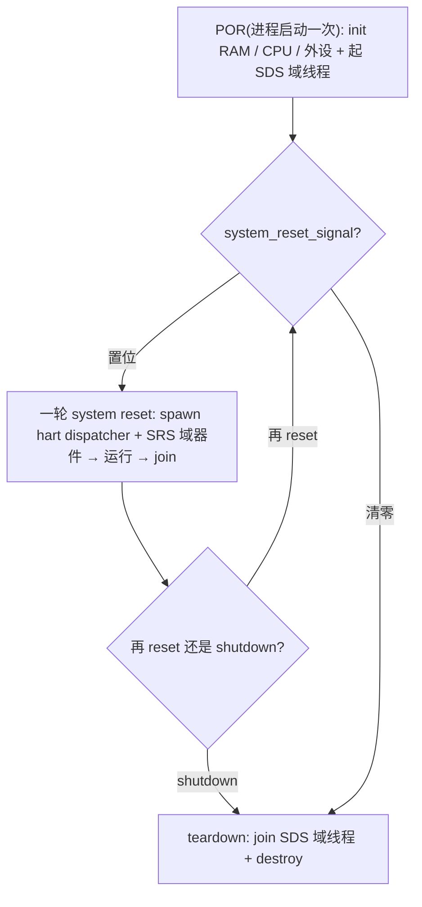
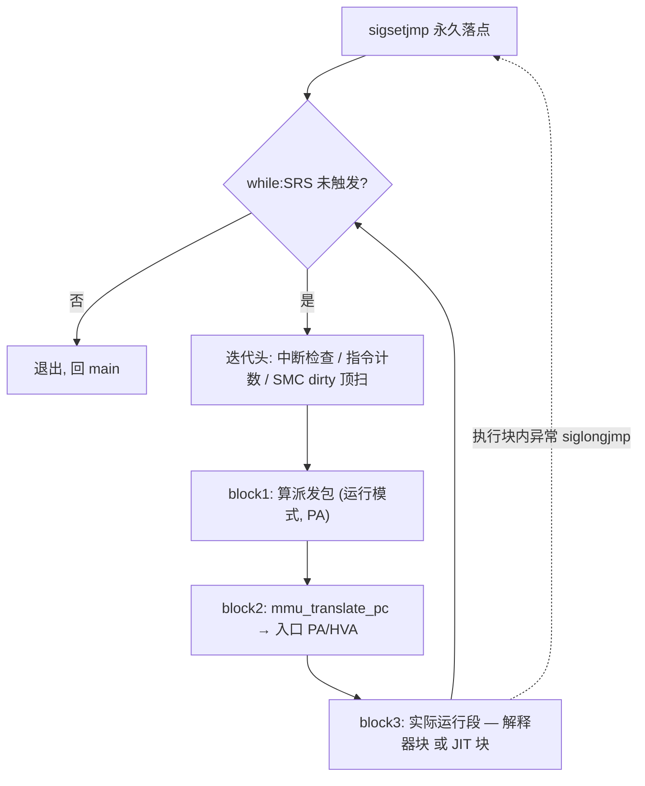
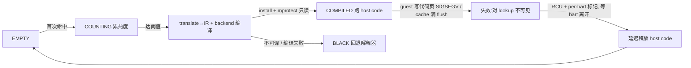

# riscv-jit-emulator

[English](./README.en.md) | 简体中文

研究生级别的 RISC-V 用户态 JIT 模拟器:在 Linux 用户态进程里翻译执行 RV32 guest 代码。目标 ISA 为 RV32 G(IMAFD_Zicsr_Zifencei)加压缩扩展 C,用于跑通 OpenSBI / 小型 OS / FreeRTOS-with-MMU 等系统软件,并产出研究生论文。

解释器打底、热块提升为 JIT 编译块。解释器 → JIT 端到端加速几何均值约 2.4x,大块场景最高约 16x(完整数据见 [`tests/review/REVIEW_REPORT.md`](tests/review/REVIEW_REPORT.md))。

## 1. 项目概览

riscv-jit-emulator 是一个 **RV32 用户态 JIT 模拟器**:在单个 Linux 进程里翻译执行 guest 的 RISC-V 机器码。解释器打底保证正确性,热点基本块即时编译为宿主(x86-64)机器码提速;目标是跑通 OpenSBI / 小型 OS / FreeRTOS-with-MMU 等系统软件,并作为研究生论文的实现载体。

- **执行模型**:解释器与 JIT 在 dispatcher 下平等调度(§5);JIT 后端为 asmjit,经 C ABI 抽象、预留 LLVM(§9)。
- **完整特权栈**:M / S / U + Sv32 MMU + trap delegation;内存 / TLB 见 §8,异常 / 中断 / WFI 见 §6 / §7。
- **SMP-ready**:`--smp N` 多 hart,共享状态走 C11 atomic + monitor 封装(§3 / §4);单 hart 恒等无开销。
- **从这里去哪**:整体怎么转 → §3;构建与运行 → §10;目录与文档导航 → §11。

## 2. 当前实现边界

已实装:

- ISA:RV32 I / M / C + A(Zaamo + Zalrsc)+ Zicsr + Zifencei。
- 特权级:M / S / U 三级,含 Sv32 MMU 与 trap delegation(medeleg / mideleg)。
- 设备:CLINT / PLIC v1.0.0 / ns16550a UART / virtio-mmio blk(legacy)/ test_dev。
- JIT:Translator → IR → JitBackend 三层端到端;SMC 整页失效;SMP-safe 块缓存。

暂缓(预留接口,后续可能做):

- F/D 浮点(`misa` F 位 = 0);H 扩展(TLB 已留 VS / VU 槽与运行模式接口,见 §8)。

明确不在目标:

- Vector、PMP、AIA / IMSIC、现代 PLIC v1.1、virtio v1.1 multi-queue。

---

## 3. 整体机器模型与生命周期

- **宏观模块**:`main` 模拟出 CPU(RISC-V 术语 HART)、RAM、外设三类器件;RISC-V 用 MMIO,所以也可抽象为"内存 + CPU",外设经物理地址空间暴露给 guest。
- **CPU 的两分**:数据 `cpu_t`(全部 guest 可见状态:寄存器 / CSR / TLB 派发表)+ 执行流 `dispatcher()`(被 `hart_exec_run` 包裹成 hart 线程入口)。
- **宏观控制**:整个程序由两套信号支配 —— `shutdown_signal`(POR / SDS 级,跨多轮 system reset 长存)与 `system_reset_signal`(SRS 级,一轮 reset 内的执行与退出)。三段生命周期 POR → system reset(`main` while 每轮 spawn / run / join)→ teardown,即这两套信号在时间轴上的展开;错误处理也走这两套信号通道,正常退出与各类失败形态一致(不分 error path)。
- **信号的两个方向**:**强制**(自上而下)—— 高层信号一旦置位,低层自然停止、无需逐个通知(要 shutdown,SRS 域器件与各 hart 随之停);**上报**(自下而上)—— 每层先自己消化,消化不了才置位信号升级(器件遇到自身无法处理的情形 → 触发 SRS;严重到需整机 abort → 经 `runtime_fatal` 升级 SDS)。
- **程序流视角下器件平权**:HART、platform device、外设三者无显著特权区别,都受这两套信号约束 —— 例如用于停机的 sifive_test 兼容设备 `test_dev` 也走这两套信号。设备在各自信号层级内自治。
- **唯一特殊点**:HART 为实现 WFI,`shutdown_signal` / `system_reset_signal` 在部分路径上依赖 `wfi` 模块的唤醒 / 兜底函数(睡在 WFI 的 hart 需经此才能看到信号变化;详见 §7)。
- 注意:dispatcher 是 system-reset 轮次里的执行流,**不再**是"带 hart-reset 自治的器件";项目已取消自定义 HART reset 与 `in_trap`。



*生命周期:POR 一次 → SRS while 轮(spawn / run / join)→ teardown;两套信号是它的控制面。*

**本节生出三条主线(后文详述,此处只点出它们如何挂在生命周期与信号体系下):**

- **外设** —— 离生命周期最近,紧接 §4 概述其模型(含 monitor)与 POR / SDS / SRS 角色。
- **Dispatcher 执行流** —— 每个 hart 一条,§5 详述其控制流与派发。
- **内存 / TLB 派发** —— guest 物理内存与地址翻译,§8 详述。

## 4. 外设模型和生命周期

> 本节只**大概说明项目有哪些外设、以及它们如何挂进 POR / SRS 生命周期**,不展开寄存器与协议;monitor 模型封装作为外设 / 平台器件的共性特性在此一并简提。

- **monitor 模型(简提)**:共享状态模块(CLINT / PLIC / RAM 写 / JIT cache 等)各自把 atomic / memory_order 封装在内部,对外只暴露 producer / consumer 接口;调用方(尤其 dispatcher)不接触同步原语,dispatcher 因此保持单线程顺序语义。
- 按生命周期角色讲,不展开寄存器 / 协议细节:
  - **POR** 一次性 init + MMIO 注册:RAM / bus / CLINT / PLIC / test_dev / UART / virtio-blk / CPU。
  - **SDS 域辅助线程**(跨 reset 长存):CLINT timer、UART RX/TX、virtio-blk io_worker。
  - **SRS / system reset**:每轮清设备 guest-visible 状态,不必销毁 host 资源或停 SDS 线程。
- 角色一览:CLINT(SDS 域,timer 线程,`mtime` 跨 reset 续跑)/ PLIC(无辅助线程)/ UART(RX + TX 线程)/ virtio-blk(`--blk` 可选,io_worker)/ test_dev(sifive_test 兼容,无线程)。
- 线程 lifecycle:谁 spawn 谁 join;`destroy` 是资源清理,不隐藏 `pthread_join`。

## 5. Dispatcher 与执行块

dispatcher 是 HART 的运行流框架。以下按**设计目的 / 实际实现 / 硬件执行流**三个视角讲(区分"为什么这么设计"与"代码实际怎么走",是本篇的常用范式)。

**设计目的视角**

- 模拟器先以解释器打底;block 热度达阈值后改用 JIT 编译路径。
- JIT 后端不保证覆盖解释器支持的所有指令;翻译不了的块回退解释器执行。
- SMC 是设计之初就纳入的约束:dispatcher 与内存(含 MMU / TLB)机制都围绕"代码页可能被 guest 写入"设计(SMC 细节见 §9,内存 / TLB 见 §8)。

**实际实现视角**

- 解释器执行流与 JIT 执行流统称**执行块**,在 dispatcher 下**平等**、无主从。
- 每个执行块结束都回到 dispatcher,由 dispatcher 决定下一轮用哪种方式执行;v1 不做 block chaining。

**CPU 内部硬件执行流视角**

- 取指操作的一部分 + 中断检查放在 dispatcher 层级;其余执行职责都在执行块内。
- 取指流程:若走页表,入口 PC 的 MMU 翻译(可能命中 / 填充 TLB)发生在 dispatcher,实际指令解码发生在执行块。
- dispatcher 对每个 block 只做一次入口取指的 MMU 翻译;块自身的执行约束(下述块边界)保证块内不需要二次走 MMU。

**执行块边界(解释器 / JIT 共享,非 JIT 专属)**

- 由 `decode.h::is_block_boundary_inst` 判定,解释器执行流与 translator 共用同一套边界 —— 它是 dispatcher / 取指翻译 / 中断延迟共同依赖的不变式。
- **硬边界**:跳转,以及可能改变 PC / 执行环境的系统指令(CSR、xRET、ECALL / EBREAK、SFENCE.VMA、WFI、FENCE.I 等)。
- **跨页截断**:block 不跨越需重新翻译的取指页边界 —— 这正是"每个 block 只需一次入口取指 MMU walk"的来源。
- **软边界**:`BLOCK_INST_LIMIT` 指令数上限,不来自 ISA 语义而是调度策略 —— 防止单块过长让中断在 dispatcher 边界等待过久;也为未来更大执行单元 / 块融合保留"eventually 回到 dispatcher"的约束。
- **当前 limitation(块融合)**:分支指令一律切块;若分支目标未跨块、仍在可译范围内,JIT 理论上可在块内做融合。性能动机有实测支撑:`tests/review/REVIEW.md` 的 block size sweep 显示**块颗粒度越大、执行 MIPS 越高**,故块融合是未来可摊薄 dispatcher round-trip 的方法之一。但 v1 明确**不做 block chaining**(块到块直接跳),所有块出口都回 dispatcher;README 只把它作为当前边界记录,不展开未来方案。



扫尾工作(中断检查 / 计数 / SMC dirty)放在**迭代头**,使正常出口与 `siglongjmp` 跳回下一轮看到的形态一致。

**派发包 `(运行模式, PA)` 的两个维度此处不展开,前向引用到各自小节:**

- **TLB / 运行模式** —— 见 §8。运行模式的设计初衷是**多 MMU / 多页表上下文**(模拟器一开始就考虑到),不是 JIT 专属优化;它客观上也加速 JIT(不同模式编不同 host code),但那是结果、不是初衷。
- **是否走 JIT** —— 见 §9(dispatcher 查 cache / 计热 / 达阈值触发编译;miss / BLACK / 编译失败回退解释器)。

**Dispatcher 向下生出三条线(后文详述):异常 / 中断(§6)、WFI(§7)、JIT 子系统(§9)。**

## 6. 异常与中断

> 承接 §5:异常和中断是 dispatcher 体系下的两条出口路径,但用**完全两套不同机制**,README 不要把二者写成同一条 trap 路径。

**两套机制**

- **中断**:由 dispatcher 在块边界轮询检查(return-based,不长跳)。
- **异常**:除少数发生在 dispatcher 取指 MMU walker 阶段外,其余全部发生在执行块中;执行块中的异常经 `siglongjmp` 长跳回 dispatcher loop 前的永久落点。

**may-trap 边界**

- 解释器用 `SYNC_COUNT()` 宏,在 may-trap 边界(可能 `_Noreturn longjmp` 前)把局部 count 同步给 dispatcher。
- JIT 块通过"调用 C 函数"这一行为本身,在 call 前 store 寄存器 / 局部计数器,保证可能长跳时状态可恢复。
- 因为 JIT 的所有外部 call 已覆盖所有直接 / 间接调用 `trap_raise_exception` 的情况,无需额外逐条标记 may-trap。

**CLINT / PLIC 中断 flag 设计**

- block 执行期间忽略中断发生;block 结束后 dispatcher 检查中断 flag。
- 早期由 dispatcher 负责检查 timer / 外部中断;为性能改为 CLINT 线程与 PLIC 相关路径在内部设置对应 hart 的 flag(性能统计见 `tests/review/REVIEW.md` / `tests/review/REVIEW_REPORT.md`)。
- 中断接收可能有 block 级延迟,但因本就是 block 后检查中断,这种延迟可忽略。
- 此设计天然保证:guest 软件仍可读 `mtime` / `mtimecmp` / PLIC pending 等 MMIO 寄存器做软轮询。

## 7. WFI

> 承接 §3"唯一特殊点":HART 为实现 WFI,会依赖 `wfi` 模块的阻塞 / 唤醒 / 兜底机制。

- WFI 是**真阻塞**实现,不是 NOP、也不是 sleep-poll。
- per-hart `(mutex, cond)` slot + predicate:执行块遇 WFI 调 `wfi_wait`;predicate 判 `system_reset_signal != 0` 或 `(mie & csr_mip_read) != 0`(WFI 唤醒不要求 `mstatus.MIE = 1`,符合 RV spec)。
- 唤醒源:CLINT / PLIC pending 0→1 点对点 `wfi_kick`;普通 shutdown 不 `wfi_kick_all`,睡着的 hart 靠 500ms `timedwait` 兜底自醒;`wfi_kick_all` 仅 `runtime_fatal` 紧急停机用。
- 解释器与 JIT 的 WFI 路径同语义(TW 检查、醒后清 LR/SC reservation、PC 自推进)。

**唯一需要解释的微妙处:sticky kick**

- `pthread_cond_signal` 是**边沿触发**:hart 尚未进入 waitqueue 时发出的 kick 会丢失。典型 race —— 外设中断在 hart 即将执行 WFI 前到达,trap 被 dispatcher 投递、handler ack 清掉 `mip`;hart 随后进入 WFI 时 pending 已消失、再无新的 0→1 翻转触发 kick,于是永睡。
- 修复:per-hart `kick_sticky` 把"发生过 kick"记成一个 atomic flag;`wfi_kick` 先 `store(sticky=1)` 再 `cond_signal`,`wfi_wait` 入口 / 每次醒来用 `exchange(0)` 消费,见到即等价一次 spurious wake 直接返回。
- 它补的是 **emulator 边沿触发 condvar 与真硬件 level-triggered 中断线之间的语义差**,不是随意加假醒;且这类 race 在**严格派真硬件上同样存在**(并非 emulator 独有,工业实例如 PULPino #91),符合 RV spec 对 WFI "可被非中断事件唤醒、软件须 `while`-loop 复查" 的允许度。

参考:RISC-V Privileged ISA Spec §3.2.3 / §3.3.2(WFI 语义);PULPino [issue #91](https://github.com/pulp-platform/pulpino/issues/91)(case A race 工业实例);完整 race 分析见模块文档 / 论文。

## 8. 内存模型、RAM/MMIO 与 TLB 派发

> 本节详细展开 §3 机器模型与 §5 dispatcher 派发中预告的"内存 / TLB"一支。内存模型是本项目**最早确定、改动最小**的部分,叙事重点是 **MMU 的 TLB 设计**。
> RV TLB 硬件规范:每个 hart 在 `sfence.vma` 刷新自己的 TLB —— 故 TLB 天然**每 HART 所有**。

**RAM vs MMIO(行为语义之分,非单纯地址范围)**

- **区分二者的根本原因是行为不同**,不是地址范围划分:原子指令(AMO / LR/SC)、页表 walk 与 PTE A/D flag 写回等只在 RAM 上成立;AMO / LR/SC 落 MMIO 被拒为 access fault,页表也必须在 RAM。
- RAM 有 HVA、可进 TLB、可作取指 / 页表 / load-store / AMO / LRSC 对象。
- MMIO 经 bus 派发到设备回调,无可缓存的 host_ptr,**不进 TLB**;未注册 MMIO 区由 bus 产生 access fault。
- `IS_GPA_RAM(pa)` 是分流点:RAM 走 `gpa_to_hva_offset + pa`;非 RAM 走 mmio helper;取指落 MMIO 是 access fault。

### 地址翻译模型

**Bare 模式直接用偏移**

- 早期曾考虑让 Bare regime(含 M 态)也走 TLB(一套代码覆盖所有访存),但走 TLB 必然可能触发 MMU 相关异常,而 Bare 模式不应在访存时遇到这些异常。
- 再者,为未来 H-extension 留出"运行模式"作为不同行为的接口。
- 注意:运行模式本身不在意 TLB 来自哪个权级(详见"走翻译的内存模型");它调用的 helper(如 CSR)可能关心权级,但这里指实际执行块内部代码(纯解释器 + JIT 块)—— helper 从块内 fast path 看已脱离。

**走翻译的内存模型**

- TLB 是每 hart 的四槽派发表 `tlb_table[4]`(`tlb_t **`,按 RV 特权级编码 U / S / VS / M 索引);语义靠 NULL / alias / ASID 容器表达,不靠额外类型层级:
  - `[M]` **恒 NULL**:Trust regime(M 态或任何 priv 带 bare satp)走 identity + `IS_GPA_RAM`,不查 TLB。
  - `[S]` **ASID 数组容器**:容器由 `cpu_create` eager 分配;叶 TLB entries 由 walker 首次访问该 ASID 时**懒分配**。
  - `[U]` **始终是副本(alias)**,镜像 U 态当前翻译上下文对应的槽:bare → 副本于 NULL(对齐 `[M]`,不查 TLB);S 态 Sv32 → 副本于 `[S]` 的 ASID 容器(默认 MSU,U / S 共享 ASID 命名空间);H 扩展(VU)→ 副本于 `[VS]` 的 ASID 容器。维护:初始化由 `cpu_create` 按 misa 派发,运行时 H 切换由 csr helper 维护 mirror。
  - `[VS]` 初版 NULL,H 扩展预留(激活时同 `[S]` 形态)。
- ASID 维度天然展开为"每 ASID 一套叶 TLB":dispatcher 派发时直接给出**当前 ASID** 的叶 TLB,执行块热路径无需再选 ASID。
- 懒分配:某 ASID 首次被用到才分配其叶 TLB —— 未充分使用 ASID 的负载不会浪费分配空间。
- 运行模式 ↔ TLB 互为约束:dispatcher 每块前按 `priv` / `satp.mode` 算 regime 与叶 TLB;命中 TLB 后执行块不再关心权级 —— 这是 §5 `(运行模式, PA)` 的来源,也是快慢路径分离成立的条件。当前运行模式三分 **BARE / SV32_S / SV32_U**(JIT 复用为 cache key,见 §9)。

**当前运行模式派发的 limitations**

- 运行模式派发与 `current_tlb == NULL` 完全对应,**无显式派发字段**。
- 未来 H 扩展 VS / VU 可能带来更复杂派发;但因执行块不在意当前权级,主要改 dispatcher 的选择逻辑即可,不必重写执行块主体。
- 当前 U 与 S 未分开派发 → 走页表 / 处理 PTE 权限时仍需知当前权级(命中 TLB 的不关心);但 MMU walker 已包装为 helper,快路径不敏感。

### 快慢路径(访存)

- 命中 TLB 的 load 直读 `*hva`,无额外副作用;store / AMO / LR/SC 因副作用必须走 helper。
- **load/store 不对称的根源是 LR/SC 机制**(加 SMC 副作用入口):store 必须经 `store_helper` 统一处理 RAM 写对 LR/SC reservation 的影响,load 无此副作用、可直接读 HVA。所以不对称是"**有无副作用**",不是"性能取舍"。
- 这条不对称**与执行块由解释器还是 JIT 执行无关** —— 二者共享同一套访存语义边界(命中 TLB 的 load 都直读 HVA;store / AMO / LR/SC 都走 helper)。

**LR/SC(简介)**

- LR/SC 是 A 扩展的 Zalrsc 部分,与 AMO(Zaamo)分开实现。reservation 是跨 hart 协议状态,由 `lrsc` 模块私有的 per-hart `_Atomic` 数组保存(**不嵌入 `cpu_t`**);reservation key 是 RAM PA word(`pa & ~3`),不是 VA。
- SC 经 per-PA hash bucket lock 比对并清 reservation(成功写 RAM、失败返 1,成败都清本 hart reservation);普通 store / AMO / device DMA 命中时也清相应 reservation;LR/SC 落 MMIO 被拒为 access fault。
- 完整算法与七类清除时机见模块文档(源:`src/isa/lrsc.{h,c}`、`dummy.txt §16`)。

**TLB fast path 形态(命中查询)**

- 叶 TLB 是 direct-mapped 数组,entry = `gva_tag` + `pte_flags`(对齐 RV PTE 位)+ `host_ptr`。
- 命中查询不暴露 `tlb_lookup` 函数,由解释器 / JIT inline:`index = (gva>>12) & (N-1)`;`gva_tag` 命中且权限位满足则直读 `host_ptr`,否则走 walker(miss / 权限不足)。
- `mmu.c` 的 walker 只是 miss 慢路径的普通页表遍历,不占主叙事。

## 9. JIT 子系统

> 本节详细展开 §5 dispatcher 派发中预告的"是否走 JIT"一支。

**设计目的视角(一个块的一生)**



一个块的一生:冷(EMPTY)→ 计热(COUNTING)→ 达阈值编译为 host code(COMPILED)→ 命中直接执行;cache 读写并发由 **RCU** 管理,可因 **SMC** 或 **code cache 满**失效并延迟回收。下面三个宏观点是这条线的关键支撑。

**三层架构**

- **Dispatcher**(执行路径选择,见 §5)→ **Translator**(懂 RISC-V decode / 块边界,产后端无关 IR,不懂 host)→ **JitBackend**(懂 host,不懂 RV opcode;当前为 asmjit;C ABI vtable 隔离 C 核心与 C++ 实现,便于将来换 LLVM)。

**宏观点 1:cache key = (运行模式, PA)**

- 运行模式本质是为服务 **TLB 分发**而生(见 §8),不是 JIT 发明:解释器用 `current_tlb == NULL` 区分 bare / M 态与走页表两类(代码注释有"为什么用 NULL 编码");**JIT 进一步把走页表细分为 S / U**(三分 BARE / SV32_S / SV32_U),编译期 baked 权限视角、消除块内 priv 分支。
- 用 **PA 不用 VA**:执行流真正跑的永远是 guest PA 上的代码字节,多个 VA / 页表上下文可映射到同一 PA —— VA-key 会重复编译同一段物理代码,且 `sfence.vma` 会让 VA-key cache 面临大量无谓失效;SMC 机制(宏观点 2)也按 PA / page 组织。综合无理由用 VA。
- 这也是 dispatcher 取指要做一段 MMU walk 的原因之一:必须先拿到入口 PA。**解释器与 JIT 块都依赖同一 PA**,行为一致。

**宏观点 2:SMC(自修改代码)触发机制**

- 把已 JIT 的 RAM 代码页 `mprotect` 改只读 → guest 写该页触发 host SIGSEGV → 用户态信号处理接管:handler 只做 async-signal-safe 最小工作(标 `page_dirty` + 解保护),真正失效推迟到 dispatcher 顶部扫 bitmap、整页失效。

**宏观点 3:生产 / 失效解耦 + 延迟释放**

- 代码注释明确:JIT 块缓存的**生产逻辑与失效逻辑互不干扰**(两个独立维度)。
- SMC 发生时**不能立刻 unmap / free** 一块 JIT host code(可能正被某 hart 执行):先让旧块对后续 lookup 不可见,再经 **RCU + per-hart 执行标记**等所有 hart 离开后才释放。

**易误解点:`sfence.vma` / `fence.i` 不主动失效 JIT cache**

- JIT 失效只由 SMC page-dirty 链路驱动(宏观点 2)。`sfence.vma` 只影响 TLB / 地址翻译状态;`fence.i` 只是块边界,让 dispatcher 在指令同步点有机会处理已记录的 dirty page —— 二者都不直接调用 JIT 失效。

*(可类比 QEMU TCG 的 Translation Block flags/tag:会影响指令解释的 CPU 状态需进入块的选择条件 —— 本项目即运行模式;但实现不照搬 QEMU。)*

---

## 10. 构建、运行与测试

- 目标环境 **Linux**(Windows 仅作文档编辑);依赖 CMake ≥ 3.20、gcc / clang、riscv64-unknown-elf-gcc(交叉编译 fixture);AsmJit 由 CMake `FetchContent` 首次 configure 时自动拉取编译。
- 三 build_type:`make debug`(ASan + UBSan)/ `make release`(perf 跑批)/ `make tsan`(SMP race;内核需 `sysctl vm.mmap_rnd_bits=28`)。
- 运行参数:`--bios FILE`(主 guest 镜像)/ `--load [ADDR=]FILE`(额外加载)/ `--blk FILE`(virtio-blk 后端)/ `--smp N`(多 hart,默认 1)。
- 测试:147 个 fixture(每个一目录 + `stub.S`);`make -C tests` 构建,`tests/review/run_tests.py` 跑批,`tests/review/run_perf.py` 跑 perf 套件。
- CLion 用户走 GUI build profile 即可;Debug 下需设环境变量 `ASAN_OPTIONS=abort_on_error=1:detect_leaks=0`(LSan 的 ptrace 与 gdb 冲突;Run 模式无需)。

## 11. 项目结构与文档导航

```
src/
  main.c              入口:POR / system reset / teardown 三段生命周期(§3)
  config.h            编译期宏(RAM / TLB / CLINT 布局 / MAX_HARTS / BLOCK_INST_LIMIT)
  riscv.h             RV ISA 定义(priv 编码 / CSR / PTE 位段 / mstatus 字段)
  loader.{c,h}        ELF / 裸二进制加载 + sanity 校验
  runtime.{c,h}       SRS / SDS 信号 bitmap + host signal handler
  debug.{c,h}         per-thread trace buf + CMake 驱动的 gate flag
  dummy.txt           跨文件协议总账(不参与编译,是源码的组成部分)
  core/               CPU 核心(全 C):cpu / dispatcher / interpreter / decode / csr / mmu / tlb / trap / wfi
  isa/                ISA 实现(全 C):lsu / amo / lrsc / fence / sfence
  platform/           平台基础设施(全 C):ram / bus / clint / plic
  device/             外设(全 C):test_dev / uart / virtio_blk
  jit/                JIT 子系统:translator / ir / jit_cache / smc / backend(C)+ backend_asmjit / jit_entry(C++)
  api/                跨语言边界(extern "C" + POD,全 C-compilable):helpers.h / jit_api.h
```

C 是默认语言;C++ 仅用于 asmjit 后端(`backend_asmjit.cc` / `jit_entry.cc`)。每个文件顶部含设计 doc,跨文件协议集中在 `src/dummy.txt`。

**文档导航:**

- 仓库内:`tests/review/REVIEW_REPORT.md`(性能评估,论文体例)/ `tests/review/REVIEW.md`(实验记录累积)/ `src/dummy.txt`(跨文件协议总账)/ 各模块 `.{c,h}` 顶段设计 doc。
- 仓库外(maintainer 内部材料):`notes/` 下的设计 plan、trade-off log、架构稿等。

## 12. 当前限制

- **ISA 范围**:F/D 浮点、Vector 未实现;H 扩展、PMP、AIA / IMSIC、现代 PLIC v1.1、virtio v1.1 不在当前目标(详见 §2)。
- **执行粒度**:所有块出口经 dispatcher,v1 不做 block chaining;分支一律切块、暂无块内融合;中断在块边界检查,故存在块级延迟(§5 / §6)。
- **运行模式派发**:U 与 S 未分开显式派发,走页表 / 处理 PTE 权限时仍需 runtime 读当前权级(命中 TLB 的快路径不受影响,§8)。
- **SMP**:数据已按 per-hart / shared 分类并 SMP-aware,但 v1 以正确性为主,未对多 hart 做调度 / 扩展性调优。

## 13. License

待定。
